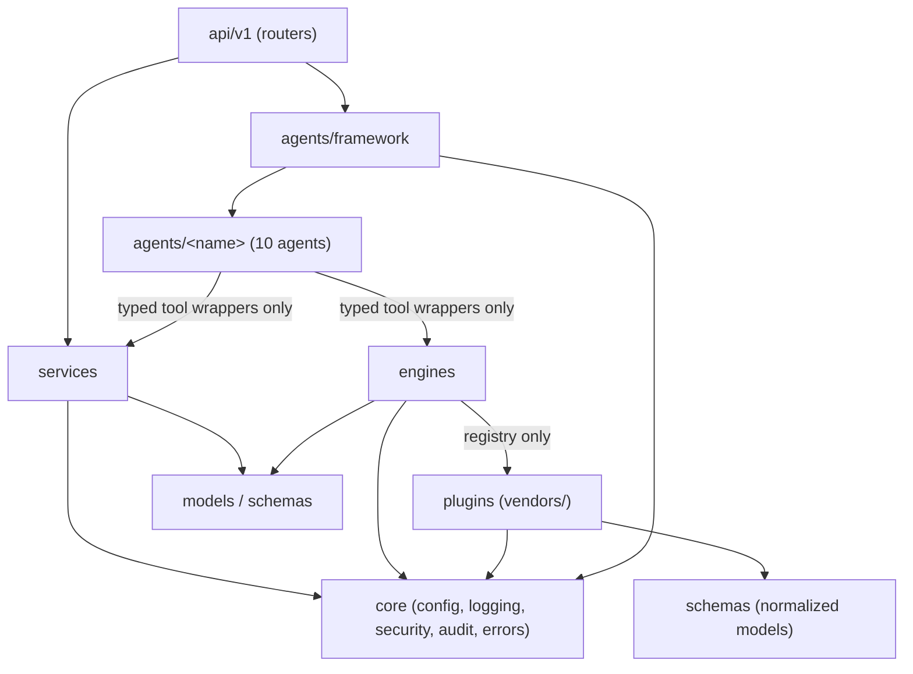

# ADR-0001: Monorepo with a Modular-Monolith Backend

**Status:** Accepted | **Date:** 2026-06-09 | **Decision:** D1

## Context

CLAUDE.md mandates a self-hosted, on-premises platform ("Local first", "Self hosted", "deployable on-premises using Docker or Kubernetes") built from a wide but tightly coupled feature set: discovery, topology, troubleshooting, packet analysis, config management, DDI, documentation, and automation, driven by 10 core agents and 13 vendor integrations. Every iteration must improve **maintainability**, **reliability**, and **observability** (CLAUDE.md "Production Readiness"), and the Development Standards require architecture design and ADRs before implementation.

The decisive constraints:

- The deliverable is a product an enterprise infrastructure team installs themselves. Every extra independently deployed service multiplies their operational burden (upgrades, TLS, networking, backups).
- Agents, engines, plugins, and the API share the same domain models (`NormalizedInterface`, `ChangeRequest`, audit entries — brief §4, §6). Splitting them across repos or services would force versioned internal APIs before a single feature exists.
- MVP milestones M0–M5 (brief §8) are delivered by a small team in rapid iterations; cross-cutting changes (e.g. adding a `Capability` enum member touches plugin contract, engines, agents, API, and frontend) must be atomic.

## Decision

**One repository, one backend deployable, enforced internal module boundaries.**

1. **Single monorepo** laid out exactly as brief §3:
   `backend/` (FastAPI app + Celery workers, one codebase), `frontend/` (React + TS + Vite), `deploy/docker/` and `deploy/kubernetes/`, `docs/` (adr, architecture, roadmap, consultant), `.github/workflows/`, `scripts/`.
2. **Modular monolith backend** under `backend/app/` with the fixed top-level modules: `core/`, `api/v1/`, `models/`, `schemas/`, `services/`, `agents/` (framework + one package per agent), `plugins/` (base, registry, `vendors/`), `engines/` (discovery, topology, packet, config_mgmt), `knowledge/`, `llm/`, `workers/`.
3. **Two runtime containers, one image source:** `api` (FastAPI) and `worker` (Celery) are built from the same `backend/` codebase (brief §1 containers table). They differ only in entrypoint.
4. **Module boundary rules**, enforced by **import-linter** in CI starting Phase 2 (brief §3):
   - `plugins` may not import `agents`.
   - `agents` use engines/services only through typed tool wrappers in `agents/framework`.
   - `engines` depend on `plugins` only via the registry (`plugins/registry.py`).
   - `core` imports nothing from feature modules.
5. **Service extraction is deferred, not forbidden:** a module is extracted into its own service only when a measured scale or isolation need demands it (e.g. packet workers needing privileged capture hosts). The boundary rules exist precisely to keep that extraction cheap.

(Arrows show allowed import direction; anything not drawn is forbidden and fails CI.)

## Consequences

**Positive**

- Atomic cross-cutting changes: one PR can change a plugin capability, the engine that consumes it, the agent tool, the API schema, and the frontend type — with one CI run (D16) validating all of it.
- Self-hosted operators deploy exactly 7 containers (frontend, api, worker, postgres, neo4j, redis, optional ollama) regardless of how many features ship — matching the docker-compose MVP target (D13).
- Shared Pydantic schemas and SQLAlchemy models are imported, not serialized over internal RPC — no version-skew class of bugs.
- The boundary rules make the dependency graph a reviewable artifact; violations are CI failures, not code-review opinions.

**Negative**

- Discipline is tooling-dependent: until import-linter lands (Phase 2), boundary violations are only caught in review.
- Scaling is coarse-grained at the container level: you scale `worker` replicas (per-queue, see ADR-0008), not individual engines. A pathological packet-analysis load shares an image with doc generation.
- One backend image means one Python dependency set; vendor SDKs (boto3, pyVmomi, azure SDKs — ADR-0007) all ship in every worker, inflating image size.
- A future extraction (e.g. dedicated capture service) still requires real work: introducing a network API where an import used to be.

## Alternatives considered

1. **Microservices per agent/engine** (discovery-svc, topology-svc, agent-runtime, etc.).
   Rejected: for a self-hosted on-prem product, every service is the *customer's* operational liability — service mesh/TLS/inter-service auth before M1 delivers value. The team size and M0–M5 cadence cannot absorb distributed-systems overhead (tracing across services, partial-failure handling, N deploy pipelines). The brief explicitly defers extraction: "services extracted later only if scale demands."

2. **Polyrepo** (backend, frontend, plugins, deploy each in their own repository).
   Rejected: the vendor plugin contract (brief §4) and normalized schemas change frequently during M1–M5; polyrepo turns each contract change into a multi-repo release dance with version pinning. CI/CD (D16: lint → typecheck → test → build → Trivy) would need cross-repo orchestration. Third-party plugin authors are still served — entry-point discovery (`netops.plugins`, D6) lets *external* packages live outside this repo without us splitting it.

3. **Monorepo with multiple independently deployed backend services from day one** (e.g. separate `api` and `discovery` services sharing a `libs/` folder).
   Rejected: keeps the repo benefits but reintroduces the deployment/runtime costs of microservices, and the shared-`libs` pattern degrades into an unbounded "common" module. The api/worker split we do keep (same codebase, different entrypoint) captures the only separation MVP needs: request/response vs. long-running jobs.
