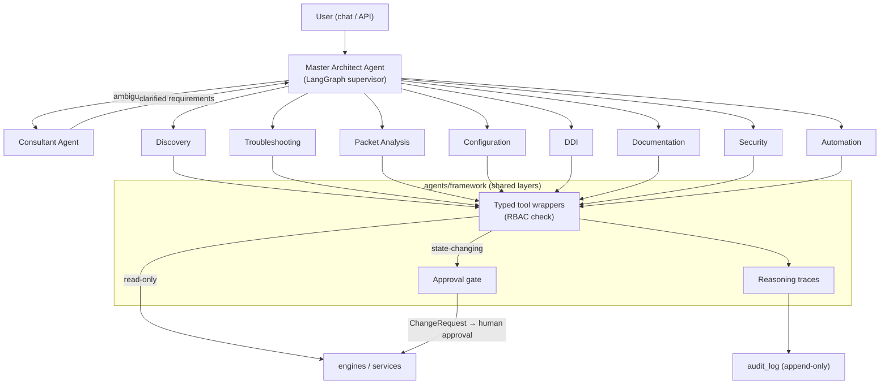

# ADR-0003: Agent Orchestration — LangGraph Supervisor Pattern

**Status:** Accepted | **Date:** 2026-06-09 | **Decision:** D3

## Context

CLAUDE.md defines exactly ten Core Agents (Master Architect, Consultant, Discovery, Troubleshooting, Packet Analysis, Configuration, DDI, Documentation, Security, Automation), mandates **LangGraph**, and imposes three non-negotiable principles on every agent action:

- **Human approval for changes** — no agent may mutate infrastructure unattended.
- **Explain all AI decisions** — every run must yield an inspectable reasoning trace.
- **Audit everything** — agent actions land in the append-only audit log (D11).

The Consultant Agent additionally has its own constitutional section: when requirements are unclear it must ask, refine, and never assume. The orchestration design must make these properties structural — enforced by the graph topology and shared layers — not behavioral conventions individual agents might forget.

## Decision

**LangGraph supervisor pattern: the Master Architect Agent is the supervisor graph; the 9 specialist agents are subgraphs; tool execution, audit, and approval are shared framework layers** (brief §2 D3, §5).

1. **Topology.** One top-level LangGraph `StateGraph` owned by the Master Architect Agent: it receives user intent, plans, routes to specialists, and synthesizes their results. Each specialist agent is a compiled LangGraph **subgraph** registered with the supervisor, declaring: `name`, `description`, a **Pydantic input schema**, and its set of typed tools (brief §5). Routing is the supervisor's decision; specialists never call each other directly — cross-agent needs go back through the supervisor.

2. **Consultant escalation.** When the supervisor classifies intent as ambiguous, it routes to the Consultant Agent, which asks the user (interactive) or — in autonomous contexts — records the question with a recommended default in `docs/consultant/QUESTIONS.md` and proceeds on the default (brief §5).

3. **Shared framework layers** in `app/agents/framework/` (brief §3) — used by all ten agents, never reimplemented per agent:
   - **Base agent + registry:** common subgraph construction, agent metadata, registration with the supervisor.
   - **Typed tool wrappers:** the *only* path from agents to engines/services (module boundary, ADR-0001). Each tool is a thin wrapper with Pydantic input/output around an engine or service function — agents never touch plugins, sessions, or raw device I/O.
   - **Read/write separation (approval gate):** tools are classified at registration. Read-only tools execute directly. Any state-changing tool call (config deploy, DDI record change, automation execution) **creates a `ChangeRequest` and blocks until human approval — no exceptions** (brief §5). The gate is implemented in the framework layer, so a specialist agent *cannot* ship a write tool that bypasses it. One narrow, ratified third classification exists (ADR-0014): **bounded diagnostic** tools — device packet captures with mandatory duration/size caps, auto-reverting by construction — execute without a ChangeRequest, gated at `operator`+ and always audited; packet captures are currently the only member of this class.
   - **Reasoning traces:** every agent run persists a trace (steps, tool calls, evidence) to `reasoning_traces` (D4/§6), linked from `audit_log` entries and surfaced in the UI.

4. **Permissions.** Agent runs execute under the invoking user's identity; RBAC (D10) is evaluated inside the tool wrappers — an agent can never do what its user cannot (brief §7).

5. **Model access.** Agents obtain chat models exclusively through the `llm/` provider registry (D9) — never by instantiating providers directly — preserving the multi-LLM and local-first principles.

**PROPOSED (not specified by the brief):** LangGraph checkpointing uses the Postgres checkpointer (`langgraph-checkpoint-postgres`) so interrupted runs — including runs blocked at the approval gate — survive process restarts; `agent_sessions` rows reference checkpoint thread IDs. Chosen conservatively because Postgres is already the system of record and adds no new infrastructure.

## Consequences

**Positive**

- The two hardest constitutional requirements are structural: approval gating and trace persistence live in one framework layer, so a new agent gets them by construction, and a security review (D11/D16) audits one chokepoint instead of ten agents.
- Supervisor routing keeps each specialist's tool space small and coherent — better tool-selection accuracy and cheaper prompts than one mega-agent with 50+ tools.
- LangGraph's interrupt/resume model maps exactly onto the ChangeRequest lifecycle (`pending_approval` = interrupted graph awaiting human input).
- Subgraph-per-agent matches the repo layout (`agents/<agent_name>/`) and lets agents be tested as isolated graphs with faked tools.

**Negative**

- Supervisor round-trips add latency and token cost versus direct tool invocation; trivial requests ("list devices") pay the planning overhead. Mitigation later: supervisor fast-paths — but only via the same framework tools.
- LangGraph's API has historically moved fast; pinning and an internal `agents/framework` abstraction are mandatory to contain churn.
- Centralized supervisor is a single semantic bottleneck: a bad routing prompt degrades every agent. Routing prompts are versioned in-repo (D9) and regression-tested (D16).
- Blocking write-tools mid-graph until approval means long-lived suspended state; the checkpointer (PROPOSED above) becomes availability-critical.

## Alternatives considered

1. **Single monolithic agent with all tools (no supervisor, no subgraphs).**
   Rejected: ten domains × multiple tools each yields a tool space far beyond reliable LLM tool selection; prompts bloat with every feature; CLAUDE.md's explicit ten-agent decomposition would exist only on paper. Explainability also suffers — one undifferentiated trace instead of per-specialist reasoning.

2. **CrewAI or AutoGen multi-agent frameworks.**
   Rejected: CLAUDE.md mandates LangGraph. Beyond the mandate: both frameworks favor free-form agent-to-agent conversation, which is exactly wrong for a platform where every write must pass a deterministic approval gate — LangGraph's explicit graph + interrupt primitives make the gate enforceable; conversational frameworks make it a prompt-level plea.

3. **Hand-rolled orchestration (state machine + function-calling loop, no framework).**
   Rejected: we would reimplement checkpointing, streaming, interrupts, subgraph composition, and retry semantics that LangGraph provides and maintains — pure undifferentiated effort, and again contrary to the constitution's explicit LangGraph requirement. The framework-layer wrappers we keep give us most of the decoupling benefit at none of the rewrite cost.

4. **Peer-to-peer agent mesh (agents invoke each other directly).**
   Rejected: untraceable control flow ("why did Configuration call Automation?"), no single point to attach audit/approval, and combinatorial test surface. The supervisor keeps one auditable routing decision per hop, which is what "Explain all AI decisions" requires.
