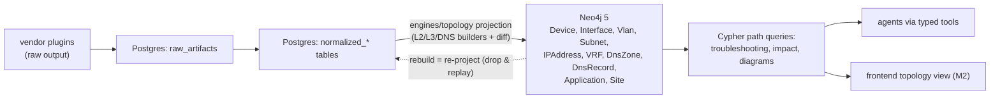

# ADR-0005: Neo4j 5 as a Rebuildable Topology/Knowledge Graph Projection

**Status:** Accepted | **Date:** 2026-06-09 | **Decision:** D5

## Context

CLAUDE.md's Topology section is explicit: maintain **L2 topology, L3 topology, DNS dependencies, and application dependencies**, and "Store relationships in Neo4j" (Neo4j is also in the mandated Architecture list). The queries this graph must answer are inherently path-shaped:

- Troubleshooting: "what is the L2/L3 path between host A and host B, and which ACL/firewall hops sit on it?" (Routing/BGP/OSPF/ACL/firewall analysis).
- Impact analysis: "if this device/interface fails, which applications and DNS zones are affected?" (`DEPENDS_ON` traversal).
- Documentation: diagram generation (M4) walks neighborhoods of the graph.

At the same time, D4 establishes PostgreSQL as the sole system of record, and "Audit everything" demands that derived views be explainable from stored evidence. Running two masters (relational + graph) would create dual-write consistency problems with no owner.

## Decision

**Neo4j 5 Community holds the topology/knowledge graph as a projection derived from PostgreSQL. The projection is fully rebuildable; Neo4j never holds data that exists nowhere else.** (brief §2 D5, §6)

1. **Graph model** (fixed by brief §6):
   - **Node labels:** `Device`, `Interface`, `Vlan`, `Subnet`, `IPAddress`, `VRF`, `DnsZone`, `DnsRecord`, `Application`, `Site`.
   - **Relationships:** `CONNECTED_TO` (L2), `L3_ADJACENT`, `ROUTES_TO`, `HAS_INTERFACE`, `IN_SUBNET`, `RESOLVES_TO`, `DEPENDS_ON`, `MEMBER_OF`, `LOCATED_AT`.

2. **Projection pipeline** owned by `engines/topology/` (brief §3): it reads `normalized_*` tables in Postgres (interfaces, routes, LLDP/CDP neighbors, DNS records — produced by discovery, ADR-0006/0007) and projects them into Neo4j: L2 builder (LLDP/CDP neighbors → `CONNECTED_TO`), L3 builder (interfaces/subnets/routes → `IN_SUBNET`, `L3_ADJACENT`, `ROUTES_TO`), DNS builder (`RESOLVES_TO`), plus **topology diff** between projections so changes between discovery runs are first-class, reportable events.

3. **Rebuildability is a contract, not an aspiration:** a full-rebuild operation (drop graph, re-project from Postgres) must always succeed and is the recovery story for Neo4j corruption or upgrades. Every node carries the Postgres primary key of its source row (**PROPOSED:** property `pg_id` plus `last_projected_at`; the brief mandates derivability but not the property names), so any edge is traceable to normalized rows and, through them, to verbatim `raw_artifacts` — keeping graph claims auditable.

4. **Access paths:** `knowledge/` (brief §3) owns the Neo4j client and graph queries; agents reach the graph only through typed tool wrappers (ADR-0003); the frontend topology view (M2, Cytoscape.js per D12) is served by the `topology` API router reading from Neo4j.

5. **Writes flow one way.** Engines write Postgres; the topology engine projects Postgres → Neo4j. Nothing else writes Neo4j; nothing ever writes "graph-only" facts.

## Consequences

**Positive**

- Path and dependency queries (k-hop traversals, shortest path through `CONNECTED_TO`/`ROUTES_TO`, transitive `DEPENDS_ON`) are natural, fast Cypher — the workloads the Troubleshooting and Documentation agents live on.
- No dual-master problem: backup/restore, encryption, and audit obligations concentrate on Postgres (ADR-0004); Neo4j loss is an inconvenience (re-project), not a data-loss incident.
- Topology diff between projections directly supports drift visibility and incident reports ("what changed since the last run?").
- Clean milestone fit: M1 fills `normalized_*` tables; M2 adds projection + visualization without reworking discovery.

**Negative**

- Projection lag: the graph is as fresh as the last projection run, not real-time. Queries answer "as of run X" — acceptable for discovery-driven topology, and the run timestamp must be surfaced in UI/agent answers.
- Two query languages (SQL + Cypher) and two stores to operate, monitor (D15), and version-upgrade.
- Neo4j 5 **Community** edition lacks clustering, online backup, and RBAC — tolerable *only because* the projection is disposable; production HA expectations are an open Consultant item (brief §9).
- Full rebuilds on large estates can be slow; incremental projection (upsert by `pg_id` + diff) is the required steady-state path, with full rebuild as recovery.

## Alternatives considered

1. **Graph-in-Postgres: recursive CTEs or the Apache AGE extension.**
   Rejected: recursive CTEs handle fixed-shape traversals but become unmaintainable for variable-length multi-relationship paths (L2 + L3 + DNS + app dependencies combined), and AGE is far less mature than Neo4j with a much smaller operational knowledge base. It would also contradict CLAUDE.md's explicit "Store relationships in Neo4j."

2. **Neo4j as the system of record for topology (write directly, no projection).**
   Rejected: creates two masters — inventory/credentials/audit in Postgres, topology only in Neo4j — so a Neo4j failure becomes unrecoverable data loss on Community edition's weak backup story, and cross-store transactions (e.g. a discovery run writing both) don't exist. The projection pattern keeps Neo4j's query power while keeping durability obligations in one place.

3. **A different graph database (ArangoDB, JanusGraph, Memgraph).**
   Rejected: none is mandated by CLAUDE.md, none beats Neo4j's Cypher ecosystem/driver maturity for this workload, and JanusGraph would drag in a storage backend (Cassandra/HBase) — absurd for a self-hosted seven-container stack. Memgraph's compatibility is good but its license/scale trade-offs buy nothing here.

4. **In-memory graph in the API process (NetworkX) built on demand from Postgres.**
   Rejected: attractive for tiny labs, but no persistence, no concurrent access for workers + API, recomputation cost on every query at enterprise scale, and no Cypher surface for ad-hoc agent queries. It would also leave the mandated Neo4j requirement unmet.
