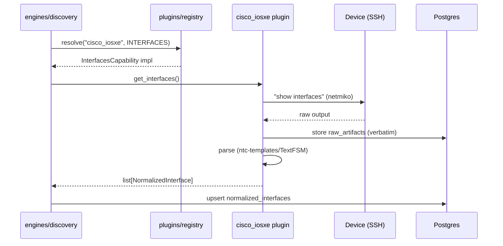

# ADR-0006: Vendor Plugin System — Capability Interfaces, Registry, Entry Points

**Status:** Accepted | **Date:** 2026-06-09 | **Decision:** D6

## Context

CLAUDE.md requires support for **13 vendors** spanning four very different shapes: CLI network OSes (Cisco IOS/IOS-XE/NX-OS, Juniper JunOS, Arista EOS), API-first security/ADC platforms (Palo Alto PAN-OS, Fortinet FortiOS, F5 BIG-IP), DDI systems (BlueCat, Infoblox), and cloud/virtualization (AWS, Azure, VMware). No two expose the same feature set — a DDI platform has no LLDP neighbors; a cloud account has no `show running-config`.

Meanwhile the engines (discovery, topology, config_mgmt — brief §3) and all ten agents must remain **vendor-agnostic**, and "Audit everything" requires raw device output to be preserved before any interpretation. The MVP ships only 3 plugins (M1: Cisco IOS, Cisco IOS-XE, Arista EOS) but the architecture must absorb the other 10 — and third-party vendors — without touching core code.

## Decision

**Capability-interface ABCs + a plugin registry; plugins discovered via Python entry points (`netops.plugins`); one package per vendor.** (brief §2 D6, §4)

1. **Contract** (`app/plugins/base.py`), exactly as brief §4:

   ```python
   class Capability(StrEnum):
       DISCOVERY_SSH, DISCOVERY_SNMP, DISCOVERY_API,
       INTERFACES, ROUTES, NEIGHBORS_LLDP, NEIGHBORS_CDP,
       BGP, OSPF, ACL, FIREWALL_POLICY,
       CONFIG_BACKUP, CONFIG_RESTORE, CONFIG_DEPLOY,
       DDI_DNS, DDI_DHCP, DDI_IPAM,
       PACKET_CAPTURE, HA_STATUS

   class VendorPlugin(ABC):
       vendor_id: str                  # e.g. "cisco_iosxe"
       display_name: str
       capabilities: frozenset[Capability]
   ```

2. **Typed capability interfaces.** Each `Capability` member pairs with an ABC defining its methods, e.g. `InterfacesCapability.get_interfaces() -> list[NormalizedInterface]`, `RoutesCapability.get_routes() -> list[NormalizedRoute]`, `ConfigBackupCapability.backup() -> ConfigSnapshot`. A plugin implements only the interfaces it declares in `capabilities` — partial coverage is the norm, not an error (Infoblox implements `DDI_*`; it will never implement `NEIGHBORS_CDP`).

3. **Normalized models as the only currency.** Capability methods return the normalized Pydantic models of brief §4 (`NormalizedInterface`, `NormalizedRoute`, `NormalizedNeighbor`, `NormalizedBgpPeer`, `NormalizedAclEntry`, `NormalizedDnsRecord`, …), defined in `app/schemas/`. **All raw command/API output is stored verbatim first** (to `raw_artifacts`, ADR-0004), then parsed — so every normalized row is re-derivable and auditable.

4. **Registry** (`app/plugins/registry.py`): resolves `(vendor_id, capability) -> implementation`. Engines call the registry, never import vendor packages (module boundary, ADR-0001). Unsupported combinations fail fast with a typed error the agents can explain to users ("FortiOS plugin does not implement OSPF analysis").

5. **Discovery via entry points.** Plugins self-register under the `netops.plugins` entry-point group (declared in `pyproject.toml`). The in-repo vendor packages live in `app/plugins/vendors/` — exactly: `cisco_ios`, `cisco_iosxe`, `cisco_nxos`, `junos`, `eos`, `panos`, `fortios`, `f5_bigip`, `bluecat`, `infoblox`, `aws`, `azure`, `vmware` — but a third-party `pip install acme-netops-plugin` is registered identically, with zero core changes.

6. **Boundary rules:** `plugins` may not import `agents`; transports/parsers (netmiko, pysnmp, httpx, TextFSM — ADR-0007) are used *inside* plugins only.



## Consequences

**Positive**

- Engines and agents are provably vendor-agnostic: they speak `Capability` + normalized models only, so M1's three plugins and vendor #13 exercise identical engine code.
- Partial capability sets are honest: the registry can answer "what can the platform do against this device?", which drives both agent tool availability and UI affordances.
- Entry-point discovery delivers true extensibility — enterprises can add an in-house vendor plugin as a private package without forking the platform.
- Raw-first storage makes parser bugs recoverable (re-parse stored artifacts) and keeps the audit trail intact even when normalization fails.

**Negative**

- The normalized models are a lowest-common-denominator: vendor-unique richness (e.g. PAN-OS security-profile detail) either extends the schema (migration + review) or rides in an escape-hatch field, where it is invisible to engines.
- Interface proliferation: ~19 capabilities × typed ABCs is real surface area to design well up front; a bad early signature ripples through 13 plugins.
- Entry points execute import-time code from installed packages — a supply-chain consideration; for self-hosted deployments the operator controls the installed set, and Trivy scanning (D16) covers images, but third-party plugin vetting is operator responsibility (documented, not solved).
- Parsing CLI output (TextFSM) is inherently brittle across OS versions; verbatim raw storage mitigates but does not eliminate template maintenance.

## Alternatives considered

1. **NAPALM as the vendor abstraction layer.**
   Rejected as the platform contract: NAPALM's getter set covers a fraction of our `Capability` enum (no DDI, no firewall policy, no packet capture, no cloud), its driver list misses FortiOS/PAN-OS/F5/BlueCat/Infoblox/AWS/Azure/VMware, and its config-replace model doesn't map onto our ChangeRequest lifecycle. Individual plugins *may* use NAPALM internally where a driver helps, but the public contract is ours.

2. **No abstraction: per-vendor branches inside engines (`if vendor == "junos": ...`).**
   Rejected: 13 vendors × 19 capabilities of conditionals makes engines untestable and violates open/closed — every new vendor edits core engine code, the exact thing entry-point discovery exists to prevent. Also collides with the module-boundary rule that engines reach vendors only via the registry.

3. **Hook-based plugin framework (pluggy).**
   Rejected: pluggy's hookspec model is great for *advice-style* extension (pytest), but our need is *typed capability resolution* — "give me the INTERFACES implementation for junos" — which ABCs + a registry express directly with full mypy coverage. pluggy's loosely-typed hook results would erode the normalized-model guarantees D6 exists to provide.

4. **Out-of-process plugins (separate plugin containers/services with an RPC contract).**
   Rejected for MVP: strongest isolation, but adds per-vendor deployment units to a self-hosted stack (contradicting ADR-0001's economics) and serializes every normalized model across a process boundary. The in-process ABC contract preserves the option — an RPC shim could implement the same capability interfaces later if isolation demands it.
