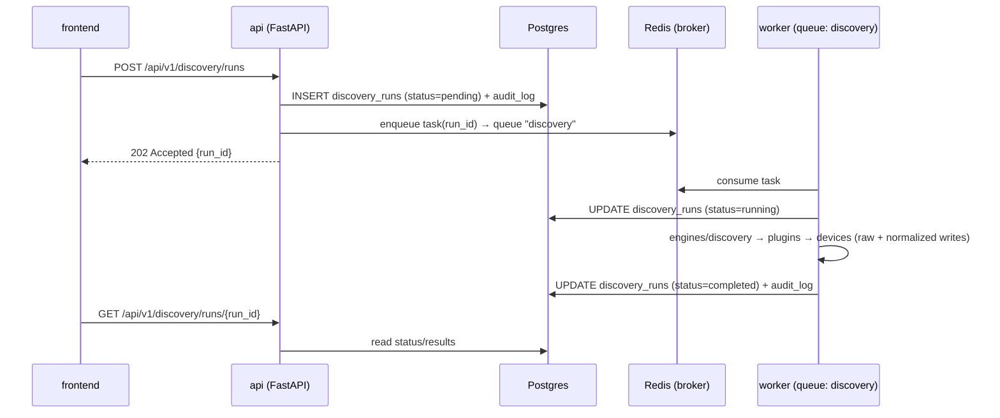

# ADR-0008: Async Jobs — Celery + Redis with Dedicated Queues

**Status:** Accepted | **Date:** 2026-06-09 | **Decision:** D8

## Context

Most of the platform's real work is long-running and must outlive any HTTP request: discovery runs against hundreds of devices (CLAUDE.md Discovery: SNMP/SSH/APIs/LLDP/CDP/routes/interfaces), config backups and drift/compliance sweeps (Config Management), packet captures and pcap analysis (tcpdump/tshark/Wireshark), and document generation (diagrams, runbooks, incident reports, inventories). The brief's container model (§1) therefore defines a `worker` container — "Celery workers (same codebase as `api`)" — and Redis 7 as "Celery broker/result backend, cache, rate limiting."

Constraints shaping the choice:

- **Reliability** (CLAUDE.md Production Readiness): jobs must survive API restarts and be retryable; "Audit everything" means job lifecycle events are auditable records, not in-memory state.
- **Blocking I/O isolation:** netmiko/pysnmp/pyVmomi are synchronous (ADR-0007) and must not run on the FastAPI event loop (ADR-0002).
- **Workload isolation:** a 2-hour packet capture must not starve discovery; doc generation (LLM-heavy) has a completely different resource profile than SSH fan-out.
- **Self-hosted economics** (ADR-0001): no new stateful infrastructure beyond the seven approved containers.

## Decision

**Celery with Redis 7 as broker and result backend; four dedicated queues: `discovery`, `config`, `packet`, `docs`.** (brief §2 D8, §1)

1. **Celery app** lives in `app/workers/` (brief §3): the Celery application object plus task definitions. Tasks are thin: they parse arguments, open a DB session, and call engine functions (`engines/discovery`, `engines/config_mgmt`, `engines/packet`, plus documentation generation) — business logic stays in engines, so it is testable without a broker. **PROPOSED:** Celery 5.x pinned in `pyproject.toml` (the brief mandates Celery but not a version; 5.x is the only currently maintained line).

2. **Queue → workload mapping** (fixed by D8):

   | Queue | Workloads | Notes |
   |---|---|---|
   | `discovery` | discovery runs: seed expansion, per-device collection, normalization | high fan-out, short-to-medium tasks |
   | `config` | config backups, restore execution (post-approval), drift detection, compliance checks | scheduled sweeps + ChangeRequest-driven executions |
   | `packet` | capture orchestration on devices, pcap analysis via tshark/pyshark in sandboxed worker context (D14) | long-running; isolated so it never starves others |
   | `docs` | diagram/runbook/incident-report/inventory generation | LLM- and CPU-heavy, latency-tolerant |

   Workers are started per queue (`celery worker -Q discovery`, etc.) from the same image as `api` (ADR-0001), so each queue scales independently — in docker-compose by replica count, in Kubernetes by per-queue Deployments (D13).

3. **Redis 7** (the `redis` container) is broker *and* result backend, and additionally serves caching and API rate limiting (brief §1). Redis is treated as **expendable infrastructure**: durable job state lives in Postgres (`discovery_runs`, `config_snapshots`, `change_requests`, `audit_log`), so a Redis flush loses at most in-flight queue entries — recoverable by re-dispatch, never data loss.

4. **Job lifecycle is a database fact.** Every job family has a Postgres row created *before* dispatch (e.g. a `discovery_runs` row in `pending`), updated by the task as it progresses, and linked to audit entries. The API and frontend read status from Postgres, not from Celery result objects; Celery results exist for chaining/retry mechanics only.

5. **Execution semantics (PROPOSED — brief silent; conservative defaults):** `task_acks_late = True` with `task_reject_on_worker_lost = True` so a killed worker's task is redelivered, which requires tasks to be **idempotent** (upsert-style writes keyed on run/device IDs — already the shape of the normalization pipeline); bounded `autoretry_for` transient transport errors with exponential backoff + jitter; per-task soft/hard time limits per queue (longest on `packet`); `worker_prefetch_multiplier = 1` on long-task queues to keep fan-out fair. Scheduled sweeps (periodic backups, compliance) use **Celery beat** with schedules in config — beat is part of Celery, no new component.

6. **Approval gate interaction:** state-changing executions (config deploy/restore, DDI changes, automation) are *only* enqueued after a `ChangeRequest` reaches `approved` (ADR-0003, brief §7); the task transitions it `approved → executing → completed | failed`, writing audit entries at each step.

## Consequences

**Positive**

- Clean blocking-I/O home: netmiko/pysnmp/pyVmomi run in worker processes, keeping the API event loop pure async (ADR-0002).
- Per-queue isolation and scaling match the four workload profiles; a runaway pcap analysis cannot starve discovery, and operators size each queue independently.
- Redis-as-expendable + Postgres-as-truth means the audit and reliability principles hold even through broker loss — no job is "remembered" only by Redis.
- Celery's maturity (retries, time limits, beat scheduling, routing) covers M1–M5 needs with zero additional infrastructure; Redis was already in the stack for caching/rate limiting.

**Negative**

- Celery's complexity is real: acks-late semantics, prefetch tuning, and worker lifecycle have sharp edges; the PROPOSED defaults above must be validated under M1 load, and idempotency is now a hard requirement on every task author.
- Redis as a broker offers no true message durability (vs. RabbitMQ's persistent queues); we accept losing in-flight deliveries on Redis failure because Postgres rows allow re-dispatch — but that re-dispatch logic must actually be built (run-reconciliation on startup).
- Celery's asyncio story is weak: tasks are sync functions; any async engine code called from tasks needs explicit event-loop management. Our transports are sync anyway (ADR-0007), so the cost is contained.
- Observability of distributed jobs requires deliberate work: per-queue Prometheus metrics and structured task logging land with D15; until then, debugging relies on Postgres job rows and worker logs.

## Alternatives considered

1. **RQ (Redis Queue).**
   Rejected: much simpler, but missing what we specifically need — first-class multi-queue routing with per-queue workers is rudimentary, no built-in periodic scheduler (separate rq-scheduler), weaker retry/time-limit semantics, and Windows-unfriendly fork model complicating developer machines. Celery's feature set maps one-to-one onto the queue isolation and scheduled-sweep requirements.

2. **Dramatiq.**
   Rejected: technically clean and arguably better-designed than Celery, but a far smaller ecosystem and operator knowledge base — a liability for a self-hosted product where *customers'* engineers run the stack — and it still wouldn't remove the need for Redis. The benefit over Celery is taste, not capability; the cost is community depth.

3. **arq / asyncio-native task queues (or FastAPI `BackgroundTasks`).**
   Rejected: arq's async model buys nothing when the dominant workloads are sync transports (netmiko, pyVmomi) — they'd need thread executors inside an async worker, inverting the problem. FastAPI `BackgroundTasks` is disqualified outright: in-process, lost on restart, unobservable, no queues — incompatible with "Audit everything" and Reliability.

4. **RabbitMQ as broker (Celery + RabbitMQ), or Kafka-based job orchestration.**
   Rejected: RabbitMQ adds an eighth stateful container solely for broker durability we deliberately don't need (Postgres is the durable job ledger); the brief already assigns Redis the broker role plus cache and rate limiting. Kafka is a streaming log, not a work queue — partition-based consumption fights per-job routing/retry, and its operational weight is wildly disproportionate for a self-hosted seven-container platform.
