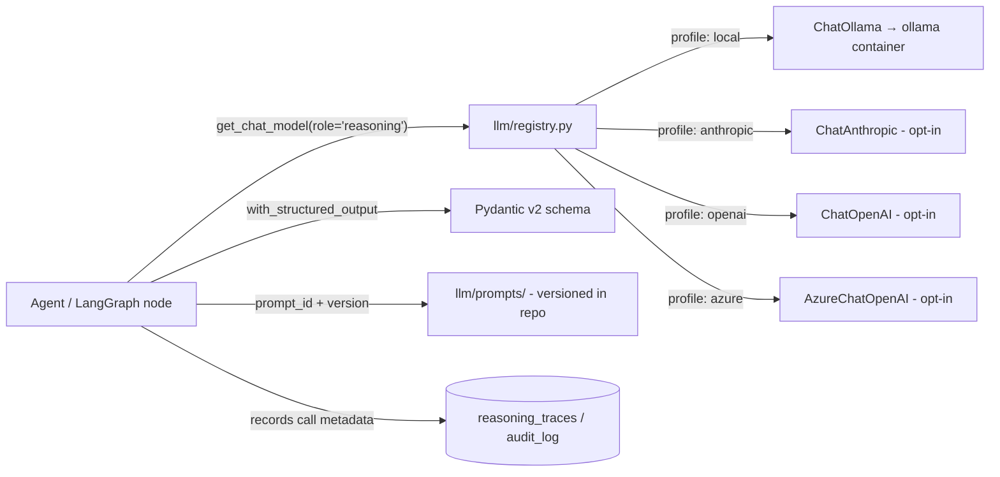

# ADR-0009: Multi-LLM Provider Abstraction

**Status:** Accepted | **Date:** 2026-06-09 | **Decision:** D9

## Context

CLAUDE.md mandates the design principles **"Support multiple LLMs"**, **"Local first"**, **"Self hosted"**, and **"Explain all AI decisions"**, and fixes **LangGraph** as the agent orchestration framework (see ADR-0003 / D3). Ten core agents (Master Architect, Consultant, Discovery, Troubleshooting, Packet Analysis, Configuration, DDI, Documentation, Security, Automation) all need LLM access, and an enterprise on-prem deployment may have no internet egress at all — so the platform must run fully against a local model while still allowing opt-in use of commercial providers.

The brief (section 2, D9; section 3 repo layout `backend/app/llm/`) requires: a LangChain chat-model interface behind an internal `llm/` provider registry; named profiles `local` (Ollama, default), `anthropic`, `openai`, `azure`; all prompts versioned in-repo; and structured outputs via Pydantic. The brief's container table makes `ollama` an **optional** Docker Compose profile, with external providers opt-in.

## Decision

1. **Single consumption interface.** All agent and engine code depends only on `langchain_core.language_models.BaseChatModel`. No module outside `backend/app/llm/` may import a concrete provider class (`ChatOllama`, `ChatAnthropic`, …). This is enforceable by import-linter alongside the module-boundary rules in brief section 3.

2. **Provider registry** in `backend/app/llm/registry.py`: maps a *profile name* to a factory returning a configured `BaseChatModel`. Profiles are declared in application settings (Pydantic Settings, env-overridable):

   | Profile | Package / class | Notes |
   |---|---|---|
   | `local` (default) | `langchain-ollama` → `ChatOllama` | Points at the `ollama` Compose profile / K8s service. Works air-gapped. |
   | `anthropic` | `langchain-anthropic` → `ChatAnthropic` | Opt-in; requires `ANTHROPIC_API_KEY`. |
   | `openai` | `langchain-openai` → `ChatOpenAI` | Opt-in; requires `OPENAI_API_KEY`. |
   | `azure` | `langchain-openai` → `AzureChatOpenAI` | Opt-in; endpoint + deployment from settings. |

   A profile bundles `{provider, model_name, temperature, max_tokens, timeout}`. Agents request a profile by *role* (e.g. `reasoning` for the Master Architect's planning, `fast` for tool-output summarization), and roles map to profiles in settings — so an operator can route reasoning to a larger model and summarization to a smaller one without code changes. **PROPOSED:** the two role names `reasoning` and `fast` as the initial set (the brief defines profiles but not role indirection).

3. **Secure-by-default egress.** External providers are *disabled* unless their API key/endpoint is explicitly configured. With no configuration, the platform runs purely on `local`. Selecting an external profile is logged to the audit log (D11) because it implies data leaving the deployment.

4. **Prompts versioned in-repo.** All prompt templates live under `backend/app/llm/prompts/` as files with an explicit `prompt_id` and integer `version` in front-matter. Reasoning traces (D11, brief section 5) record `(prompt_id, version, profile, model_name)` for every LLM call, so any AI decision can be reproduced and explained — directly serving "Explain all AI decisions" and "Audit everything".

5. **Structured outputs via Pydantic v2.** Agent decisions (routing, plans, findings, generated ChangeRequest payloads) are obtained with `model.with_structured_output(PydanticSchema)`. For providers/models without native tool-calling or JSON mode (some Ollama models), the registry wraps the call with a JSON-output parser plus one bounded retry on validation failure. Free-text generation is allowed only for human-facing prose (documentation, chat replies).

6. **Embeddings.** RAG over pgvector (D4, `backend/app/knowledge/`) uses the same registry pattern with a `BaseEmbeddings`-typed `embedding` profile; default is a local Ollama embedding model. **PROPOSED:** `nomic-embed-text` as the default local embedding model (the brief does not name one).

## Consequences

**Positive**
- Any agent works against any provider; swapping models is a settings change, not a code change.
- Air-gapped deployments work out of the box (`local` default) — satisfies local-first and self-hosted.
- Versioned prompts + per-call trace metadata make AI behavior reproducible and auditable.
- Structured outputs eliminate fragile free-text parsing in the agent control flow.
- LangChain's chat-model interface is what LangGraph natively consumes — zero adaptation layer.

**Negative**
- Couples the platform to the `langchain-core` interface and its release cadence; breaking changes in LangChain ripple through `llm/`.
- Capability differences across providers (tool-calling quality, context window, JSON-mode reliability) leak into agent quality; the `local` default with small Ollama models will be measurably weaker than commercial frontier models, which must be communicated to users.
- The registry adds one indirection layer that contributors must learn (and import-linter must police).
- Per-provider extras (`langchain-ollama`, `langchain-anthropic`, `langchain-openai`) inflate the dependency tree even when unused.

## Alternatives considered

1. **LiteLLM proxy/gateway** — a separate service exposing an OpenAI-compatible API over 100+ providers. Rejected: adds another always-on container to a self-hosted footprint, normalizes everything to a lowest-common-denominator OpenAI shape (losing provider-native structured output and tool-calling fidelity), and duplicates what LangChain's interface already gives us inside the process LangGraph runs in.
2. **Hand-rolled provider abstraction over raw SDKs** (`anthropic`, `openai`, `ollama` Python clients behind our own ABC). Rejected: we would re-implement streaming, retries, tool-call normalization, and structured output for every provider — exactly the surface LangChain maintains — and we'd still need an adapter to feed LangGraph, which expects `BaseChatModel`.
3. **Hosted model router (e.g. OpenRouter) as the single backend.** Rejected outright: violates "Local first" and "Self hosted"; an enterprise NOC platform cannot depend on a third-party SaaS for its core reasoning path.
