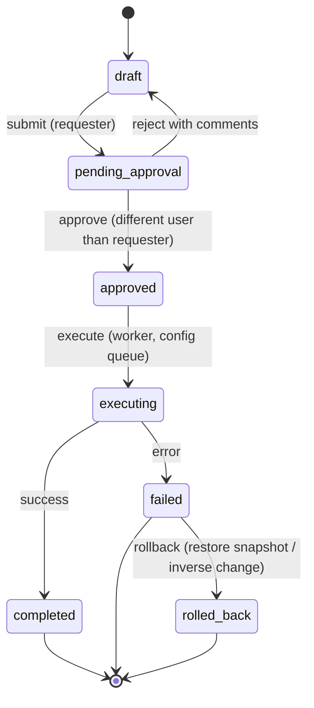

# ADR-0011: Security Model — Credential Vault, Append-Only Audit, and Change Approval

**Status:** Accepted | **Date:** 2026-06-09 | **Decision:** D11

## Context

Four CLAUDE.md design principles converge here: **"Secure by default"**, **"Audit everything"**, **"Human approval for changes"**, and **"Explain all AI decisions"**. The platform holds the keys to the kingdom — SSH/SNMP/API credentials for routers, firewalls, DDI appliances, and cloud accounts — and its agents can generate configuration changes. The brief (D11, section 7) fixes the mechanisms: AES-256-GCM envelope encryption for device credentials with a master key from env/file behind a KMS-compatible interface; an append-only audit log; a mandatory ChangeRequest with human approval for every state-changing action; and agent reasoning traces persisted and linked to audit entries. Data tables involved (brief section 6): `device_credentials`, `change_requests`, `approvals`, `audit_log`, `agent_sessions`, `reasoning_traces`.

## Decision

### 1. Credential vault — envelope encryption

- Implemented in `backend/app/core/security` + `backend/app/services/credentials`, using the `cryptography` library's AESGCM primitive.
- **Envelope scheme:** each credential gets its own random 256-bit **DEK**; the secret is encrypted with AES-256-GCM (96-bit random nonce, AAD = credential row id **PROPOSED** to bind ciphertext to its row). The DEK is wrapped by the platform **KEK** (master key) and stored alongside: `device_credentials(ciphertext, nonce, wrapped_dek, kek_version, …)`.
- **KEK source behind a `KeyProvider` interface** (KMS-compatible, per the brief): `EnvKeyProvider` (env var) and `FileKeyProvider` (mounted file / K8s Secret) ship in MVP; AWS KMS / Azure Key Vault providers implement the same interface on the production roadmap. `kek_version` enables rotation: a rotation job re-wraps DEKs (cheap — no payload re-encryption).
- **No API ever returns a secret** (write-only fields; redacted in logs, traces, and serialized schemas). Decryption happens only inside the device-connectivity layer (plugins/engines per D6/D7) in the `api`/`worker` processes, immediately before opening a session.

### 2. Append-only audit log

- `audit_log` records: actor (user id, plus agent name when an agent acted on the user's behalf), action, target (entity type + id, device, vendor), before/after state (JSONB), timestamp, request id, and a **link to the reasoning trace** when the action originated from an agent.
- Append-only is enforced **in the database**, not by convention: the application's Postgres role is granted `INSERT`/`SELECT` only on `audit_log` (no `UPDATE`/`DELETE`), and **PROPOSED:** a `BEFORE UPDATE OR DELETE` trigger raising an exception as defense-in-depth against future grant mistakes.
- Audited events include: logins, credential create/rotate, discovery runs, every agent tool call that touches a device, ChangeRequest lifecycle transitions, approvals, packet-capture starts and pcap downloads, and selection of an external LLM profile (ADR-0009).

### 3. ChangeRequest workflow — human approval, no exceptions

Per brief section 5: read-only tools execute directly; **any** state-changing tool call (config deploy, DDI record change, automation execution) creates a `ChangeRequest` and blocks until a human approves. Lifecycle (brief section 7):

- **Four-eyes rule:** the approver must differ from the requester; configurable but **on by default** (secure by default). Approval rights per the RBAC matrix in ADR-0010.
- Every ChangeRequest carries: the exact payload to be applied (rendered config diff / API calls), the target devices, the generating agent's reasoning-trace link, and a rollback plan (config snapshot reference from the config_mgmt engine, D8/M4).
- Agents can *prepare* and *explain* changes; only humans move `pending_approval → approved`. There is no auto-approve path in any environment.

### 4. Reasoning traces

- Every agent run persists a `reasoning_traces` record: ordered steps, tool calls with inputs/outputs (secrets redacted), evidence cited, prompt id + version and model profile (ADR-0009). Traces are linked from `audit_log` entries and rendered in the UI (D12) — making "Explain all AI decisions" a stored artifact, not a UI nicety.

### 5. Transport and runtime hardening

- TLS everywhere in production (ingress-terminated or end-to-end); containers run non-root (D13); Kubernetes NetworkPolicies restrict east-west traffic so only `api`/`worker` reach `postgres`/`neo4j`/`redis`, and only `worker` reaches managed network devices.

## Consequences

**Positive**
- A database dump alone reveals no device credentials; compromise requires the KEK too. Per-credential DEKs limit blast radius and make rotation cheap.
- DB-enforced append-only audit survives application bugs and compromised app code paths — credible in an enterprise security review.
- The ChangeRequest gate makes the platform's most feared failure mode ("the AI changed my firewall") structurally impossible, and every change ships with its own explanation and rollback plan.
- The KeyProvider interface gives a clean upgrade path to KMS/HSM without schema changes.

**Negative**
- Human approval adds latency to every change — intentional, but it rules out closed-loop auto-remediation even where operators might want it; that would require a future, separately-decided policy ADR.
- Key management burden shifts to the operator: losing the KEK means losing all stored credentials (documented recovery: re-enter credentials). Env-based KEK is only as safe as the host's env hygiene.
- Append-only audit grows unboundedly; retention/archival policy is an open item routed to the Consultant Agent (brief section 9).
- Before/after state capture in `audit_log` duplicates some data already in `config_snapshots`, costing storage for the sake of self-contained audit records.

## Alternatives considered

1. **HashiCorp Vault (or OpenBao) as a required external secret store.** Rejected for MVP: adds an HA-sensitive external service with its own unseal/operational burden to a self-hosted platform that must run from a single docker-compose file. The `KeyProvider` interface deliberately leaves room for a Vault-transit provider later without changing the credential schema.
2. **Postgres `pgcrypto` column encryption.** Rejected: keys would transit SQL and live in database server memory/logs, there is no envelope structure (so rotation means re-encrypting every payload), and the database admin could decrypt everything — weaker separation of duties than app-side AES-GCM with an external KEK.
3. **Kubernetes Secrets / Docker secrets as the credential store itself.** Rejected: covers only one deployment target (Compose parity is poor), base64 is not encryption at rest unless etcd encryption is separately configured, and it offers no per-credential granularity, rotation metadata, or audit linkage. K8s Secrets remain appropriate for the *KEK*, not for the credential corpus.
4. **Soft-delete / application-level "don't update" convention for the audit log.** Rejected: any application bug or SQL-injection foothold could rewrite history. Grants + trigger enforcement in the database is cheap and categorical.
