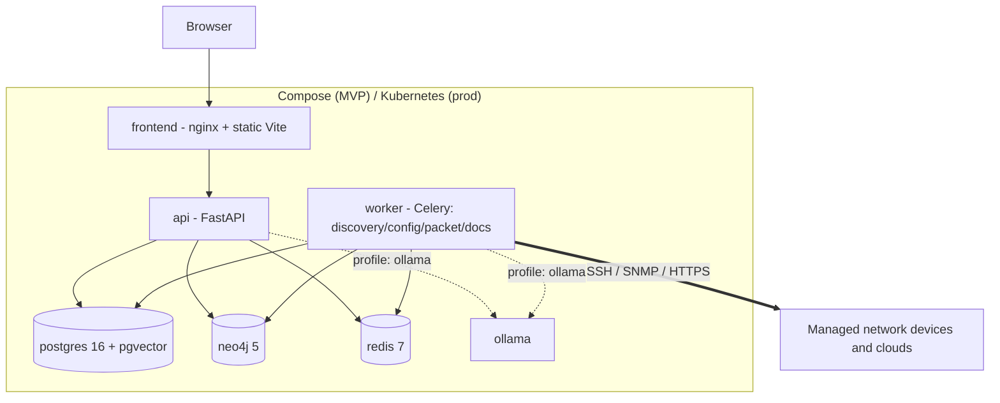

# ADR-0013: Deployment — Docker Compose for MVP, Kubernetes via Helm for Production

**Status:** Accepted | **Date:** 2026-06-09 | **Decision:** D13

## Context

CLAUDE.md's production-readiness section requires the final product to be **"deployable on-premises using Docker or Kubernetes"**, under the principles **"Local first"**, **"Self hosted"**, and **"Secure by default"**. The brief (D13) fixes: Docker Compose for MVP/dev with an optional `ollama` profile; Kubernetes via a Helm chart for production; one image per container. The container set is defined in the brief's C4 table (section 1): `frontend`, `api`, `worker`, `postgres` (16 + pgvector), `neo4j` (5 Community), `redis` (7), and optional `ollama`. Milestone M0 delivers the compose stack with health endpoints; K8s hardening lands on the production roadmap (section 8). The `worker` runs the same codebase as the `api` (Celery, D8).

## Decision

1. **Two first-class deployment targets, one source of truth for images.**
   - `deploy/docker/docker-compose.yml` — MVP, dev, and small on-prem installs.
   - `deploy/kubernetes/` — a Helm chart for production.
   Both consume the same images built by CI (D16), so dev and prod run identical artifacts.

2. **Images.** One image per container as mandated; **PROPOSED:** the `api` and `worker` containers run the **same `backend` image** with different commands (`uvicorn app.main:create_app` vs. `celery -A app.workers worker -Q <queues>`), since the brief states they share one codebase — "one image per container" is read as *one image assigned to each container*, not *one build per container*. Images:

   | Image | Base (**PROPOSED** pins) | Notes |
   |---|---|---|
   | `netops-backend` | `python:3.11-slim` | Multi-stage: builder installs deps, runtime is slim; runs `api` and `worker` |
   | `netops-frontend` | build `node:20-alpine` → serve `nginx:1.27-alpine` | Static Vite output (ADR-0012) |
   | `postgres` | `pgvector/pgvector:pg16` | Official pgvector build of Postgres 16 |
   | `neo4j` | `neo4j:5-community` | |
   | `redis` | `redis:7-alpine` | |
   | `ollama` | `ollama/ollama` | Optional |

   All app containers run as a **non-root user** with read-only root filesystems where feasible (brief section 7).

3. **Compose specifics.**
   - Profiles: default profile runs the six core services; `--profile ollama` adds local LLM inference (matching ADR-0009's `local` default — the compose file documents that without Ollama an external provider must be configured).
   - Named volumes: `pgdata`, `neo4jdata`, `redisdata`, `pcaps` (ADR-0014), `ollama-models`.
   - Healthchecks on every service wired to the D15 endpoints (`/healthz`, `/readyz`) and native probes (`pg_isready`, `redis-cli ping`, Neo4j HTTP); `depends_on: condition: service_healthy` orders startup.
   - Secrets (platform master key / KEK per ADR-0011, DB passwords) injected via env file or Docker secrets — never baked into images.
   - Celery worker started with the four dedicated queues from D8: `discovery`, `config`, `packet`, `docs`.

4. **Helm chart specifics.**
   - `Deployment`s for `frontend`, `api`, `worker` (independently scalable replicas; `worker` replicas can be split per-queue via values, e.g. a dedicated `packet` worker per ADR-0014).
   - **PROPOSED:** `StatefulSet`s for `postgres`, `neo4j`, `redis` are included but each is toggleable via `values.yaml` (`postgresql.enabled=false` + external connection settings) so enterprises can point at operator-managed or external instances — the brief fixes Helm but not whether data stores are in-chart.
   - Liveness/readiness probes on the D15 endpoints; `PodSecurityContext` non-root, no privilege escalation; **NetworkPolicies** restricting east-west traffic exactly as in brief section 7 (only `api`/`worker` → data stores; only `worker` → managed network devices); `Ingress` with TLS for `frontend`/`api`.
   - KEK and DB credentials from K8s `Secret`s; values support `existingSecret` references so secret material never passes through Helm values in plaintext.

## Consequences

**Positive**
- A single `docker compose up` gives a complete, air-gap-capable platform — the lowest possible barrier for the MVP's target audience of infrastructure teams (local-first).
- Identical images across Compose and K8s eliminate "works in dev" drift; the Helm chart adds only orchestration, not behavior.
- Shared backend image for `api`/`worker` halves backend build/scan time and guarantees task code and API code never skew.
- Toggleable in-chart data stores serve both "give me everything" pilots and enterprises with existing managed Postgres/Neo4j.

**Negative**
- Two deployment artifacts (compose file + Helm chart) must be kept in lockstep — every new env var, volume, or port is a two-place change; CI must smoke-test both.
- In-chart StatefulSets for Postgres/Neo4j are convenience-grade, not HA-grade; production HA/DR expectations are an open Consultant item (brief section 9) and will likely require operators (CloudNativePG, Neo4j enterprise) later.
- Neo4j 5 **Community** edition has no clustering — a hard scalability ceiling accepted in D5 and inherited here.
- The optional `ollama` profile means a fresh install without it has no working LLM until a provider is configured; first-run UX must surface this clearly.

## Alternatives considered

1. **Kubernetes-only (kind/minikube for dev), no Compose.** Rejected: forces every evaluator and developer through K8s tooling, hostile to the "infrastructure team trying the product on one VM" path that local-first demands. Compose-for-MVP is also explicitly fixed by D13.
2. **Kustomize overlays instead of a Helm chart.** Rejected: enterprises overwhelmingly expect a Helm chart with a `values.yaml` for on-prem software; Helm's templating handles the conditional data-store toggles and secret references cleanly, where Kustomize patching gets unwieldy. D13 names Helm.
3. **Single "fat" container (supervisord running app + Postgres + Neo4j + Redis).** Rejected: breaks independent scaling of workers, makes upgrades and backups dangerous, violates the one-image-per-container decision and non-root/least-privilege hardening, and is unacceptable in enterprise security reviews.
4. **Docker Swarm / HashiCorp Nomad as the production orchestrator.** Rejected: CLAUDE.md names Kubernetes; Swarm and Nomad have shrinking enterprise footprints, and shipping a third orchestration target multiplies the maintenance matrix for no constituency the platform targets.
