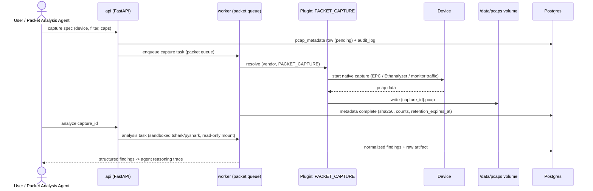

# ADR-0014: Packet Analysis Pipeline

**Status:** Accepted | **Date:** 2026-06-09 | **Decision:** D14

## Context

CLAUDE.md requires packet analysis as a core capability with explicit tool support for **tcpdump, tshark, and Wireshark**, delivered through a dedicated **Packet Analysis Agent**. The brief (D14) fixes the mechanism: tshark/pyshark executed in a **sandboxed worker context**; pcap artifacts stored on a **disk volume** with metadata and a **retention policy in Postgres** (`pcap_metadata`, section 6); and capture orchestration **on devices via a plugin capability** (`PACKET_CAPTURE` in the D6 capability enum, section 4). Celery routing uses the dedicated `packet` queue (D8). Audit and RBAC constraints from D10/D11 apply: captures can contain credentials and PII, so starting a capture and downloading a pcap are audited, permission-gated actions. Packet analysis basics land in milestone M5.

## Decision

### 1. Capture orchestration — plugin capability

- The Packet Analysis Agent (or a user via the API) requests a capture with a typed spec: target device, interface, capture filter (BPF/vendor syntax), duration cap, and size cap.
- `backend/app/engines/packet/` plans the capture and resolves `(vendor_id, PACKET_CAPTURE)` through the plugin registry (D6). Vendor implementations drive the device's native facility — e.g. IOS-XE Embedded Packet Capture, NX-OS Ethanalyzer, JunOS `monitor traffic`, PAN-OS packet capture — via the D7 connectivity stack (netmiko/httpx).
- **Starting a capture is a state-affecting action on a device** but is classified as a *diagnostic* (read-oriented, auto-reverting, bounded) operation: captures execute without a ChangeRequest, gated at `operator`+ (ADR-0010), always audited, and hard-limited by mandatory duration (default 300 s) and size (default 50 MB) caps enforced by the engine — the brief does not explicitly classify captures, and this is the conservative reading consistent with "read-only tools execute directly" (section 5) while keeping device impact bounded. This is ratified as the third tool classification (`diagnostic`, alongside `read_only` and `state_changing`) in the agent framework — see ADR-0003 Decision 3 and `REPO-STRUCTURE.md` section 7; packet captures are currently its only member.
- **M5 capture scope (matches `MVP.md` M5):** worker-side **tcpdump** capture on segments reachable from the platform/worker host (satisfying the CLAUDE.md "tcpdump" requirement in MVP) **plus** device-side capture on `eos` via monitor session. Cisco EPC orchestration and the remaining device-side facilities (NX-OS Ethanalyzer, JunOS `monitor traffic`, PAN-OS capture) follow in the production roadmap; a dedicated capture sidecar for broader host-side visibility is likewise a production-roadmap item.

### 2. Artifact storage and retention

- Retrieved pcaps land on the dedicated `pcaps` volume (Compose named volume / K8s PVC, ADR-0013) at `/data/pcaps/{capture_id}.pcap`. The worker writes; nothing else mounts the volume read-write.
- A `pcap_metadata` row records: capture id, device, interface, filter, requester, start/end timestamps, byte/packet counts, **sha256 of the file** (integrity + audit), storage path, and `retention_expires_at`.
- **Retention policy lives in Postgres**; **PROPOSED:** default retention 30 days, configurable per policy (the brief mandates a retention policy but no default). A Celery beat task on the `packet` queue deletes expired files and marks metadata rows purged (metadata is retained for audit; the payload is not).
- **Wireshark support** = authenticated pcap download for offline analysis: `engineer`+ (ADR-0010), every download audited with file hash (D11), since pcaps may contain cleartext credentials.

### 3. Sandboxed analysis

- Analysis runs **pyshark driving tshark** in Celery workers consuming **only the `packet` queue**. tshark's dissectors regularly carry parsing CVEs and pcaps are untrusted input, so the sandbox is real, not decorative:
  - **PROPOSED** concrete sandbox profile (the brief says "sandboxed worker context" without details): a dedicated worker deployment for the `packet` queue with no device-credential access (it analyzes files, it never logs into devices), pcap volume mounted **read-only**, non-root, all Linux capabilities dropped, `no-new-privileges`, CPU/memory limits, and a hard subprocess timeout per analysis task; tshark invoked with `-n` (no name resolution → no DNS egress from dissection).
- Analysis tasks produce **normalized Pydantic findings** (conversations/endpoints, protocol hierarchy, TCP anomalies — retransmissions/resets/zero-window, DNS query/response pairs and failures, TLS handshake metadata) stored as `raw_artifacts` + structured results, which the Packet Analysis Agent reasons over. The LLM receives **summarized, structured findings — never raw packet bytes** (token economics and data-minimization toward external providers, ADR-0009).
- Reasoning traces link findings to the source `capture_id` so every packet-level conclusion is evidence-backed (D11, "Explain all AI decisions").

## Consequences

**Positive**
- tshark's dissector coverage (thousands of protocols) arrives for free via pyshark, with the dangerous parsing confined to a least-privilege, no-credentials worker.
- Device-native capture through the plugin capability means no agents/taps to deploy and the same UX across Cisco/Juniper/Arista/Palo Alto, with vendor differences hidden behind the registry exactly as D6 intends.
- Hash-recorded, retention-bound, download-audited pcaps satisfy "Audit everything" for the most sensitive artifact class the platform stores.
- Hard duration/size caps make captures safe to delegate to `operator`s and to agent-initiated diagnostics.

**Negative**
- pyshark spawns tshark subprocesses and is slow on multi-hundred-MB captures; large-capture analysis may need chunked processing or a future native parser for hot paths — accepted for M5 scope.
- Device-side capture capabilities vary widely (filter syntax, buffer sizes, export methods); each vendor plugin carries nontrivial, hardware-dependent quirks and test burden.
- The dedicated packet worker adds a deployment unit (or at least a queue-pinned worker class) to operate.
- Storing pcaps on a single volume is not horizontally scalable storage; object-storage backends are a production-roadmap concern, not MVP.

## Alternatives considered

1. **Scapy for capture parsing.** Rejected as the primary engine: pure-Python dissection is an order of magnitude slower on real-world captures and covers far fewer protocols than tshark's dissector library; scapy's strength (packet *crafting*) is not this feature. It remains available for targeted unit-test fixture generation.
2. **dpkt (or pcapkit) for parsing.** Rejected: very fast but low-level — it decodes headers, not application protocols; reproducing even DNS/TLS/BGP dissection quality that tshark provides out of the box would be a large permanent engineering tax.
3. **A full packet platform (Arkime/Moloch, or Zeek for metadata) embedded in the product.** Rejected for MVP: Arkime drags in Elasticsearch and continuous-capture architecture; Zeek is superb at flow/metadata but is a continuous sensor, not an on-demand pcap analyzer, and neither matches the "engineer requests a bounded capture, agent explains it" workflow M5 needs. Zeek may be revisited for streaming telemetry (an open Consultant item, brief section 9).
4. **No server-side analysis — download-only pcaps for local Wireshark.** Rejected: abandons the Packet Analysis Agent requirement entirely; the platform must produce explained, audited findings, not just files.
