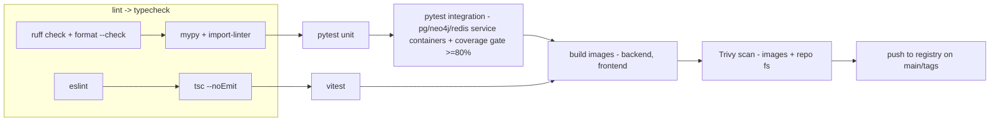

# ADR-0016: Testing and CI/CD

**Status:** Accepted | **Date:** 2026-06-09 | **Decision:** D16

## Context

CLAUDE.md's development standards are explicit: **every feature must include tests, documentation, and API documentation**, and every iteration must improve reliability and maintainability. This platform's failure modes are severe — a bad parser corrupts inventory, a bad agent tool call drafts a wrong firewall change — so test depth on parsers, plugins, and the agent framework is a safety property, not hygiene. The brief (D16) fixes the toolchain: **pytest + pytest-asyncio with a ≥80% coverage gate on core modules; ruff (format + lint) + mypy; frontend vitest + testing-library + eslint + tsc; GitHub Actions pipeline: lint → typecheck → test → build images → Trivy scan**. Section 3 adds that the module-boundary rules are **enforced by import-linter in CI from Phase 2**. CI lands in milestone M0.

## Decision

### 1. Backend testing

- **pytest + pytest-asyncio** (async-first, matching SQLAlchemy 2.0 async / FastAPI per D2). Tests mirror the `app/` layout under `backend/tests/` (brief section 3).
- **Coverage gate ≥80%** via `pytest-cov`, enforced in CI **on the core modules**; **PROPOSED** enumeration of "core" (the brief does not list them): `app/core`, `app/services`, `app/engines`, `app/plugins`, `app/agents/framework`, `app/llm`. Generated/migration code (`alembic/`) is excluded. The gate fails the build, not just warns.
- **Test layers:**
  1. **Unit — parser golden files.** Every vendor plugin capability ships with recorded raw CLI/API output fixtures (`tests/plugins/fixtures/<vendor>/…`) and asserts the exact normalized Pydantic models (D6/D7). Raw output is committed verbatim — the same artifacts the auditability rule stores in production. This is where multi-vendor correctness lives.
  2. **Integration.** Real Postgres (+pgvector), Neo4j, and Redis; **PROPOSED:** provisioned with `testcontainers-python` locally and GitHub Actions service containers in CI. Covers Alembic migrations (upgrade-from-empty on every PR), repository/services code, the Neo4j projection rebuild (D5's "fully rebuildable" claim gets a test), and Celery tasks in eager + real-broker modes.
  3. **Agent tests — no live LLM in CI, ever.** LangGraph graphs run against `langchain_core`'s fake chat models / scripted tool-call responses, asserting routing decisions, structured-output schemas, the read-vs-write separation (a state-changing tool **must** produce a ChangeRequest and block — D11's invariant is a permanent regression test), and reasoning-trace persistence. CI is deterministic and air-gapped; model-quality evaluation is a separate, non-gating concern.
  4. **API tests** with `httpx.AsyncClient` against the app factory: authn/z matrix per ADR-0010 role, and a schema snapshot of the OpenAPI document (which is also the contract for frontend type generation, ADR-0012).
- **Static analysis:** **ruff** is both formatter and linter (replacing black/isort/flake8 — one fast tool, per the brief); **mypy** on `app/` (**PROPOSED:** `strict = true` per-module ratchet — strict on `core`, `schemas`, `plugins/base`, `agents/framework` from day one, expanding outward); **import-linter** contracts encode section 3's rules: `plugins` ⊄ `agents`; `agents` → engines/services only via `agents/framework` tool wrappers; `engines` → `plugins` only via the registry; `core` imports no feature modules.

### 2. Frontend testing

- **vitest + @testing-library/react** for components and hooks (approval flows and reasoning-trace rendering get priority coverage — they are the human-safety UI), **eslint** (typescript-eslint, react-hooks), and **`tsc --noEmit`** as a dedicated typecheck step. Generated API types (ADR-0012) are regenerated in CI and the build fails on drift against the backend OpenAPI snapshot.

### 3. CI/CD — GitHub Actions

Pipeline exactly as D16 orders it, parallel across backend/frontend where stages allow:

- **Workflows** in `.github/workflows/` (brief section 3): `ci.yml` on every PR/push; **PROPOSED:** `release.yml` on version tags publishing images to **GHCR** with the git SHA and semver tags (the brief fixes the pipeline stages but not the registry).
- **Trivy** scans built images *and* the repo filesystem (dependency CVEs + IaC misconfig in `deploy/`); **PROPOSED:** fail on `CRITICAL` CVEs through MVP (matching the M0/M5 exit criteria in `MVP.md`), with the gate raised to `HIGH,CRITICAL` at production release per `PRODUCTION.md` section 5; a reviewed `.trivyignore` covers accepted findings — threshold not specified in the brief.
- Images built once and promoted (never rebuilt per environment), feeding both Compose and Helm targets (ADR-0013).
- Branch protection on `main`: all stages green required; coverage and import-linter are blocking, matching "every feature must include tests".

### 4. Known fixture-honesty limits (F3, 2026-07-10 testing-strategy review)

Two of the fixture layers section 1 relies on ("API tests", "agent tests") are
honest approximations of the real transport, not full-fidelity substitutes —
documented here deliberately, with the compensating controls already shipped,
rather than left as a silent gap:

- **`httpx.MockTransport` / `httpx.ASGITransport` hide real connection-pool
  semantics.** Driving the app in-process over an ASGI transport (as the
  entire `backend/tests/api/` suite does) never opens a real socket or
  exercises `httpx`'s connection-pool, keep-alive, or event-loop-binding
  behavior. This is exactly the seam that hid H9 — `spatiumddi` reusing one
  `httpx.AsyncClient` across per-call `asyncio.run()` loops crashed only in
  production, never in CI (`docs/reviews/2026-07-10-testing-strategy-review.md`
  F3). **Compensating control:** Wave 2 (`docs/reviews/WAVE2-PLAN.md` T5) added
  a loop-teardown regression test for the SpatiumDDI client that drives it
  across separate event loops the way production does, instead of asserting
  request/response shape alone over a fake transport.
- **Fixture SSH hides vendor-syntax divergence.** The netmiko/Tcl fixtures the
  config-write suite drives record and replay command *strings*; they cannot
  certify CLI mode transitions, SSH handshake phases, or a real device's
  intermediate echo — the seam Wave 3's review (C2/C3) found hiding a no-op
  commit and other transport-mode bugs behind green fixture tests
  (`docs/roadmap/LESSONS.md` L-XPORT-1). **Compensating control:** Wave 3
  hardened those fixtures with explicit command-sequence assertions (exit/
  re-enter pinning, anchored integrity tokens, per-step finalize checks before
  advancing) so the fake at least proves the *sequence* a real device would
  receive, even though it still cannot prove the device's *response* to that
  sequence.
- **A synthetic auth probe proves nothing about real routes.** Mounting a
  probe route with its own `Depends(require_role(...))` shows the dependency
  *can* raise 403 — not that any real router actually wires it in. Closed by
  hitting real protected routes directly: `test_account.py`'s
  `test_flagged_user_blocked_on_real_protected_route` (forced-password-change
  guard through `require_role` -> `get_active_user`) and `test_role_matrix.py`
  (one boundary-pair per router's own minimum `require_role` tier) both call
  real `/api/v1/...` routes, never a mounted fake.

Closing these seams for real needs a live-lab or `kind`-backed transport, which
stays the P-phase (live-lab/`kind`) track — not a unit/API-layer addition.

## Consequences

**Positive**
- Golden-file parser tests turn the riskiest multi-vendor surface into cheap, reviewable, vendor-realistic regression tests — adding a vendor (M1's IOS/IOS-XE/EOS onward) starts with committing real device output.
- Deterministic fake-LLM agent tests keep CI fast, free, and air-gapped while still pinning the safety-critical invariants (approval gating, structured outputs, trace persistence).
- ruff-as-formatter+linter and a single `ci.yml` keep the toolchain small enough that contributors actually run it locally (`pre-commit` mirrors CI — **PROPOSED**).
- import-linter makes the modular-monolith boundaries (D1) machine-enforced, which is the only way they survive contact with deadlines.

**Negative**
- Integration jobs spinning Postgres+Neo4j+Redis are the slow tail of CI (~minutes); demands caching discipline and tiered triggers to keep PR feedback under ~10 minutes.
- A blanket 80% line-coverage gate can be gamed by low-value tests and can block urgent fixes; it measures execution, not assertion quality — review still carries that weight.
- Fake-LLM testing cannot catch real-model regressions (prompt drift, provider behavior changes); a separate non-CI evaluation harness becomes necessary as agents mature, and that work is *not* covered by this ADR.
- Golden fixtures rot as device OS versions evolve; each vendor plugin owner must refresh fixtures when supporting new OS trains, an ongoing curation cost.

## Alternatives considered

1. **tox/nox as the local+CI test orchestrator.** Rejected: a single Python version target (3.11+, D2) and a GitHub Actions matrix leave tox little to do beyond adding an indirection layer and a second place where env config drifts; plain `pytest`/`ruff`/`mypy` invocations mirrored in a Makefile/`pre-commit` are simpler.
2. **black + isort + flake8 (+plugins) instead of ruff.** Rejected: three tools, three configs, slower runs; ruff implements the same rule sets in one Rust binary and is what D16 specifies. No capability we need is lost.
3. **Jest instead of vitest.** Rejected: the frontend is Vite-built (D12); vitest reuses the Vite transform pipeline (no parallel babel/ts-jest config to keep in sync) and is the brief's choice. Jest would mean duplicating module/alias config solely for tests.
4. **Grype/Snyk instead of Trivy; GitLab CI/Jenkins instead of GitHub Actions.** Rejected: Trivy is OSS, runs offline (matters for self-hosted forks of this repo), covers images + fs + IaC in one tool, and is named in D16. The repo lives on GitHub and the brief fixes GitHub Actions; maintaining a second CI dialect serves no current constituency.
5. **Mock-everything unit tests instead of containerized integration tests.** Rejected for data-layer code: mocked SQLAlchemy/Neo4j tests reliably pass while real queries fail (dialect, transaction, and Cypher behavior); the system-of-record/projection contract (D4/D5) is only meaningful against real engines.
