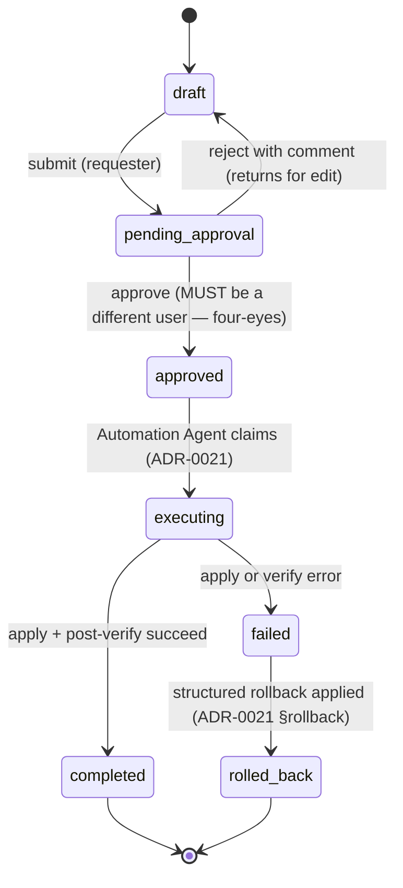

# ADR-0020: ChangeRequest Workflow and Four-Eyes Approval

**Status:** Accepted | **Date:** 2026-06-18 | **Milestone:** M5 (realizes D11 brief §7 — the persistent write-path spine)

## Context

M5 is the first **write-path** milestone: the platform can now change the network (`CONFIG_RESTORE`/`CONFIG_DEPLOY` per ADR-0021, DDI record add/modify/delete per ADR-0022). CLAUDE.md mandates **"Human approval for changes"** and **"Audit everything"**, and ADR-0011 (D11) §3 already fixed the lifecycle, the four-eyes rule, and the `change_requests` + `approvals` tables *as a decision*. What did **not** yet exist in code: ADR-0011 §3 was a decision; M3/M4 shipped only `agents/framework/approval.py` — an in-process `ApprovalGate`/`DenyAllGate` that **hard-rejects** every state-changing tool with an audit entry, because there was no persistent ChangeRequest to create. M5 must now (a) build the persistent ChangeRequest spine and (b) rewire that gate from hard-reject to CR-creation.

This ADR fixes the concrete state machine, the data-model shape, and — security-critically — **where the four-eyes rule is enforced and why a UI-only check is insufficient**. It binds ADR-0011 §3 to the M5 implementation; ADRs 0021/0022 reference this ADR for "writes only ever run via an approved ChangeRequest."

## Decision

**A persistent ChangeRequest is the single spine for every state-changing action. Its lifecycle is a guarded server-side state machine; the four-eyes rule (approver ≠ requester) is enforced in the ChangeRequest service and a database constraint — never in the UI alone; every transition writes an `audit_log` entry with before/after state and a reasoning-trace link.**

### 1. Lifecycle state machine

- Terminal states: `completed`, `rolled_back`. `failed` is non-terminal — it transitions to `rolled_back` once the structured rollback (ADR-0021) completes; a `failed` CR whose rollback also fails stays `failed` and raises an operator alert (it is never silently closed).
- **Every** edge is a guarded transition implemented in the ChangeRequest service (`backend/app/services/change_requests/`). Guards validate the *from*-state, the actor's RBAC, the four-eyes predicate, and (for `approved → executing`) that the caller is the Automation Agent. No transition is performed by an UPDATE outside the service.
- There is **no auto-approve edge in any environment**. Agents may author and explain a CR (`draft`, then `submit`); only a human performs `pending_approval → approved`.

### 2. Data model — `change_requests` + `approvals`

`change_requests`:
`{ id, state (enum), requester_id (FK users), generating_session_id (FK agent_sessions, nullable for human-authored), reasoning_trace_id (FK reasoning_traces, nullable), kind (config_restore | config_deploy | ddi_record), target_refs (JSONB — device ids / DDI object refs), payload (JSONB — the exact diff/API calls to apply), rollback_plan (JSONB — ADR-0021: snapshot ref or inverse-change spec), before_state / after_state (JSONB — the audited diff, §4, kept alongside the applied payload), four_eyes_required (bool, default true), created_at, updated_at }`.

`approvals` (one row per approve/reject decision — full history, not a mutable column):
`{ id, change_request_id (FK), decision (`approve` | `reject`), actor_id (FK users), comment, created_at }`.

> **Decision vocabulary (binding):** the `decision` column persists the imperative values **`approve` / `reject`** (matching `ApprovalDecision` in `backend/app/models/change_requests.py`). Code is the source of truth for this literal; every reference in this ADR uses `approve` / `reject` accordingly.

- **Database-level four-eyes backstop:** a constraint trigger (it spans two tables, so a single-row `CHECK` cannot express it) enforces that no `approvals` row with `decision = 'approve'` may have `actor_id = change_requests.requester_id` for that CR. The trigger is **conditional on `four_eyes_required`**: it raises **only when `change_requests.four_eyes_required = true` AND `decision = 'approve'` AND `actor_id = change_requests.requester_id`**. This keeps the backstop in force for the default secure path while leaving the documented `four_eyes_required = false` path (self-approval producing a distinct `approvals` row, §3) actually reachable — an unconditional trigger would reject the very self-approval the disabled mode is meant to allow, making that mode unbuildable. This is defense-in-depth behind the service guard (§3), in the same spirit as ADR-0011 §2's DB-enforced append-only audit. **It is a best-effort backstop, not a complete invariant — see §3 for exactly what it does and does not guarantee.** The migration test (M5 task #2) covers both cases: enabled rejects self-approval, disabled allows it.
- The `payload`, `target_refs` and `rollback_plan` are captured **at submit time** and are immutable through approval/execution — what an approver reviews is exactly what executes (no TOCTOU between approval and apply). `before_state` / `after_state` are the audited diff (§4), carried alongside the applied `payload` rather than in place of it. Re-editing requires `reject → draft` and a fresh submit.
- `payload` may carry secret-bearing config/DNS content; any rendering toward an LLM (diff/intent preview, agent explanation) passes the A9 redaction layer (`llm/redaction.py`, ADR-0011/0017). The stored payload itself is verbatim (parity with `config_snapshots`, ADR-0017 §2) so execution replays a real change.

### 3. Four-eyes rule — enforced server-side, on by default

- **Rule:** the approver MUST differ from the requester. `four_eyes_required` defaults to **true** (secure by default) and is configurable per deployment policy; when disabled, the disablement itself is an audited config event and self-approval still produces a distinct `approvals` row attributed to the actor.
- **Who may disable it (binding):** waiving four-eyes (`four_eyes_required = false`) is an **admin-only** action — it is *not* a free per-CR keyword any engineer can flip on their own CR, because that would collapse the two-person control to one person (the author who will also approve). The ChangeRequest service rejects `create_draft(..., four_eyes_required=False)` from any role below `admin` (ADR-0010 §3), aligning with ADR-0010 §3's deployment-level/admin governance of approval policy. The waiver is recorded as its own first-class audit event — action `change_request.four_eyes_waived`, attributing the waiving role — emitted **separately from** `change_request.created`, so a waiver is never just an inline flag inside the create event.
- **Enforcement point:** the predicate `actor_id != requester_id` is checked **inside the ChangeRequest service transition guard** for `pending_approval → approved`, before any state write, and is additionally backstopped at approval-insert time by the DB constraint trigger (§2) — within the trigger's scope (it re-checks on every `approvals` write, but not on later CR-row mutations; see the backstop-scope note in §3). The API approval endpoint (M5 task #15, `changes` router) is a thin caller of this service.
- **Why UI-only is insufficient (security-critical):** a UI check disables a button but the approval is ultimately an HTTP request to the API. Any client that bypasses the SPA — `curl`, a stale/forged frontend bundle, a scripted client, a future integration, or an XSS-driven request riding the victim's session — reaches the endpoint directly. If four-eyes lived only in React, a requester could self-approve their own firewall change with one API call. Enforcing in the service (every transition path funnels through it) plus a DB constraint trigger means self-approval cannot be performed through the application at all, and a direct `INSERT` of a self-`approve` row on a four-eyes CR is also rejected at the database. This is exit criterion #2 (self-approval rejected under default config, automated test).
- **What the DB trigger does and does not guarantee (scope of the backstop):** the constraint trigger fires only on the `approvals` table and reads `change_requests.requester_id` / `.four_eyes_required` at the instant the approval row is written. It is therefore a **best-effort backstop**, not a complete, injection-proof invariant. It does **not** re-validate when the `change_requests` row itself is mutated: an attacker with a SQL foothold who can `UPDATE change_requests SET requester_id = <approver_id>` (retroactively making requester == approver) or `UPDATE change_requests SET four_eyes_required = false` after a legitimate different-user approval was recorded would leave a conflicting `approve` row the trigger never re-checks. The real invariant — **the CR row (notably `requester_id` and `four_eyes_required`) is immutable post-submit** — is enforced **only in the ChangeRequest service guard** (task #3), not at the database. The DB trigger raises the bar for a write-only `approvals` foothold; it is not a substitute for the service-level immutability guard, and the two together (not the trigger alone) are what make application-path self-approval impossible.

### 4. Audited transitions + reasoning-trace link

- Every transition writes an `audit_log` entry (ADR-0011 §2): actor (user id, plus agent name when an agent authored), action (`change_request.<from>_to_<to>`), target (`change_request` + id and the target devices/DDI refs), **before/after state JSONB**, request id, and the `reasoning_traces` link when the CR originated from an agent run. The full chain (requester → approver → executor → before/after → trace) is reconstructable from `audit_log` + `approvals` alone — this is the audited golden path of exit criterion #1.
- **Field realization (binding).** The above field list maps to persisted columns/detail as follows, so the spec and the schema do not drift:
  - *actor* — `audit_log.actor` (`user:<id>` for human transitions; `agent:automation` — the verified Automation principal — for the `approved → executing → completed/failed/rolled_back` handoffs, derived from the caller identity, never a hardcoded literal).
  - *action* — `audit_log.action` (`change_request.<from>_to_<to>`, `change_request.created` for the initial draft, and `change_request.four_eyes_waived` for an admin disabling four-eyes, see §3).
  - *target* — `audit_log.target_id` is the `change_request` id; `audit_log.detail.target_refs` carries the **id-only** affected device/DDI refs (a stable projection of `change_requests.target_refs`). The secret-bearing `payload` is **never** written to `audit_log`.
  - *before/after state* — `audit_log.detail.before_state` / `.after_state` (the lifecycle states).
  - *request id* — `audit_log.request_id`: a **nullable correlation id** (plain indexed UUID, no FK — there is no request table; mirrors `reasoning_trace_id`). It is the inbound HTTP request/correlation id, captured at the route layer (task #15) and threaded through the CR service transition calls. It is `NULL` for transitions raised outside an HTTP request — e.g. the Automation Agent's background `mark_*` handoffs, which carry no inbound correlation id — so `request id` is "present when there is an inbound request," not "always non-null."
  - *reasoning-trace link* — `audit_log.reasoning_trace_id`, copied from the CR's `reasoning_trace_id` (`NULL` for human-authored CRs).

### 5. RBAC — who may approve

- Per the ADR-0010 §3 role matrix (the binding matrix): **`engineer`+ may author/edit, submit, *and* approve CRs** — `create/edit ChangeRequests` and `approve ChangeRequests` are both `engineer` capabilities there — and the four-eyes predicate (approver ≠ requester) still applies on top of the role, so a CR authored by one engineer must be approved by a *different* engineer+. `admin` inherits `engineer`. `operator` is **read-only on the CR lifecycle**: per ADR-0010 §3 an operator may run read-only agent sessions, trigger discovery runs, request packet captures, and run config backups, but may **not** author, submit, or approve CRs; it can see CRs and the audit chain (as `viewer` can) but takes no lifecycle action. Approval rights — and authoring rights — are checked in the same service guard as the four-eyes predicate. (This row is aligned with ADR-0010 §3 to avoid silent drift between the two matrices on who may author a write; an earlier draft mistakenly granted operators CR-authoring rights.)

## Consequences

**Positive**
- The single most-feared failure mode ("the AI changed my firewall") has no application write path that is not a service-guarded transition out of an `approved` CR authored by a *different* user.
- Defense-in-depth four-eyes (service guard + DB constraint trigger) survives a frontend bypass, a scripted client, and an application bug. The DB trigger is a best-effort backstop, not a complete injection-proof invariant: it covers a write-only `approvals` foothold but does not re-validate CR-row mutations (`requester_id` / `four_eyes_required`), whose post-submit immutability is service-enforced only (§3). This is the honest claim for an enterprise security review — the trigger raises the bar, the service guard owns the invariant.
- Immutable approved-payload eliminates the approve-then-swap (TOCTOU) class of attack and makes the audit chain self-consistent.
- The `approvals`-as-history table (not a column) preserves every decision and comment, including rejections — useful for audit and for re-work context.

**Negative**
- Human approval adds latency to every change and rules out closed-loop auto-remediation (inherited from ADR-0011; a future policy ADR would be required to revisit).
- The cross-table four-eyes constraint needs a constraint trigger (a single-row `CHECK` cannot reference another table), adding a small migration-maintenance surface verified by a dedicated migration test (M5 task #2).
- Capturing full before/after state in `audit_log` duplicates some data also in `change_requests`/`config_snapshots` — accepted for self-contained audit records (same trade-off ADR-0011 already took).

## Alternatives considered

1. **UI-only four-eyes (disable the approve button for the requester).** Rejected, security-critical: the approval is an API call; any non-SPA client reaches the endpoint directly, so a button check is cosmetic. Enforcement must live where every path converges — the service — backed by a DB constraint.
2. **Mutable single `approval` column on `change_requests` instead of an `approvals` history table.** Rejected: loses rejection history and comment trail, and a mutable column is easier to overwrite than an append-only decision log. The history table mirrors the append-only posture of `audit_log`.
3. **Allow editing the payload after approval (re-render at execution).** Rejected: opens an approve-then-swap TOCTOU window — the approver would not be approving what executes. Re-work goes through `reject → draft → submit` so approval always binds to a frozen payload.
4. **Keep the M3 `DenyAllGate` and bolt approval on as a separate side-channel.** Rejected: two parallel notions of "is this change allowed" drift apart. M5 rewires the one gate (ADR-0020 §ref by task #4) to create a CR, so there is exactly one spine.
