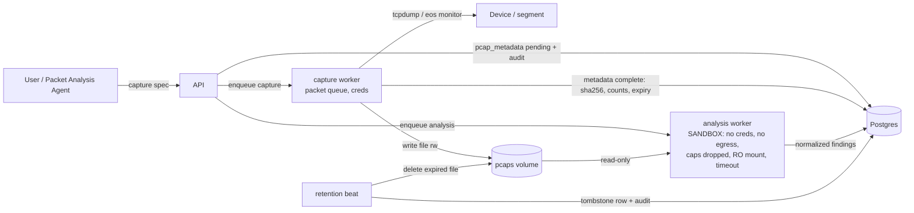

# ADR-0023: Packet Analysis Sandbox and pcap Retention

**Status:** Accepted | **Date:** 2026-06-18 | **Milestone:** M5 (realizes D14 — implementation of ADR-0014's proposed sandbox + retention)

## Context

ADR-0014 (D14) fixed the packet-analysis pipeline as a *decision* and flagged its sandbox and retention defaults as **PROPOSED**: "a dedicated worker deployment for the `packet` queue … pcap volume mounted read-only, non-root, all Linux capabilities dropped, no-new-privileges, CPU/memory limits, hard subprocess timeout" and "default retention 30 days … a Celery beat task … deletes expired files and marks metadata rows purged." M5 builds the implementation (`engines/packet/`, M5 task #8) and must turn those proposals into a concrete, testable sandbox profile, capture-orchestration mechanics, the `pcap_metadata` model, and the retention/tombstone/audit job.

The driving threat: **pcaps are untrusted input** and **tshark dissectors carry parsing CVEs**. A malicious or malformed pcap analyzed by tshark is remote-attacker-controlled input hitting a C parser inside our worker. The sandbox is a real containment boundary, not decoration. Secondarily, pcaps hold **packet payloads** (cleartext credentials, PII) — the most sensitive artifact class the platform stores — so retention, download, and deletion are all audited and permission-gated (ADR-0011 §2).

## Decision

**A dedicated, least-privilege `packet`-queue worker parses untrusted pcaps with tshark/pyshark under a concrete sandbox profile (resource limits, no network egress, dropped capabilities, non-root, read-only pcap mount, subprocess timeout). Captures are orchestrated worker-side (`tcpdump`) and device-side (`eos` monitor-session) via the `PACKET_CAPTURE` capability. pcap files live on a disk volume; `pcap_metadata` lives in Postgres; a retention beat job deletes expired files and tombstones (never deletes) their metadata rows, audited. Downloads are Wireshark-compatible and audited.**

### 1. Sandboxed packet worker (D14 — concrete profile)

A dedicated worker **deployment/class** consuming **only the `packet` queue** (ADR-0008), distinct from the `config`/`docs`/default workers:

- **No device-credential access** — this worker never logs into devices; it analyzes files. It is not granted the credentials-service role and the vault is unreachable from it (separation from the capture role, §2).
- **No network egress** — Compose: attached only to an internal network with no route out; K8s: a `default-deny` egress NetworkPolicy (only Postgres for results + the pcap volume). tshark is invoked with **`-n`** (no name resolution) so dissection performs no DNS/lookups.
- **Dropped capabilities** — `cap_drop: [ALL]`, `no-new-privileges`, **non-root** UID, read-only root filesystem where feasible.
- **pcap volume mounted read-only** — the analysis worker cannot modify or delete pcaps (only the capture worker and the retention job write/delete, §2/§3).
- **Resource bounds** — CPU/memory limits on the container plus a **hard per-task subprocess timeout** on the tshark child (pyshark spawns tshark); oversized/slow captures fail the task rather than exhausting the worker.
- **Data minimization to the LLM** — analysis produces normalized Pydantic findings (conversations/endpoints, protocol hierarchy, TCP anomalies, DNS pairs, TLS metadata) stored as `raw_artifacts` + structured results; the LLM receives **summarized structured findings, never raw packet bytes** (ADR-0014 §3, ADR-0009 economics + minimization).

### 2. Capture orchestration (`PACKET_CAPTURE`)

- M5 capture scope (matches ADR-0014 §1 / MVP.md §7): **worker-side `tcpdump`** on segments reachable from the worker host, **plus device-side capture on `eos`** via a monitor session (SPAN/mirror to a capture point). Cisco EPC / NX-OS Ethanalyzer / JunOS / PAN-OS are production-roadmap.
- Capture runs on the `packet` queue with a typed spec (target/interface, BPF/vendor filter, **mandatory duration cap default 300 s, size cap default 50 MB** enforced by the engine). Starting a capture is the **`diagnostic`** tool class (ADR-0014 §1 / ADR-0003): it executes **without a ChangeRequest** (bounded, auto-reverting, read-oriented), gated at `operator`+, always audited. This is the one exception to "device-affecting ⇒ CR" and is deliberately scoped: a capture cannot change running config or DDI state.
- The **capture** worker writes the retrieved pcap to the volume (read-write mount); the **analysis** worker (§1) only reads it. The two roles are separated so the credential-bearing capture path and the untrusted-parsing path never share privileges.

### 3. pcap storage + `pcap_metadata`

- pcap files: dedicated **`pcaps` disk volume** (Compose named volume / K8s PVC, ADR-0013) at `/data/pcaps/{capture_id}.pcap`.
- `pcap_metadata` (Postgres): `{ id, capture_id, device_id (nullable for worker-side tcpdump), interface, filter, requester_id, started_at, ended_at, byte_count, packet_count, sha256 (integrity + audit), storage_path, retention_expires_at, tombstoned_at (nullable), tombstoned_reason }`. The sha256 is recorded at capture-complete and re-checked on download.

### 4. Retention job + tombstone + audit

- A **Celery beat task on the `packet` queue** runs on a schedule, finds rows where `retention_expires_at < now()` and `tombstoned_at IS NULL`, **deletes the pcap file from the volume**, and sets `tombstoned_at` + `tombstoned_reason = 'retention_expired'`. **The metadata row is tombstoned, never deleted** — the audit record of "a capture existed and was purged" must survive (ADR-0011 "Audit everything"); the sensitive payload (the file) is what is removed.
- Default retention **30 days**, configurable per policy. Every purge writes an `audit_log` entry (actor = system/retention, action = `pcap.purged`, target = capture id, file hash). This is exit criterion #5 (expired pcaps removed; metadata tombstoned + audited) and dovetails with the M5 hardening retention pass (task #19).

### 5. Wireshark-compatible download

- pcap download is the **Wireshark interop deliverable**: authenticated, `engineer`+ (ADR-0010), every download audited with the file hash (ADR-0011 §2), since pcaps may contain cleartext credentials. The stored file is a standard pcap/pcapng written by tcpdump/tshark so it opens cleanly in Wireshark (exit criterion: "same pcap opens cleanly in Wireshark"). A tombstoned capture's download 404s (the file is gone; metadata remains for audit).

## Consequences

**Positive**
- The dangerous work (tshark parsing untrusted bytes) is confined to a no-credentials, no-egress, capability-dropped, read-only-mount, timeout-bounded worker — a real containment boundary that limits a dissector-CVE exploit to a sandbox with nothing worth stealing and nowhere to exfiltrate.
- Splitting capture (credentials, rw) from analysis (no credentials, ro) means neither role holds both the keys and the untrusted-parser exposure.
- Tombstone-not-delete keeps a faithful audit history of every capture while removing the sensitive payload on schedule — satisfies "Audit everything" and retention simultaneously.
- Device-native + worker-side capture behind one `PACKET_CAPTURE` capability keeps the UX uniform and the engine vendor-agnostic (ADR-0006).

**Negative**
- A dedicated `packet` worker class is an extra deployment unit / queue-pinned worker to operate (inherited from ADR-0014).
- pyshark spawns tshark and is slow on multi-hundred-MB captures; the subprocess timeout will fail very large captures rather than chunk them — chunked/native parsing is a production-roadmap item (ADR-0014 negative).
- A single pcap volume is not horizontally scalable storage; object-storage backends are production-roadmap.
- Classifying capture as `diagnostic` (no CR) is a deliberate exception to the CR gate; it is justified by hard duration/size caps and read-orientation but is a documented widening of the "no device effect without approval" stance, bounded to captures only.

## Alternatives considered

1. **Analyze pcaps in the general worker pool (no dedicated sandbox class).** Rejected, security-critical: that pool holds device credentials and has Postgres/Neo4j/Redis reachability; a tshark dissector CVE there is a credential-theft and lateral-movement path. The whole point of D14 is that untrusted parsing runs where there is nothing to steal.
2. **Hard-delete `pcap_metadata` rows on retention.** Rejected: destroys the audit record that a capture ever existed and was purged. Tombstoning removes the payload (the file) while preserving the audited history, consistent with ADR-0011 and the config-snapshot retention posture (ADR-0017 §1).
3. **Route captures through the ChangeRequest approval gate like config/DDI writes.** Rejected: a bounded, auto-reverting diagnostic capture is not a persistent state change; gating it behind four-eyes approval would make routine troubleshooting unusable. ADR-0014's `diagnostic` class (operator+, audited, capped) is the calibrated middle ground.
4. **Server-side decode-and-discard (never store the pcap, only findings).** Rejected: abandons the Wireshark interop deliverable (MVP.md §7) and re-analysis; engineers must be able to download the exact capture for offline analysis. Retention + tombstone bounds the storage risk instead.
