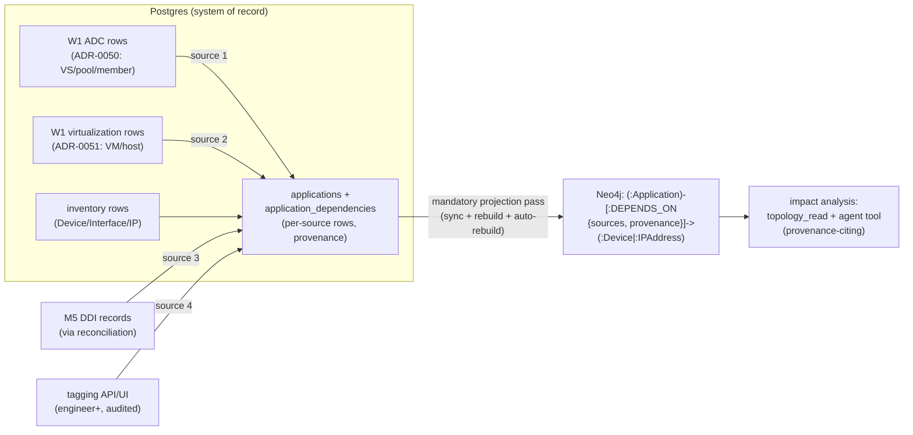

# ADR-0052: Application-Dependency Topology — PG-Backed `Application`/`DEPENDS_ON` Layer, Four Derivation Sources, Direct-Write Tagging Under RBAC

**Status:** Proposed | **Date:** 2026-07-05 | **Milestone:** P4 W0

## Context

CLAUDE.md's Topology section mandates **application dependencies** alongside L2,
L3, and DNS, with relationships stored in Neo4j. `PRODUCTION.md` §2.4 schedules
the delivery in P4: "`Application` nodes + `DEPENDS_ON` edges in Neo4j, derived
from F5 VIP→pool→member chains, VMware VM placement, DNS dependencies (M5), and
manual application tagging in the UI." Both the node label (`Application`) and
the relationship type (`DEPENDS_ON`) are already reserved in the fixed graph
model (brief §6, ADR-0005 §1) — this ADR fills them in. It is the **design
gate**: the code lands in **W2** (`P4-PLAN.md` §3 — T1 schema + projector, T2
derivation, T3 tagging, T4 impact analysis), field-for-field and
mechanism-for-mechanism against the sections below. No code in this ADR.

The decision is bounded by:

- **D5 / ADR-0005 — Neo4j is a rebuildable projection.** Postgres is the sole
  system of record; Neo4j never holds data that exists nowhere else; a
  drop-and-reproject must always reconstruct the graph from Postgres alone.
  The application layer inherits this contract without exception, and the P3
  reliability machinery that enforces it — the auto-rebuild reconciler
  (`backend/app/engines/topology/auto_rebuild.py`), the destroy-and-rebuild
  drill, and its hardware-free bite proof
  (`ci/kind/selftest/neo4j-rebuild-bite.sh`) — must stay green with the new
  kinds (P4-PLAN §0a: "the P3 G-REL mechanism doesn't silently rot").
- **The existing projection mechanics** (`backend/app/engines/topology/projector.py`):
  nodes `MERGE`d by the per-label key property from
  `app.knowledge.schema.NODE_KEY_PROPERTY` with `SET n = row.props`; edge
  endpoints `MATCH`-ed, never created (no phantom nodes); every element stamped
  `last_projected_at`; a **stale sweep deletes every node/edge of the projected
  labels/types not stamped in the pass**. Whatever this ADR adds must converge
  under exactly those mechanics.
- **W1 upstream models** (built in parallel W0): ADR-0050 fixes the F5 ADC
  surface — `NormalizedVirtualServer` / `NormalizedPool` (nested
  `NormalizedPoolMember`) via the `ADC_SERVICES` capability; ADR-0051 fixes the
  VMware virtualization surface — `NormalizedVirtualMachine`,
  `NormalizedHypervisorHost`, `NormalizedComputeCluster`,
  `NormalizedPortGroup` via `VIRTUALIZATION_INVENTORY`. The W2 derivation
  consumes their **persisted** inventory rows (W1 binds the row tables), never
  live plugin calls.
- **The M5 DNS-dependency layer** (`engines/topology/dns.py`): `derive_dns` is
  a pure derivation producing `DnsZone`/`DnsRecord` nodes and
  `IN_ZONE`/`RESOLVES_TO` edges, with IP-literal reconciliation against
  inventory `Device`/`Interface` rows. Two observed facts about it are
  load-bearing for this design (verified at source, 2026-07-05):
  1. **The optional-layer kwarg pattern is a deletion hazard.** `project()`
     sweeps *all* of `PROJECTED_NODE_LABELS`/`PROJECTED_REL_TYPES`
     unconditionally (`projector.py` stale sweep); the DNS layer only survives
     a pass when the caller passes `dns=`. The production call sites —
     `workers/tasks/topology.py::_project_run` (per-discovery-run sync) and
     `engines/topology/rebuild.py::rebuild` (operator/auto rebuild) — do **not**
     pass `dns=`, so any pass they run sweeps the DNS layer clean. The
     application layer must not repeat this pattern (§5).
  2. **M5 DNS records are not persisted in Postgres.** `derive_dns` consumes
     live `DdiDnsCapability` output; there is no DNS-record row model in
     `app/models`. A `DnsRecord` node is therefore **not rebuild-safe** and
     cannot be a `DEPENDS_ON` edge target under the rebuild-from-Postgres-alone
     contract (§2.3, §5).
- **The tagging write-path decision — already made.** The user decided
  (2026-07-05, recorded in `P4-PLAN.md` §3 W0-T3): manual application tagging
  is a **direct write under RBAC (engineer+) with full audit on every change**;
  CR-gating was considered and **declined** — tags never touch a device, and
  the device-inventory precedent (`api/v1/devices.py`: create/update/delete
  are direct `Engineer`-floor writes) already establishes the pattern. This ADR
  records the decision and its security rationale (§7); the open Consultant §12
  item ("app-tagging ownership") may later refine the **role floor only**, not
  the mechanism.
- **Flow-telemetry enrichment (NetFlow/gNMI) is out of scope** until the
  Consultant telemetry item is answered (`PRODUCTION.md` §2.4, P4-PLAN §0) —
  the source set below is closed at four.

## Decision

**Add a PG-backed application-dependency layer: two new Postgres tables
(`applications`, `application_dependencies`) as the system of record behind an
expand-only Alembic migration, projected to Neo4j as `Application` nodes and
`DEPENDS_ON` edges under the existing ADR-0005 projector mechanics. Edges are
derived from exactly four sources — F5 VIP→pool→member chains, VMware VM→host
placement, M5 DNS dependencies, and manual tagging — with per-source provenance
on every edge, per-source row ownership (a derivation pass replaces only its
own source's rows), additive-evidence conflict semantics with manual-wins
attribute precedence, and idempotent re-derivation by natural key. Derivation
is part of the mandatory whole-inventory projection pass (never an optional
kwarg), so every production sync/rebuild path reproduces the layer from
Postgres alone. Tagging is a direct write at the `engineer` role floor with a
full audit entry per mutation (decided; CR-gating declined). Impact analysis
ships as a `knowledge/topology_read.py` extension plus a read-only
Troubleshooting-Agent tool whose answers cite per-edge provenance.**

### 1. Postgres schema — system of record (W2-T1 binds field-for-field)

Two new tables, added by one **expand-only** Alembic migration (new tables
only; no existing table/column is altered — the ADR-0004/N-2-upgrade
expand/contract discipline). Names are **final**. Enum-valued columns are
plain `String` with app-layer `StrEnum` validation plus CHECK constraints —
not native PG enums — so SQLite (unit suite) and PostgreSQL (`tests/pg/`)
agree on semantics (P2 recurring-major lesson, P4-PLAN §0a).

**`applications`** — one row per application identity:

| Column | Type | Notes |
|---|---|---|
| `id` | UUID PK | Projection key (`pg_id` in Neo4j, §5) |
| `name` | `str` (min 1, max 255) | Unique **case-insensitively** (unique index on `lower(name)`) |
| `description` | `str \| None` | Free text |
| `fqdns` | JSONB list of `str`, default `[]` | FQDNs the application answers on; input to the DNS source (§2.3). Settable manually; the F5 derivation may seed one when a virtual-server name is a valid FQDN (W2-T2 binds the heuristic) |
| `origin` | `str` — `manual` \| `derived` | Who owns the row's lifecycle (§3) |
| `origin_ref` | `str \| None` | For `derived` rows: the stable natural key of the deriving object (e.g. `f5:<device_pg_id>:<vs_full_path>`), unique where not null — re-derivation MERGEs on it so the row UUID (and hence the Neo4j node key) is **stable across re-runs** |
| `owner` | `str \| None` | Free-text owner/team annotation |
| `created_by` | UUID FK → `users.id`, nullable | Set for `manual` rows; null for `derived` |
| `created_at` / `updated_at` | tz-aware timestamps | House mixins |

**`application_dependencies`** — one row per (application, target, source)
assertion:

| Column | Type | Notes |
|---|---|---|
| `id` | UUID PK | |
| `application_id` | UUID FK → `applications.id`, `ON DELETE CASCADE` | |
| `target_kind` | `str` — `device` \| `ip_address` | The projected target label, lower-snake (§2.3 restricts targets to rebuild-safe kinds) |
| `target_ref` | `str` | The target row's PG UUID as string — **by construction the target label's Neo4j key property value** (`NODE_KEY_PROPERTY` is `pg_id` for both `Device` and `IPAddress`), so projection resolves endpoints without joins |
| `source` | `str` — `f5` \| `vmware` \| `dns` \| `manual` | The asserting derivation source (§2) |
| `provenance` | JSONB | The evidence chain for this assertion (§3.1): ordered list of `{"kind": ..., "ref": ...}` steps |
| `derived_at` | tz-aware timestamp | When this source last asserted the row |
| `created_by` | UUID FK → `users.id`, nullable | Set for `source='manual'` rows only |

Constraints: unique on `(application_id, target_kind, target_ref, source)` —
the **natural key** idempotent re-derivation upserts against (§4); index on
`(target_kind, target_ref)` for reverse ("what depends on X") reads; CHECK
constraints on the `source`/`target_kind`/`origin` value sets.

There is **no separate tag table**: a manual tag *is* an
`application_dependencies` row with `source='manual'` (plus, when needed, a
`manual`-origin `applications` row). One model serves all four sources; the
UI's "tag object X into application A" is exactly one row.

### 2. The four derivation sources (closed set for P4)

Sources 1, 2, and 4 consume **persisted Postgres rows only** (never live
plugin calls), so re-running their derivation needs nothing beyond the system
of record. **Source 3 is the named input-side exception**: M5 DNS records are
not persisted in Postgres (Context), so its evidence — the DDI-normalized
records for each application's `fqdns` — is fetched by the **caller** at
derivation time on the post-discovery-run trigger (§5), the same
caller-loads-inputs shape the M5 `derive_dns` call path uses today. The
exception is inputs only and does not touch the rebuild contract: every
source's **results** persist as `application_dependencies` rows, and
rebuild/projection read only those rows (§6.1) — source 3 needs DDI
reachability to *refresh* its rows, never to rebuild the graph from them.
Each source emits `application_dependencies` rows carrying its own `source`
value and records its evidence chain in `provenance`. W2-T2 implements all
four behind one deterministic, pure derivation function mirroring the
`derive_dns` / `derive_topology` house pattern (no I/O inside the derivation;
inputs loaded by the caller; output independent of input ordering).

| # | Source | Evidence consumed (input contract per intro) | Applications created | Edges emitted |
|---|---|---|---|---|
| 1 | **F5 VIP→pool→member** | W1 persisted ADC rows (ADR-0050: virtual servers, pools, members) + inventory `Device`/`Interface`/IP rows for member-address reconciliation | One `derived` application per virtual server (`origin_ref = f5:<device_pg_id>:<vs_full_path>`), name from the VS name — the VS *is* the service identity (`PRODUCTION.md` §2.4: "the primary source of service-to-server mappings") | app → each pool member's reconciled endpoint: `ip_address` when the member IP reconciles to an inventory IP row, else `device` when it reconciles to a device; unreconcilable members emit **no edge** (mirrors unreconciled `RESOLVES_TO`) and are counted in derivation stats |
| 2 | **VMware VM→host placement** | W1 persisted virtualization rows (ADR-0051: VMs with guest IPs, host placement) | **None** — a VM is a workload, not an application | A *chain extender*: for every application-linked VM — linked by a manual tag on the VM's endpoint or by member-IP ↔ guest-IP reconciliation with source 1 — emit app → `device` (the hypervisor host's inventory device row), provenance recording the VM hop. Where the host is not in inventory as a device, no edge (no phantom endpoints) |
| 3 | **DNS dependencies (M5)** | The M5 reconciliation machinery (`engines/topology/dns.py` `_AddressIndex` over inventory `Device`/`Interface` rows) applied to the DDI-normalized records for each application's `fqdns` — **caller-fetched at derivation time** (the input-side exception; intro) | **None** | app → the reconciled `device`/`ip_address` endpoints its FQDNs resolve to; provenance records the DNS record keys (`name\|type\|value`) walked, including CNAME hops. Because the *result rows* persist in PG, the edges survive rebuild even though M5 DNS records themselves are not persisted (Context; §2.3) |
| 4 | **Manual tagging** | User writes via the tagging API/UI (§7) | `manual`-origin applications, user-named | app → any `device`/`ip_address` the user selects; provenance is the single step `{"kind": "user", "ref": <user_id>}` |

#### 2.3 Rebuild-safe targets only — `Device` and `IPAddress`

`DEPENDS_ON` edge targets in P4 are restricted to the two projected kinds that
are (a) keyed by `pg_id` and (b) reproducible from Postgres alone: `Device`
and `IPAddress`. `DnsRecord` is **excluded as a target** because M5 DNS
records are not persisted in Postgres (Context): an edge to a node that
vanishes on rebuild would violate the §6 exit criteria by construction. DNS
evidence still reaches the graph — as provenance on edges to the *reconciled*
endpoints (source 3). Application→`DnsRecord` edges are **named-deferred**
until DNS records persist in PG (a future expand-only table; not P4 scope).
Application→Application edges (declared app-to-app dependencies) are likewise
named-deferred — no source produces them in P4 and admitting them early would
complicate the impact traversal for zero derivable data.

### 3. Provenance, edge identity, and precedence/conflict rules

#### 3.1 Per-source provenance on every edge

Every `application_dependencies` row carries its full evidence chain:
`provenance` is an ordered JSONB list of `{"kind": ..., "ref": ...}` steps,
e.g. for source 1: `[{"kind":"virtual_server","ref":"<row-id>"},
{"kind":"pool","ref":"<row-id>"}, {"kind":"member","ref":"<ip:port>"},
{"kind":"interface","ref":"<pg_id>"}]`. Refs are PG row ids or stable natural
keys — each step is traceable to normalized rows and, through them, to
verbatim `raw_artifacts` (the ADR-0005 §3 auditability chain, extended to the
application layer). Provenance never contains credentials or secret material —
it references rows by id, it does not embed row content.

#### 3.2 One projected edge per (app, target); union of sources

Postgres keeps **per-source rows** (the unique key includes `source`);
Neo4j projects **one `DEPENDS_ON` edge per (application, target) pair**. The
projected edge carries `sources` (sorted list of the asserting source names),
`derived_at` (newest across sources), a compact `provenance` summary (list of
`source:kind:ref` strings, deterministic order), and `last_projected_at`.
Rationale: impact traversals must not double-count a dependency asserted by
three sources, and the existing projector `MERGE`s a relationship by endpoint
keys + type — one edge per pair is what its mechanics naturally converge to.
Full per-source provenance remains authoritative in PG; the impact surface
(§8) reads PG for citation detail when the graph summary is insufficient.

#### 3.3 Sources are additive evidence; per-source row ownership

Sources never *compete* on edge existence — an edge asserted by any source
exists. The conflict rules:

1. **Row ownership.** A derivation pass for source *S* replaces exactly the
   `source=S` rows (diff by natural key, §4) — it never inserts, updates, or
   deletes another source's rows. `manual` rows are owned by users and are
   never touched by any derivation pass.
2. **Edge removal.** When source *S* stops asserting (app, target), its row is
   deleted in *S*'s next pass; the projected edge survives as long as **any**
   source still asserts the pair, and disappears (via the stale sweep) only
   when the last asserting row is gone. A manual row is removed only by an
   authorized user (§7), audited.
3. **Application attribute precedence — manual wins.** Derived re-runs MERGE
   `derived` applications by `origin_ref` and may refresh derived metadata,
   but they never overwrite operator-edited `name`/`description`/`owner`/
   `fqdns` on a row a user has touched (W2-T1 binds the dirty-tracking
   mechanism — simplest: derivation updates only rows where
   `updated_at == derived-managed watermark`, else leaves attributes and
   refreshes edges only). Scalar precedence order, where it ever matters:
   `manual > f5 > vmware > dns`.
4. **Name collision = same application.** If derivation would create a
   `derived` application whose case-insensitive name equals an existing
   application's, it does **not** create a duplicate — it attaches its edges
   to the existing row (recording `origin_ref` on first attach if the row
   lacks one). A user naming an application "payroll" and an F5 VS named
   "payroll" are the same service; two nodes would split the impact picture.
5. **Deletion scope.** Users may delete `manual`-origin applications (cascade
   deletes their dependency rows, audited). `derived` applications are
   lifecycle-owned by derivation: they disappear when their `origin_ref`
   source object disappears (next pass), not by user delete — a user delete
   would silently resurrect on re-derivation. A user-facing "suppress derived
   application" flag is named-deferred, not P4.

### 4. Idempotent re-derivation — no dupes, asserted under real PG

Re-running any derivation pass against unchanged inputs is a **no-op**: the
pass computes its desired `source=S` row set, diffs against the existing set
by the natural key `(application_id, target_kind, target_ref, source)`, and
inserts/updates/deletes only actual differences inside one transaction.
Unchanged rows are not rewritten (no `updated_at`/audit churn). Application
identity is equally idempotent: `derived` rows MERGE on `origin_ref`, so
UUIDs — and therefore Neo4j node keys — are stable across re-runs and no
duplicate `Application` nodes can arise. The projection side is idempotent by
the existing `MERGE` semantics.

Per P4-PLAN §0a ("SQLite hides PG semantics"), the idempotency and
diff-replace behavior are asserted under **real PostgreSQL** in `tests/pg/`
(blocking `pg-integration` CI job) — the unique-violation and
partial-unique-index (`origin_ref` where not null) semantics are exactly the
class SQLite mismodels. The W4-T2 derivation eval corpus adds the
prove-it-bites negative control: a planted wrong `DEPENDS_ON` edge in the
expected-graph fixtures fails the eval (P4-PLAN §0a row 1).

### 5. Neo4j projection contract (extends ADR-0005; W2-T1 binds)

New schema constants in `app/knowledge/schema.py`, following the DNS-layer
precedent exactly:

- `LABEL_APPLICATION = "Application"` with
  `NODE_KEY_PROPERTY["Application"] = "pg_id"` (projected directly from the
  `applications` row, like `Device`/`Interface`/`IPAddress`). The uniqueness
  constraint (`netops_unique_application_pg_id`) falls out of the existing
  `ensure_constraints` generation over `NODE_KEY_PROPERTY`.
- `REL_DEPENDS_ON = "DEPENDS_ON"` appended to `PROJECTED_REL_TYPES`.

Node properties: `pg_id`, `name`, `description`, `origin`, `owner`, `fqdns`,
`last_projected_at`. Edge properties: per §3.2. All primitives/arrays (Neo4j
property constraints) — the full JSONB provenance stays in PG.

Projection mechanics — inherited unchanged:

- `Application` rows join `_node_sets`; `DEPENDS_ON` rows join `_edge_groups`
  **grouped per target label** (one `UNWIND` statement per
  (`Application`, target-label) pair) — the same multi-endpoint-label pattern
  `RESOLVES_TO` already uses.
- Endpoints are `MATCH`-ed, never created: a dependency row whose target row
  has not been projected (e.g. the device was deleted between derivation and
  projection) carries **no edge** that pass — the no-phantom-nodes invariant.
- Elements are stamped `last_projected_at` and swept if unstamped — no new
  sweep machinery.

**Mandatory-pass integration — the load-bearing wiring decision.** The
application layer is derived and projected as part of **every**
whole-inventory projection pass, not behind an optional kwarg. Rationale
(observed, Context): the stale sweep deletes any projected-label element not
stamped in the pass, so an optional layer (the `dns=` pattern) is silently
destroyed by every caller that omits it — and the production call sites
(`_project_run`, `rebuild.py`) do omit `dns=` today. Concretely, W2-T1:

1. extends the whole-inventory load (`_load_inventory` in both
   `workers/tasks/topology.py` and `engines/topology/rebuild.py`) to read
   `applications` + `application_dependencies`;
2. extends `derive_topology`/`DerivedTopology` (or passes a **required**
   application component alongside nodes/edges) so `project()` and
   `full_rebuild()` cannot run a pass without the application layer;
3. leaves per-source *derivation* (writing PG rows, §2) on its own trigger
   (post-discovery-run for sources 1–3, request-time for source 4) — the
   projection pass only ever reads the PG rows. Projection never derives;
   derivation never projects. Writes flow one way (ADR-0005 §5).

The un-wired-in-production `dns=` state is prior art this ADR must not extend;
W2-T2's source-3 work naturally brings the M5 DNS *evidence* into the
always-projected application layer (as provenance on rebuild-safe edges)
without depending on the optional DNS-layer kwarg. Re-wiring the
`DnsZone`/`DnsRecord` display layer itself is out of this ADR's scope.

### 6. Rebuild-drill compatibility + projection-lag SLO — explicit exit criteria

The following are **W2 exit criteria** (they restate `P4-PLAN.md` §5 W2 as the
binding contract of this ADR; W4 re-verifies them on the release HEAD):

1. **Rebuild from Postgres alone.** `python -m app.engines.topology.rebuild`
   and the auto-rebuild reconciler (`auto_rebuild.py::reconcile`) reproduce
   the complete application layer — every `Application` node and `DEPENDS_ON`
   edge — from the PG tables with **no** re-derivation and no plugin/DDI
   access, after total graph loss. Extend the existing
   `test_rebuild_exit_criteria.py` isomorphism/pg-id-resolution assertions to
   the new kinds.
2. **`ci/kind/selftest/neo4j-rebuild-bite.sh` stays green with the new
   kinds.** The bite proof's completeness assertion compares live Neo4j counts
   against the Postgres source; the application tables join that count
   comparison, and the PARTIAL case (a projection-source gap) must go RED if
   the application layer is missing from a rebuild — i.e. the negative control
   still bites with the extended kind set (P1-W4 lesson).
3. **Projection-lag SLO recording rule holds.** The rule
   `slo:netops_topology_projection_lag:seconds` (=
   `topology_graph_age_seconds`, `deploy/observability/slo-recording.rules.yaml`;
   runbook `docs/runbooks/slo-topology-projection-lag.md`) is driven by the
   projector's `last_projected_at` watermark, which the application layer
   stamps identically — the rule, its burn-rate alert, and the
   `topology_rebuild_*` textfile metrics remain valid without modification,
   and the W2 changes must not regress the recording-rule tests
   (`slo-recording.rules.test.yaml`).
4. **Idempotency under real PG** (§4) and **all four sources produce
   provenance-carrying edges** in the derivation eval corpus, with the planted
   wrong-edge negative control failing (W4-T2).

### 7. Tagging write-path authorization — DECIDED: direct write under RBAC, full audit; CR-gating declined

*(Secret-surface-adjacent section — written to the strong bar per P4-PLAN §5
W0.)*

**Decision (user, 2026-07-05).** Manual tagging — creating `manual`
applications, adding/removing `source='manual'` dependency rows, editing
application attributes, deleting `manual` applications — is a **direct write
at the `engineer` role floor** (`require_role("engineer")`, the exact
`api/v1/devices.py` device-inventory precedent), with a **full audit entry on
every mutation**. Routing tag writes through the ChangeRequest lifecycle was
considered and **declined**.

**Why direct write does not erode the change-control posture:**

1. **Zero device blast radius.** The D11/brief-§5 CR mandate exists because
   state-changing actions reach managed infrastructure (config deploy, DDI
   record change, automation). A tag mutates two platform-metadata tables and
   a graph projection; no transport is opened, no device state is readable or
   writable through it. The G-SEC criterion "100% of state-changing actions
   traverse the ChangeRequest lifecycle" has always been read as scoped to
   infrastructure-touching actions — device-inventory CRUD, user management,
   and credential-vault administration are the standing direct-write-under-
   RBAC precedents; tagging is strictly lower-consequence than all three.
2. **Full accountability without the CR queue.** Every mutation writes an
   audit entry via the audit spine (`services/audit/service.py::record`) on
   the ADR-0038 hash-chained, append-only log: actor, action
   (`application.create` / `application.update` / `application.delete` /
   `application_dependency.create` / `application_dependency.delete`), target
   ids, and before/after state. Tag rows carry `created_by`; audit answers
   who/what/when for every edge that ever influenced an impact answer.
   Four-eyes remains untouched — nothing about tagging weakens CR approval
   invariants because tagging never enters the CR pipeline at all.
3. **Cost of the alternative.** CR-gating every annotation would put a
   human-approval queue in front of the very activity the platform wants to
   encourage (enriching the dependency graph), for writes with no rollback
   semantics to protect (the inverse of a tag write is trivially the opposite
   write, fully reconstructable from audit) — process weight with no risk
   reduction.

**Hard edges of the decision:**

- **Role floor: `engineer`** (write); reads at `viewer` like the rest of the
  topology surface. The floor matches device-inventory (an engineer curates
  what the platform believes about the estate). The Consultant §12
  "app-tagging ownership" item may later refine this floor (e.g. to
  `operator`); the *mechanism* — direct write + audit — is settled and not
  re-openable by that answer.
- **Agents cannot tag in P4.** No tagging tool is exposed to any agent. If
  one ever ships, it is STATE_CHANGING by classification and therefore
  CR-gated under the unchanged brief-§5 rule — the direct-write decision here
  applies to authenticated human API/UI writes only, and inherits-user-RBAC
  (D10) means an agent could never out-write its invoking user anyway.
- **No secret surface.** Tag payloads are names, descriptions, FQDNs, owner
  strings, and row references — validated as such (length caps; no credential
  fields exist on either table). Provenance references rows by id and never
  embeds row content (§3.1), so no path exists for credential material to
  enter the application layer, its audit entries, its projection, or an
  impact answer. The W4 credential-leak sweep (G-SEC) extends to the tagging
  API responses and audit payloads as a matter of course.
- **Abuse containment.** The standard API rate-limiting and session controls
  (P1-W6) apply to the tagging endpoints; mass-mutation is bounded and fully
  audited. A malicious or mistaken bulk tagging cannot touch devices — worst
  case is graph pollution, reversible from the audit trail, and visible in
  the derivation/projection metrics.

### 8. Impact-analysis query surface + Troubleshooting-Agent tool (W2-T4 binds)

**`knowledge/topology_read.py` extension** (the `knowledge/` package remains
the only Neo4j reader; the projector remains the sole writer):

- New layer value `LAYER_APP = "app"` in `LAYERS` /
  `rel_types_for_layer` → `(REL_DEPENDS_ON,)`; `LAYER_ALL` includes it. The
  existing `fetch_graph` / `fetch_neighborhood` surfaces then serve the
  app-dependency UI view with zero new endpoint mechanics.
- New read `fetch_impact(client, *, target_label, target_key, depth)`
  (PROPOSED name; W2-T4 binds): answers **"what depends on X"** — for a
  target `Device`/`IPAddress`/`Interface`/`Subnet`, collect the applications
  reachable against `DEPENDS_ON` direction, including indirect impact through
  the physical chain (e.g. device → its interfaces → their IPs →
  applications) — and the reverse **"what does application A depend on"**.
  Depth is bounded by the existing `MAX_NEIGHBORHOOD_DEPTH` discipline;
  results are JSON-safe dicts carrying, per edge: `sources`, the compact
  provenance summary, and the `projected_at` watermark ("as of run X",
  ADR-0005 — the answer's freshness is explicit, mirrored from the
  `last_projected_at` stamps).
- API: the `topology` router gains the impact read at `viewer`+ (read-only,
  like the rest of the topology surface); the frontend app-dependency view
  renders the `app` layer with per-edge source badges (W2-T4).

**Troubleshooting-Agent tool:** a new `@netops_tool(classification=
ToolClassification.READ_ONLY)` wrapper (house pattern:
`agents/troubleshooting/tools.py`) — `get_application_impact(target)` — that
calls the `fetch_impact` read and returns JSON whose every dependency claim
**cites its provenance** (source name + evidence-chain refs + graph
watermark), satisfying the explainability requirement ("answers reference
graph evidence", P4-PLAN §5 W2). The Troubleshooting Agent remains read-only;
this tool cannot mutate anything, and failures return the house
`{"error": ...}` object rather than raising, so a missing graph never aborts
a multi-evidence diagnosis. Deterministic CI evals cover the tool's
correctness and provenance-citation contract (W4-T2); real-LLM runs stay the
documented opt-in manual gate (P4-PLAN §0).

## Consequences

**Positive**

- The application layer inherits every hard-won invariant for free by riding
  the existing mechanics: rebuild-from-Postgres (D5), stale-sweep convergence,
  no-phantom-nodes, `pg_id` traceability to `raw_artifacts`, the projection
  watermark and its SLO — no new reliability machinery, only new kinds inside
  proven machinery.
- Per-source rows + one-union-edge projection give impact answers that are
  both clean to traverse (no double-counting) and fully citable (every claim
  traces to a source and an evidence chain, through normalized rows to
  verbatim raw artifacts).
- Additive-evidence semantics with per-source row ownership make the four
  sources composable and independently re-runnable — a re-derivation of one
  source can never damage another source's assertions or a user's manual
  curation.
- The tagging decision preserves the platform's real change-control invariant
  (device-touching actions are CR-gated, four-eyes intact) while keeping graph
  curation friction-free and 100% audited — accountability without queueing.
- Restricting targets to rebuild-safe kinds means the §6 exit criteria hold by
  construction, not by test luck; the rebuild drill and its bite proof stay
  meaningful with the new kinds rather than silently rotting (P4-PLAN §0a).

**Negative**

- Collapsing VIP→pool→member and VM→host chains into single `DEPENDS_ON`
  edges (no `VirtualServer`/`Pool`/`VirtualMachine` node labels) loses
  graph-native traversal *through* the intermediates — the chain survives only
  as provenance. Estates wanting "show me the pool between app and server" as
  a graph walk wait for a future ADR that promotes intermediates to labels
  (named-deferred; the brief-§6 label set stays closed in P4).
- No Application→`DnsRecord` edges until DNS records persist in PG, and no
  Application→Application edges — both named-deferred (§2.3); the DNS source's
  value is bounded by reconciliation coverage in the meantime. And because
  source 3's inputs are caller-fetched rather than persisted (§2 intro),
  *refreshing* its rows — unlike sources 1/2/4 — requires live DDI
  reachability at derivation time; rebuild from the persisted rows does not.
- Derived-application naming (one application per F5 virtual server; VS-name
  collision-attach) is a heuristic — estates whose VS names don't map 1:1 to
  business applications will need manual curation (rename/attach), which
  precedence rule §3.3(3) protects but does not automate.
- The manual-wins dirty-tracking rule (§3.3.3) adds a subtle write-path
  invariant to W2-T1 that must be PG-asserted; getting it wrong either
  clobbers operator edits (trust-destroying) or freezes derived metadata
  (stale names) — called out for the W2 reviewer explicitly.
- Two more whole-inventory table scans per projection pass and one more edge
  family in the graph; at ADC scale (hundreds of VS, thousands of members)
  this is noise against the existing interface/route volumes, and the batched
  `UNWIND` mechanics bound the transaction cost.

## Alternatives considered

1. **Write tags and derived edges directly to Neo4j (graph-only application
   layer).** *Rejected:* violates D5's core contract — Neo4j would hold data
   that exists nowhere else, the rebuild drill would silently lose the layer,
   and backup/audit obligations would split across two masters (the exact
   dual-write problem ADR-0005 exists to prevent). **Chosen:** PG system of
   record, projected.
2. **Promote intermediates to node labels (`VirtualServer`, `Pool`,
   `VirtualMachine`) and chain `DEPENDS_ON` through them.** *Rejected for P4:*
   the brief-§6/ADR-0005 label set is fixed and reserves exactly
   `Application` + `DEPENDS_ON` for this layer; three new labels + their key
   properties + rebuild/sweep/bite-proof surface for every one of them is a
   materially bigger, riskier change than provenance-carrying collapsed edges;
   and the impact question ("which apps die if this device dies") needs the
   endpoints, not the intermediates. Named-deferred — P5's hybrid-cloud
   stitching is the natural revisit point. **Chosen:** collapse chains to
   rebuild-safe endpoints, chain in provenance.
3. **CR-gate tagging writes.** *Rejected (user decision, 2026-07-05):* tags
   never touch a device; the CR lifecycle protects infrastructure mutations,
   not platform metadata (device-inventory CRUD is the standing precedent);
   an approval queue in front of annotation work deters exactly the curation
   the graph needs, buying no risk reduction that RBAC + append-only audit do
   not already provide. **Chosen:** direct write at `engineer`+ with a full
   audit entry per mutation (§7); the Consultant item may refine the role
   floor only.
4. **Single-winner precedence: one source of truth per edge, lower-precedence
   assertions dropped.** *Rejected:* the sources attest the *same fact* from
   independent evidence; dropping all but one discards exactly the
   corroboration that makes impact answers trustworthy, and makes edge
   lifecycle fragile (winner disappears ⇒ edge flaps even though another
   source still asserts it). **Chosen:** additive evidence, per-source rows,
   union projection (§3).
5. **Optional projection kwarg for the application layer (the `dns=`
   pattern).** *Rejected:* the stale sweep deletes any unstamped layer, so an
   optional kwarg means every caller that omits it destroys the layer — the
   observed fate of the DNS layer on the production sync/rebuild paths
   (Context). **Chosen:** mandatory whole-pass integration wired into every
   production entry point (§5).
6. **Derive at query time (compute dependencies on demand from W1 rows, no
   persisted edge rows).** *Rejected:* impact answers would depend on live
   derivation cost per query, could not be projected (Neo4j would need the
   derivation logic), would have no stable provenance to audit, and would
   break rebuild-from-Postgres (nothing persisted to rebuild from). Manual
   tags need rows regardless — one persistence model for all four sources is
   strictly simpler. **Chosen:** persisted `application_dependencies` rows,
   derived on discovery/tag events, projected like every other layer.
