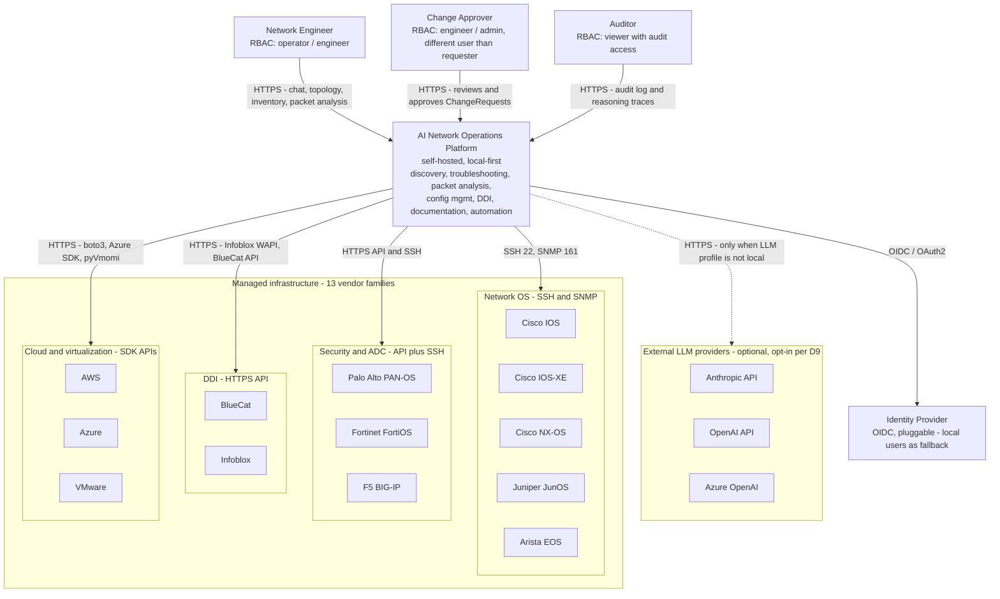
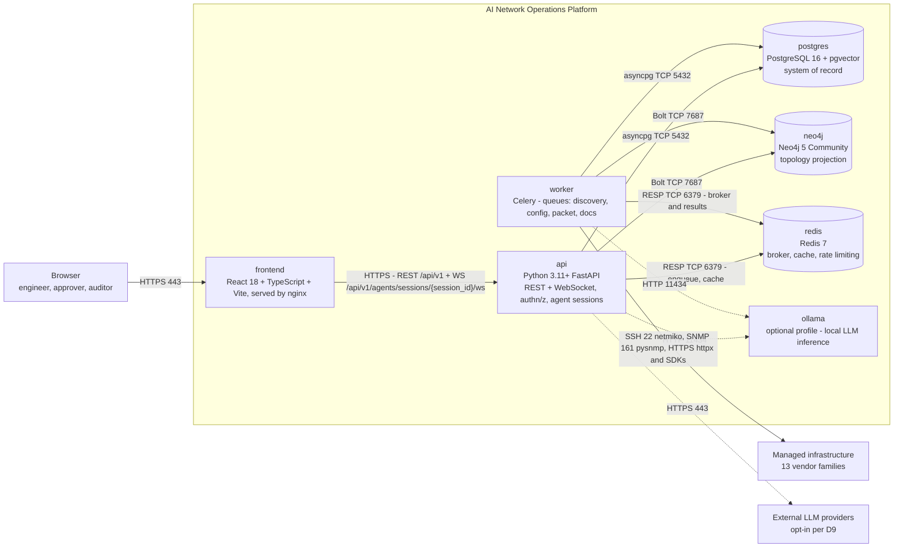
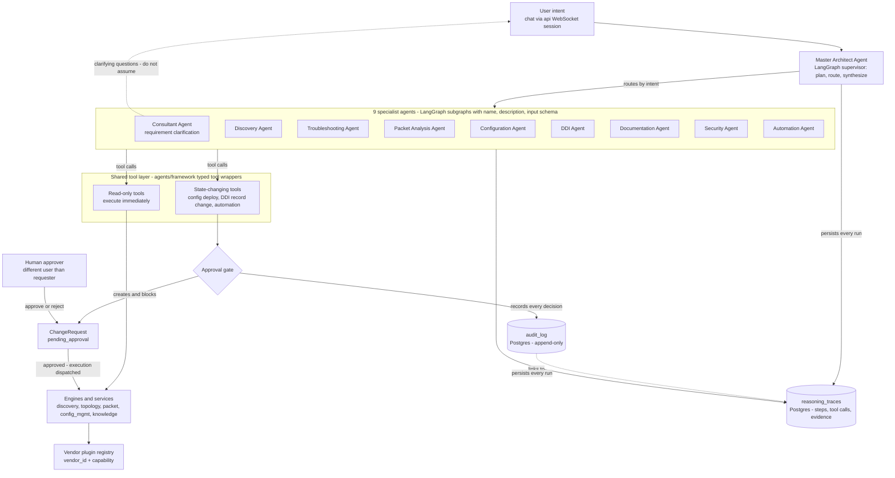
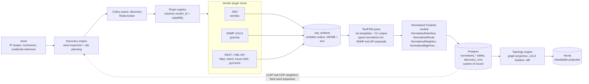
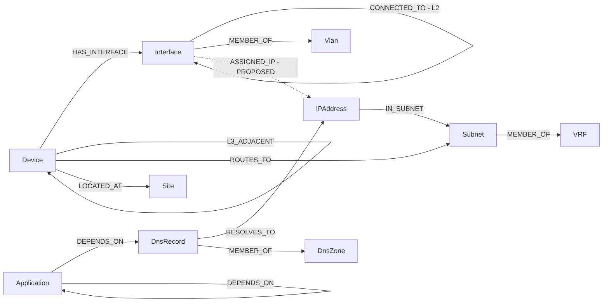
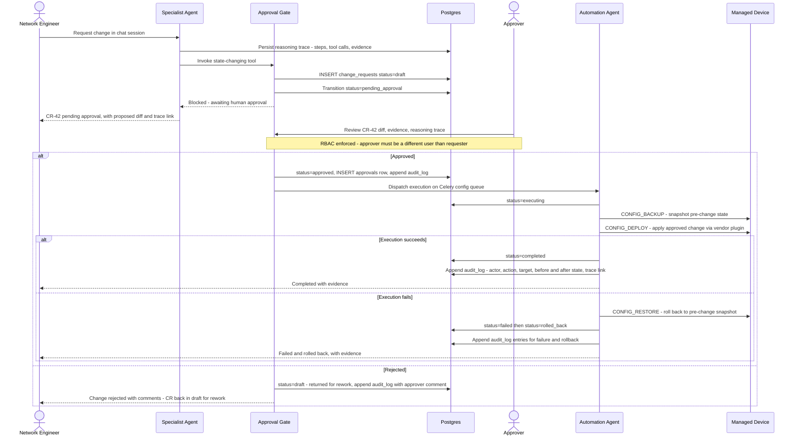
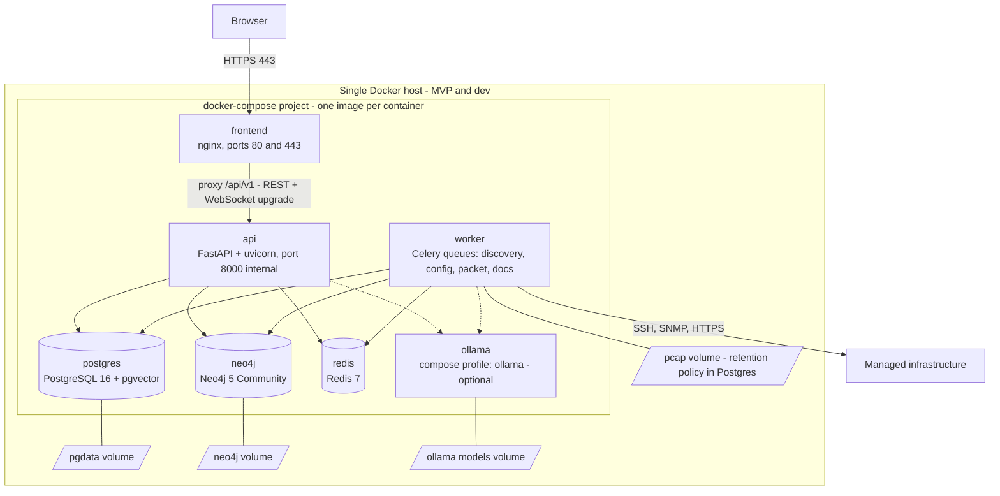
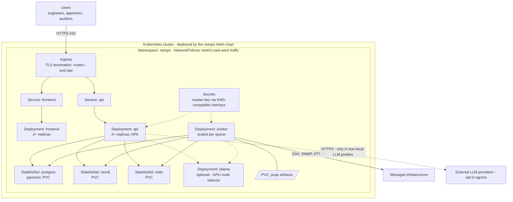

# Architecture Diagrams

**Project:** AI Network Operations Platform
**Status:** Draft v0.1 — Iteration 1 (Phase 1: Architecture)
**Date:** 2026-06-09
**Sources of truth:** `CLAUDE.md` (platform constitution) and `docs/architecture/DECISIONS-BRIEF.md` (binding decisions D1–D16). Every element in these diagrams traces to one of those two documents; anything the brief does not cover is marked **PROPOSED** inline.

Diagrams:

1. [System context (C4 L1)](#1-system-context-c4-l1)
2. [Container diagram (C4 L2)](#2-container-diagram-c4-l2)
3. [Agent orchestration (LangGraph supervisor)](#3-agent-orchestration-langgraph-supervisor)
4. [Discovery pipeline flow](#4-discovery-pipeline-flow)
5. [Neo4j topology data model](#5-neo4j-topology-data-model)
6. [Change-approval sequence](#6-change-approval-sequence)
7. [Deployment topologies](#7-deployment-topologies)

---

## 1. System context (C4 L1)

The platform is a single self-hosted system. Three human roles interact with it over HTTPS: **network engineers** drive discovery, troubleshooting, and change requests; **approvers** review and approve/reject ChangeRequests (a different user than the requester, per D11/section 7); **auditors** read the append-only audit log and reasoning traces. The platform reaches **managed infrastructure** — the 13 vendor families required by `CLAUDE.md` — over SSH, SNMP, and vendor HTTPS APIs (D7). LLM inference is **local-first via Ollama**; external providers (the `anthropic`, `openai`, `azure` profiles from D9) are strictly opt-in, shown dashed. Authentication uses local users plus a pluggable **OIDC identity provider** (D10).

---

## 2. Container diagram (C4 L2)

The seven containers from brief section 1, with the protocols on each edge. `frontend` is React 18 + TypeScript + Vite served by nginx; `api` is FastAPI exposing REST and WebSocket; `worker` runs Celery from the **same codebase** as `api` (D1, D8) and is the only container that talks to managed devices — long-running discovery, config backup, packet capture, and doc-generation jobs run there on the dedicated `discovery`, `config`, `packet`, and `docs` queues. Postgres is the system of record; Neo4j is a rebuildable projection (D5). `ollama` runs only when its compose profile / Helm value is enabled; external LLM calls (dashed) exist only in non-`local` D9 profiles.

---

## 3. Agent orchestration (LangGraph supervisor)

D3 / brief section 5: the **Master Architect Agent** is the LangGraph supervisor — it receives user intent, plans, routes to the nine specialist subgraphs, and synthesizes the answer. The **Consultant Agent** is the one specialist with a loop back to the user: it asks clarifying questions when intent is ambiguous (or records them with defaults in `docs/consultant/QUESTIONS.md`). All specialists act only through the **shared typed tool layer** in `agents/framework`. Read-only tools execute immediately against engines/services; **every state-changing tool call hits the approval gate**, which creates a ChangeRequest and blocks until a human (different user) approves — no exceptions. Every run persists a reasoning trace; audit-log entries link back to traces (D11). Agents inherit the invoking user's RBAC permissions — an agent can never do what its user cannot.

---

## 4. Discovery pipeline flow

Brief sections 4 and 6, D6–D8. A discovery run starts from a **seed** (IP ranges / hostnames plus a credential reference — credentials never leave the vault). The discovery engine expands the seed and plans jobs onto the Celery `discovery` queue. The plugin registry resolves `(vendor_id, capability)` to a driver: netmiko for SSH, pysnmp for SNMP v2c/v3, httpx/SDKs for APIs. **All raw output is stored verbatim first** (`raw_artifacts`, JSONB + text) for auditability, then CLI output is parsed with ntc-templates/TextFSM into **normalized Pydantic models** (structured SNMP/API payloads map through typed normalizers to the same models — D7). Normalized rows land in Postgres `normalized_*` tables (system of record), and the topology engine projects them into Neo4j — a projection that can always be fully rebuilt from Postgres (D5). LLDP/CDP neighbor results feed back into seed expansion, which is how the network is walked.

---

## 5. Neo4j topology data model

Brief section 6, exactly: node labels `Device`, `Interface`, `Vlan`, `Subnet`, `IPAddress`, `VRF`, `DnsZone`, `DnsRecord`, `Application`, `Site`; relationship types `CONNECTED_TO` (L2), `L3_ADJACENT`, `ROUTES_TO`, `HAS_INTERFACE`, `IN_SUBNET`, `RESOLVES_TO`, `DEPENDS_ON`, `MEMBER_OF`, `LOCATED_AT`. The brief fixes the names but not every endpoint pairing; the pairings below are the canonical mapping for the projection builder. `MEMBER_OF` is deliberately reused for three containment pairings (Interface→Vlan, Subnet→VRF, DnsRecord→DnsZone). One edge the brief does not name is needed to attach addresses to interfaces: **`ASSIGNED_IP` (Interface→IPAddress) — PROPOSED**, shown dashed; it must be ratified in ADR-0005 before the projection builder ships. Neo4j never holds data that exists nowhere else — everything here is derived from Postgres.

Coverage of the four required topology views (`CLAUDE.md`): **L2** = `CONNECTED_TO` + `MEMBER_OF` Vlan; **L3** = `L3_ADJACENT` + `ROUTES_TO` + `IN_SUBNET` + VRF membership; **DNS dependencies** = `RESOLVES_TO` + `MEMBER_OF` DnsZone; **application dependencies** = `DEPENDS_ON`.

---

## 6. Change-approval sequence

D11 / brief section 7. Any state-changing tool call — config deploy, DDI record change, automation — is intercepted by the approval gate, which creates a `ChangeRequest` and blocks. The lifecycle is `draft → pending_approval → approved → executing → completed | failed → rolled_back`; a rejection returns the ChangeRequest to `draft` for rework with the approver's comments (ADR-0011 state machine — rejection is not terminal). The approver must be a **different user** than the requester (configurable). Execution is dispatched to the **Automation Agent** on the Celery `config` queue; it snapshots the pre-change state first (`CONFIG_BACKUP`) so the rollback path is always available. Every transition appends to the append-only `audit_log` with actor, action, target, before/after state, and a link to the reasoning trace.

---

## 7. Deployment topologies

D13: **Docker Compose for MVP/dev**, one image per container, with `ollama` behind an optional compose profile; **Kubernetes via Helm chart for production**. The pcap volume implements D14 (pcap artifacts on a disk volume, metadata + retention in Postgres). In production, TLS terminates at the ingress, all containers run non-root, NetworkPolicies restrict east-west traffic, and the platform master key arrives through a KMS-compatible secrets interface (section 7). Every container exposes health/readiness endpoints and Prometheus metrics (D15).

### 7a. Docker Compose (MVP / dev)

### 7b. Kubernetes via Helm (production)

**PROPOSED (not covered by the brief):** Postgres/Neo4j/Redis run as in-cluster StatefulSets by default; pointing the Helm chart at externally managed database instances is a values-level override. HA/DR posture is an open item routed to the Consultant Agent (brief section 9).
