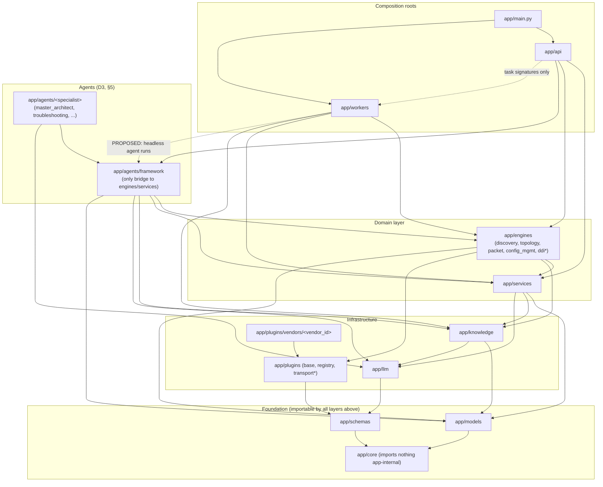

# Repository Structure

**Project:** AI Network Operations Platform
**Status:** Draft v0.2 — Iteration 1 (Phase 1: Architecture; amended 2026-06-10 to ratify the M0 as-built layout — see section 9)
**Date:** 2026-06-09
**Authority:** Expands `DECISIONS-BRIEF.md` §3 (which itself derives from `CLAUDE.md`). This document is the blueprint that Phase 2 scaffolding follows **exactly** — directory names, file names, and module boundaries below are normative. Anything the brief does not decide is chosen conservatively and marked **PROPOSED**; PROPOSED items are defaults we build on until confirmed by ADR or the Consultant Agent process (`docs/consultant/QUESTIONS.md`).

Decision references: `D1`–`D16` = binding decisions in `DECISIONS-BRIEF.md` §2; `§4`–`§7` = brief sections (plugin contract, agent contract, data architecture, security architecture).

---

## 1. Top-level repository tree

```
network-infrastructure-ai-platform/
├── CLAUDE.md                        # Platform constitution (requirements, vendors, agents, principles)
├── README.md                        # Project overview, quickstart (docker compose up), links to docs/
├── LICENSE                          # PROPOSED: license file (license choice routed to Consultant Agent)
├── .gitignore                       # Python, Node, IDE, pcap/artifact volumes, .env files
├── backend/                         # Modular-monolith Python backend — one deployable, api + worker entrypoints (D1)
├── frontend/                        # React 19 + TypeScript + Vite SPA, served by nginx (D12)
├── deploy/
│   ├── docker/                      # Dockerfiles + docker-compose.yml (MVP/dev, optional `ollama` profile) (D13)
│   │   ├── backend.Dockerfile       # Single backend image; `api` and `worker` containers differ by command (D1, D13)
│   │   ├── frontend.Dockerfile      # Multi-stage: Vite build → nginx (D12, D13)
│   │   ├── docker-compose.yml       # frontend, api, worker, postgres(+pgvector), neo4j, redis, ollama(profile) (§1)
│   │   └── .env.example             # Compose environment template; never contains real secrets (D11)
│   └── kubernetes/
│       └── netops/                  # Helm chart for production deployment (D13)
├── docs/
│   ├── adr/                         # ADR-0001..0016 (one per D1–D16) + README.md (ADR index)
│   ├── architecture/                # DECISIONS-BRIEF.md, DIAGRAMS.md, REPO-STRUCTURE.md (this file)
│   ├── roadmap/                     # MVP.md (M0–M5), PRODUCTION.md (§8)
│   ├── consultant/                  # GAP-ANALYSIS.md, QUESTIONS.md, ASSUMPTIONS.md (§9)
│   └── vendors/                     # PROPOSED: per-vendor capability matrix pages (one .md per vendor_id)
├── .github/
│   └── workflows/
│       └── ci.yml                   # lint → typecheck → test → build images → Trivy scan (D16)
└── scripts/                         # Dev helper scripts (db reset, seed data, local LLM pull); no business logic
```

Conventions for all trees in this document:

- Every Python package directory contains an `__init__.py`; they are **omitted below for brevity** but are mandatory in scaffolding.
- One-line annotations are normative intent, not exhaustive API docs.

---

## 2. `backend/` expanded to file level

```
backend/
├── pyproject.toml                   # Single project; deps per D2/D7/D8/D9; entry-point group "netops.plugins" (D6);
│                                    #   tool config for ruff, mypy, pytest, coverage (D16)
├── alembic.ini                      # Alembic configuration (D4 — Alembic owns the schema)
├── alembic/
│   ├── env.py                       # Async migration environment; imports app.models metadata
│   ├── script.py.mako               # Revision template
│   └── versions/                    # Migration revisions; never edit an applied revision (see §4.3 naming)
├── tests/                           # Mirrors app/ — full layout in section 5 of this document
└── app/
    ├── main.py                      # FastAPI app factory (composition root): mounts api routers, health, /metrics,
    │                                #   middleware (auth, audit context, request logging) (D15)
    ├── db.py                        # Async SQLAlchemy 2.0 engine + session factory (D2, D4) — top-level
    │                                #   module, NOT core/db.py (as-built placement ratified, §9 A1)
    │
    ├── core/                        # Cross-cutting foundations — imports NOTHING from feature modules (§3 rule)
    │   ├── config.py                # pydantic-settings Settings; env prefix NETOPS_, nested via "__" (PROPOSED)
    │   ├── logging.py               # structlog JSON config; request-id / trace-id binding (D15)
    │   ├── security.py              # JWT issue/verify, password hashing, RBAC checks: viewer|operator|engineer|admin (D10)
    │   ├── crypto.py                # AES-256-GCM envelope encryption + master-key loader (env/file/KMS-compatible) (D11)
    │   ├── audit.py                 # Append-only audit-write primitive: actor, action, target, before/after, trace link (D11)
    │   ├── errors.py                # NetOpsError exception hierarchy + FastAPI handlers + uniform error envelope
    │   ├── redis.py                 # Redis client factory: cache, rate limiting (Celery broker configured in workers/) (D8)
    │   └── observability.py         # Prometheus registry/metrics helpers, optional OTel tracer, probe helpers (D15)
    │
    ├── api/
    │   ├── deps.py                  # Shared dependencies: db session, current_user, require_role(), pagination params
    │   └── v1/                      # All business routes under /api/v1 — router set fixed by brief §3
    │       ├── router.py            # Aggregates the ten v1 routers below onto one APIRouter(prefix="/api/v1")
    │       ├── health.py            # GET /api/v1/health/live + /api/v1/health/ready (per-dependency
    │       │                        #   postgres/neo4j/redis status, degrades gracefully) — versioned
    │       │                        #   paths ratified, supersede P3's /healthz+/readyz (§9 A2) (D15)
    │       ├── auth.py              # /auth: login, refresh, logout; local users + pluggable OIDC (D10)
    │       ├── devices.py           # /devices: inventory CRUD + credential references; secrets never returned (D11)
    │       ├── discovery.py         # /discovery: start runs (enqueues Celery job), run status, artifact views
    │       ├── topology.py          # /topology: L2/L3/DNS/app-dependency graph queries for the UI (D5, D12)
    │       ├── agents.py            # /agents: session CRUD, WebSocket chat, reasoning-trace retrieval (§5)
    │       ├── changes.py           # /changes: ChangeRequest lifecycle — create, approve, reject, status (§7, D11)
    │       ├── ddi.py               # /ddi: DNS/DHCP/IPAM reads; every write goes through a ChangeRequest (§5)
    │       ├── packets.py           # /packets: capture jobs, pcap metadata, analysis results (D14)
    │       ├── docs.py              # /docs: generated diagrams, runbooks, incident reports, inventories
    │       │                        #   (route prefix /api/v1/docs — distinct from FastAPI's swagger UI at /docs)
    │       └── audit.py             # /audit: read-only audit-log queries with filters; no mutation endpoints (D11)
    │
    ├── models/                      # SQLAlchemy models — table set fixed by brief §6; one module per aggregate
    │   ├── base.py                  # DeclarativeBase, constraint-naming convention, UUID-pk + created_at/updated_at
    │   │                            #   mixins (UUID primary keys: PROPOSED)
    │   ├── device.py                # devices
    │   ├── credential.py            # device_credentials — ciphertext + key-wrap columns only (D11)
    │   ├── discovery.py             # discovery_runs, raw_artifacts (JSONB + verbatim text) (D4, §4)
    │   ├── normalized.py            # normalized_interfaces, normalized_routes, normalized_neighbors,
    │   │                            #   normalized_bgp_peers, normalized_acl_entries, normalized_dns_records
    │   ├── config_mgmt.py           # config_snapshots, compliance_policies
    │   ├── change.py                # change_requests, approvals (lifecycle per §7; approver ≠ requester)
    │   ├── audit.py                 # audit_log — append-only; app role has no UPDATE/DELETE grants (D11)
    │   ├── user.py                  # users, roles (D10)
    │   ├── document.py              # documents, embeddings (pgvector column) (D4)
    │   ├── agent.py                 # agent_sessions, reasoning_traces (§5)
    │   └── pcap.py                  # pcap_metadata incl. retention-policy fields; payloads live on disk volume (D14)
    │
    ├── schemas/                     # Pydantic v2 contracts — pure data, no I/O (D2)
    │   ├── common.py                # Page[T] envelope, ErrorResponse, shared enums, pagination params
    │   ├── auth.py                  # Token pair, login/refresh payloads
    │   ├── user.py                  # User/role read & admin payloads
    │   ├── device.py                # Device Create/Update/Read
    │   ├── credential.py            # Credential Create (write-only secret fields) / reference Read — never echoes secrets
    │   ├── discovery.py             # Run Create/Read, artifact views
    │   ├── topology.py              # Graph query params, node/edge DTOs for Cytoscape.js rendering (D12)
    │   ├── agent.py                 # Session Create/Read, chat messages, reasoning-trace DTOs
    │   ├── change.py                # ChangeRequest Create/Read, approval/rejection payloads
    │   ├── ddi.py                   # DNS record/zone, DHCP scope/lease, IPAM subnet DTOs
    │   ├── packet.py                # Capture job Create/Read, analysis result DTOs
    │   ├── document.py              # Generated-document metadata + content DTOs
    │   ├── audit.py                 # Audit entry Read + filter params
    │   └── normalized/              # Vendor-agnostic network models — the plugin output contract (§4, D7)
    │       ├── device.py            # NormalizedDeviceFacts (hostname, vendor, model, serial, os_version)
    │       ├── interface.py         # NormalizedInterface
    │       ├── route.py             # NormalizedRoute
    │       ├── neighbor.py          # NormalizedNeighbor (LLDP/CDP unified)
    │       ├── bgp.py               # NormalizedBgpPeer
    │       ├── ospf.py              # NormalizedOspfNeighbor
    │       ├── acl.py               # NormalizedAclEntry
    │       ├── firewall.py          # NormalizedFirewallRule (FIREWALL_POLICY capability)
    │       ├── dns.py               # NormalizedDnsRecord, NormalizedDnsZone
    │       └── dhcp.py              # NormalizedDhcpScope, NormalizedDhcpLease
    │
    ├── services/                    # Business logic over Postgres — no plugin or LLM access (see import table)
    │   ├── inventory.py             # Device lifecycle, search, vendor/site assignment
    │   ├── credentials.py           # Vault service: encrypt-on-write via core.crypto; plaintext exists only
    │   │                            #   in-process when handed to a plugin connection (D11)
    │   ├── change_mgmt.py           # ChangeRequest state machine: draft → pending_approval → approved → executing
    │   │                            #   → completed | failed → rolled_back; approver ≠ requester (§7)
    │   ├── audit_query.py           # Read-side audit queries (the append-only write primitive lives in core/audit.py)
    │   ├── users.py                 # User/role management, OIDC account linking (D10)
    │   └── documentation.py         # PROPOSED: deterministic rendering of inventories/runbooks/incident reports
    │                                #   consumed by the docs worker queue and the Documentation Agent's tools
    │
    ├── agents/                      # LangGraph supervisor + 9 specialists (D3, §5)
    │   │                            # Standard specialist layout = agent.py (subgraph) + tools.py (typed tools).
    │   │                            # Specialists import ONLY agents/framework — never engines/services directly (§3).
    │   ├── framework/               # The shared agent layer named in brief §3
    │   │   ├── base.py              # BaseAgent: declares name, description, input schema, tool set; builds the
    │   │   │                        #   LangGraph subgraph; obtains chat model from llm registry by profile (§5, D9)
    │   │   ├── registry.py          # Agent registry: specialists register; Master Architect routes by name/description
    │   │   ├── tools.py             # Typed tool-wrapper factory around engine/service callables; every tool is
    │   │   │                        #   declared read_only, state_changing, or diagnostic (bounded carve-out,
    │   │   │                        #   ADR-0014) — the only agents→engines bridge (§3, §5)
    │   │   ├── approval.py          # Approval gate: any state-changing tool call creates a ChangeRequest and blocks
    │   │   │                        #   until human approval — no exceptions (§5, D11)
    │   │   ├── traces.py            # Reasoning-trace recorder: steps, tool calls, evidence; persisted to
    │   │   │                        #   reasoning_traces and linked from audit_log (§5, D11)
    │   │   └── state.py             # PROPOSED: shared LangGraph state schema passed supervisor ↔ subgraphs
    │   ├── master_architect/
    │   │   ├── agent.py             # LangGraph supervisor: receive intent → plan → route to specialists → synthesize (D3)
    │   │   └── tools.py             # Delegation handles to registered specialists + plan scratchpad tools
    │   ├── consultant/
    │   │   ├── agent.py             # Requirement clarification; in autonomous contexts records questions with
    │   │   │                        #   recommended defaults in docs/consultant/QUESTIONS.md and proceeds (§5)
    │   │   └── tools.py             # ask_user, record_question, record_assumption tools
    │   ├── discovery/               # Standard layout; tools wrap engines/discovery (read-only triggers + result reads)
    │   ├── troubleshooting/
    │   │   ├── agent.py             # Subgraph: symptom intake → hypothesis → evidence gathering → diagnosis (M3, read-only)
    │   │   └── tools.py             # Tools over topology queries, normalized_* data, and read capabilities via engines
    │   ├── packet_analysis/         # Standard layout; pcap analysis reads; starting a capture is a bounded
    │   │                            #   diagnostic (ADR-0014): operator+, audited, hard caps — no ChangeRequest
    │   ├── configuration/           # Standard layout; backup/drift/compliance reads; deploy/restore are state-changing
    │   ├── ddi/                     # Standard layout; DNS/DHCP/IPAM reads; any record change is state-changing
    │   ├── documentation/           # Standard layout; generates diagrams, runbooks, incident reports, inventories
    │   ├── security/                # Standard layout; ACL/firewall posture, credential hygiene, audit review (read-only)
    │   └── automation/              # Standard layout; executes automations — every execution via ChangeRequest (M5)
    │
    ├── plugins/                     # Vendor plugin system (D6, §4) — may NOT import agents (§3)
    │   ├── base.py                  # VendorPlugin ABC, Capability StrEnum (19 members per §4), and one typed
    │   │                            #   interface per capability (e.g. InterfacesCapability.get_interfaces())
    │   ├── registry.py              # Entry-point discovery (group "netops.plugins"); resolves
    │   │                            #   (vendor_id, capability) → implementation; third-party packages plug in (D6)
    │   ├── transport/               # PROPOSED: shared connection helpers so vendor packages stay thin (D7)
    │   │   ├── ssh.py               # PROPOSED: netmiko session lifecycle, retries, timeouts, raw-output capture hook
    │   │   ├── snmp.py              # PROPOSED: pysnmp v2c/v3 get/walk helpers
    │   │   └── http.py              # PROPOSED: httpx client factory (TLS verify, auth, pagination) for REST/XML APIs
    │   └── vendors/                 # One package per vendor — 13 packages fixed by CLAUDE.md vendor list
    │       ├── cisco_iosxe/         # ◄ REFERENCE LAYOUT (expanded below); every vendor package follows it (M1)
    │       │   ├── plugin.py        # CiscoIosXePlugin(VendorPlugin): vendor_id="cisco_iosxe", display_name,
    │       │   │                    #   capabilities frozenset — declare only what is implemented
    │       │   ├── commands.py      # Capability → CLI/API command map; single source of command strings
    │       │   ├── parsers.py       # ntc-templates/TextFSM (or API JSON) → normalized Pydantic models (D7)
    │       │   └── capabilities/    # One module per capability group; each implements an interface from plugins/base.py
    │       │       ├── discovery.py # DISCOVERY_SSH + DISCOVERY_SNMP: reachability, NormalizedDeviceFacts
    │       │       ├── interfaces.py# INTERFACES → list[NormalizedInterface]
    │       │       ├── routes.py    # ROUTES → list[NormalizedRoute]
    │       │       ├── neighbors.py # NEIGHBORS_LLDP + NEIGHBORS_CDP → list[NormalizedNeighbor]
    │       │       ├── bgp.py       # BGP → list[NormalizedBgpPeer]
    │       │       ├── ospf.py      # OSPF → list[NormalizedOspfNeighbor]
    │       │       ├── acl.py       # ACL → list[NormalizedAclEntry]
    │       │       ├── config.py    # CONFIG_BACKUP / CONFIG_RESTORE / CONFIG_DEPLOY — writes execute only under
    │       │       │                #   an approved ChangeRequest (enforced upstream by approval gate) (§5)
    │       │       └── packet.py    # PACKET_CAPTURE via IOS-XE Embedded Packet Capture (D14)
    │       ├── cisco_ios/           # M1 plugin (SSH + SNMP; interfaces, routes, LLDP/CDP)
    │       ├── cisco_nxos/          # NX-OS (CLI + NX-API)
    │       ├── junos/               # Juniper JunOS
    │       ├── eos/                 # Arista EOS — M1 plugin (CLI + eAPI)
    │       ├── panos/               # Palo Alto PAN-OS (XML API via httpx) — FIREWALL_POLICY, HA_STATUS
    │       ├── fortios/             # Fortinet FortiOS (REST API) — FIREWALL_POLICY
    │       ├── f5_bigip/            # F5 BIG-IP (iControl REST) — HA_STATUS, interfaces, DNS (GTM later)
    │       ├── bluecat/             # BlueCat (REST) — DDI_DNS, DDI_DHCP, DDI_IPAM (production roadmap)
    │       ├── infoblox/            # Infoblox (WAPI) — first DDI plugin (M5): DDI_DNS, DDI_DHCP, DDI_IPAM
    │       ├── aws/                 # boto3 — DISCOVERY_API (VPC/ENI/route tables) + Route53 as DDI_DNS
    │       ├── azure/               # azure SDK — DISCOVERY_API (VNet/NIC/route tables)
    │       └── vmware/              # pyVmomi — DISCOVERY_API (vSwitch/portgroup/VM NIC inventory)
    │
    ├── engines/                     # Deterministic domain engines — the ONLY consumers of the plugin registry (§3)
    │   ├── discovery/
    │   │   ├── planner.py           # Seed expansion (discovered neighbors → new targets), per-device capability job plan
    │   │   ├── runner.py            # Executes plan via plugin registry; stores raw output verbatim to raw_artifacts (§4)
    │   │   └── normalize.py         # Normalization pipeline: raw artifacts → normalized models → normalized_* tables
    │   ├── topology/
    │   │   ├── projection.py        # Full, rebuildable Postgres → Neo4j projection; Neo4j never holds unique data (D5, §6)
    │   │   ├── l2.py                # L2 builder: LLDP/CDP neighbors → CONNECTED_TO edges
    │   │   ├── l3.py                # L3 builder: routes/subnets/VRFs → L3_ADJACENT, ROUTES_TO, IN_SUBNET edges
    │   │   └── diff.py              # Diff between projections (topology drift, change visualization)
    │   ├── packet/
    │   │   ├── capture.py           # Device capture orchestration via PACKET_CAPTURE capability (D14)
    │   │   ├── analysis.py          # tshark/pyshark analysis, sandboxed worker context only (D14)
    │   │   └── retention.py         # Enforces pcap disk-volume retention per pcap_metadata policy (D14)
    │   ├── config_mgmt/
    │   │   ├── backup.py            # On-demand/scheduled backups via CONFIG_BACKUP → config_snapshots
    │   │   ├── restore.py           # Restore execution — runs only under an approved ChangeRequest (§5, §7)
    │   │   ├── drift.py             # Live config vs latest snapshot diff detection
    │   │   └── compliance.py        # Evaluates compliance_policies against snapshots; produces findings
    │   └── ddi/                     # PROPOSED: DDI engine — DDI ops must call vendor plugins, and only engines may
    │       │                        #   consume the plugin registry (§3), so this logic cannot live in services/
    │       ├── dns.py               # PROPOSED: zone/record reads + change execution (DDI_DNS)
    │       ├── dhcp.py              # PROPOSED: scope/lease reads + change execution (DDI_DHCP)
    │       └── ipam.py              # PROPOSED: subnet/address reads + change execution (DDI_IPAM)
    │
    ├── knowledge/                   # Graph + RAG infrastructure (D5, D4)
    │   ├── neo4j_client.py          # Async Neo4j 5 driver wrapper, session/transaction helpers
    │   ├── queries.py               # Typed Cypher library using only the labels/relationships fixed in §6
    │   └── rag.py                   # Embedding generation (via llm providers) + pgvector retrieval over
    │                                #   documents/embeddings (D9)
    │
    ├── llm/                         # Multi-LLM abstraction (D9)
    │   ├── registry.py              # Provider registry behind the LangChain chat-model interface
    │   ├── profiles.py              # Profiles: local (Ollama — default), anthropic, openai, azure
    │   ├── providers/
    │   │   ├── ollama.py            # Local-first default provider (CLAUDE.md: local first)
    │   │   ├── anthropic.py         # Opt-in external provider
    │   │   ├── openai.py            # Opt-in external provider
    │   │   └── azure.py             # Opt-in external provider (Azure OpenAI)
    │   ├── redaction.py             # Mandatory prompt-redaction pipeline (A9/Q9): strips vendor secret patterns
    │   │                            #   (SNMP communities, type-7/9 material, BGP/RADIUS keys) from ALL prompt
    │   │                            #   content for ALL providers; vault credentials never enter prompts
    │   └── prompts/                 # ALL prompts versioned in-repo (D9); prompt files with an explicit prompt_id
    │       │                        #   and integer version in front-matter (ADR-0009 Decision 4); one dir per agent
    │       ├── master_architect/    # Supervisor planning/routing/synthesis prompt files
    │       └── <agent_name>/        # consultant/, discovery/, troubleshooting/, packet_analysis/,
    │                                #   configuration/, ddi/, documentation/, security/, automation/
    │
    └── workers/                     # Celery app + tasks (D8) — same codebase, `worker` container entrypoint
        ├── celery_app.py            # Celery app; Redis broker/result backend; queue routing by task-name prefix:
        │                            #   discovery | config | packet | docs (D8)
        ├── schedules.py             # PROPOSED: Celery beat schedules (e.g. nightly config backups, retention sweeps)
        └── tasks/
            ├── discovery.py         # Queue "discovery": discovery.run_discovery_job
            ├── config.py            # Queue "config": config.backup_device, config.detect_drift, config.run_compliance
            ├── packet.py            # Queue "packet": packet.run_capture, packet.analyze_pcap, packet.enforce_retention
            └── docs.py              # Queue "docs": docs.generate_inventory, docs.generate_runbook,
                                     #   docs.generate_diagram, docs.generate_incident_report
```

### 2.1 `frontend/` (directory level — file-level layout is an M2 deliverable)

```
frontend/
├── package.json                     # React 19, TypeScript, Vite, TanStack Query, Zustand, Tailwind, Cytoscape.js (D12)
├── vite.config.ts                   # Vite build config; dev proxy → api container
├── tsconfig.json                    # "strict": true mandatory (D12)
├── tailwind.config.ts               # Tailwind setup (D12)
└── src/
    ├── api/                         # Typed API client + TanStack Query hooks (mirrors /api/v1 routers)
    ├── stores/                      # Zustand stores (session, UI state)
    ├── components/                  # Shared presentational components
    ├── features/                    # chat console, topology (Cytoscape.js), inventory, approvals, audit views (§1)
    └── pages/                       # Route-level views
```

---

## 3. Module-boundary rules

The brief (§3) fixes four rules; this section expands them into the complete allowed-imports matrix that the import-linter CI gate (Phase 2, per §3) enforces. "MAY import" lists **app-internal** packages only — third-party libraries are governed by D2/D7/D8/D9, not this table. Imports *within* the same package are always allowed. `tests/` and `alembic/env.py` may import anything in `app/`.

### 3.1 Dependency direction (Mermaid)

Arrows mean "may import". Everything except `core` may also import `core` and `schemas`; those edges are collapsed into the two foundation notes to keep the diagram readable.



`ddi*` and `transport*` are PROPOSED packages (see section 8).

### 3.2 Allowed-imports table

| # | Importing package | MAY import (app-internal) | MUST NOT import | Source / rationale |
|---|---|---|---|---|
| 1 | `app/core` | *(nothing app-internal)* | everything else in `app/` | Brief §3: "core imports nothing from feature modules" |
| 2 | `app/schemas` | `core` | all others | Pure Pydantic contracts; importable by every layer without cycles |
| 3 | `app/models` | `core` | all others | Persistence definitions only; business logic lives in services/engines |
| 4 | `app/llm` | `core`, `schemas` | `agents`, `engines`, `services`, `plugins`, `models`, `knowledge`, `api`, `workers` | D9: provider layer is a leaf — consumed by agents/knowledge, never the reverse |
| 5 | `app/knowledge` | `core`, `schemas`, `models`, `llm` | `agents`, `engines`, `services`, `plugins`, `api`, `workers` | Neo4j + RAG infrastructure; needs llm providers for embeddings (D9) |
| 6 | `app/plugins` (`base.py`, `registry.py`, `transport/`) | `core`, `schemas` | `agents`, `engines`, `services`, `models`, `llm`, `knowledge`, `api`, `workers` | Brief §3: "plugins may not import agents" — expanded: plugins return normalized schemas and know nothing about persistence or AI |
| 7 | `app/plugins/vendors/<vendor_id>` | `plugins.base`, `plugins.registry`, `plugins.transport`, `core`, `schemas` | everything in row 6 **plus** any *other* `plugins.vendors.*` package | D6: vendor packages are independent and individually removable |
| 8 | `app/services` | `core`, `models`, `schemas`, `knowledge`, `llm` | `agents`, `engines`, `plugins`, `api`, `workers` | Business logic over Postgres; engines depend on services, never the reverse (no cycles) |
| 9 | `app/engines/*` | `core`, `models`, `schemas`, `services`, `knowledge`, `plugins.base`, `plugins.registry` | `agents`, `api`, `workers`, `llm`, **`plugins.vendors.*`** | Brief §3: "engines depend on plugins only via the registry" — never on a concrete vendor package; engines are deterministic (no LLM) |
| 10 | `app/agents/framework` | `core`, `models`, `schemas`, `services`, `engines`, `knowledge`, `llm` | `api`, `workers`, `plugins` | §5: the framework's typed tool wrappers are the *only* bridge from agents to engines/services; device access always goes agents → framework → engines → plugin registry |
| 11 | `app/agents/<specialist>` (all ten agent packages) | `agents.framework`, `core`, `schemas`, `llm` (prompts/profiles) | `engines`, `services`, `plugins`, `models`, `knowledge`, `api`, `workers` | Brief §3: "agents use engines/services only through typed tool wrappers in agents/framework" |
| 12 | `app/api` | `core`, `schemas`, `services`, `engines`, `agents.framework`, `workers.tasks` (task signatures for enqueue only) | `models`, `plugins`, `llm`, `knowledge`, `agents.<specialist>` | API stays behind service/engine facades; specialists are reached only via the framework registry/supervisor |
| 13 | `app/workers` | `core`, `models`, `schemas`, `services`, `engines`, `knowledge`, `agents.framework` (PROPOSED — headless doc-generation agent runs) | `api`, `plugins` (use engines), `llm` directly, `agents.<specialist>` | D8: tasks are thin wrappers around engine/service calls; queue names per D8 |
| 14 | `app/main.py` | `core`, `api` | direct imports of anything else (wired via `api`) | Composition root for the `api` container; `workers/celery_app.py` is the root for the `worker` container |

### 3.3 CI enforcement (import-linter contracts, Phase 2)

Declared in `backend/pyproject.toml`; the CI `lint` stage fails on violation (D16):

1. **forbidden** — `app.plugins` → `app.agents` (the literal brief rule, plus rows 6–7 expansions).
2. **forbidden** — `app.agents` (excluding `app.agents.framework`) → `app.engines | app.services | app.plugins | app.models`.
3. **forbidden** — `app.engines` → `app.plugins.vendors`.
4. **forbidden** — `app.core` → any other `app.*` package.
5. **independence** — all `app.plugins.vendors.*` packages are mutually independent.
6. **layers** — `main` / (`api`, `workers`) / `agents` / `agents.framework` / `engines` / `services` / (`knowledge`, `llm`, `plugins`) / (`models`, `schemas`) / `core`.

---

## 4. Naming conventions

### 4.1 Files and Python symbols

| Thing | Convention | Examples |
|---|---|---|
| Python modules / packages | `snake_case`, no hyphens; entity modules singular | `device.py`, `change_mgmt.py`, `cisco_iosxe/` |
| API router modules | plural resource name, **exactly** the brief §3 list | `devices.py`, `changes.py`, `packets.py` |
| Vendor packages | `vendor_id` string == directory name == entry-point name | `cisco_iosxe`, `f5_bigip`, `infoblox` |
| Classes | `PascalCase` | `Device`, `ChangeRequest`, `DiscoveryRunner` |
| SQLAlchemy model classes | singular noun → plural table | `Device` → `devices` |
| Pydantic API schemas | `<Entity>Create` / `<Entity>Update` / `<Entity>Read`; lists wrapped in `Page[T]` | `DeviceCreate`, `ChangeRequestRead` |
| Normalized models | `Normalized<Noun>` (fixed by brief §4) | `NormalizedInterface`, `NormalizedBgpPeer` |
| Plugin classes | `<Vendor>Plugin`; capability interfaces `<Name>Capability` | `CiscoIosXePlugin`, `InterfacesCapability` |
| Agent classes / ids | class `<Name>Agent`; string id = package name | `TroubleshootingAgent`, id `"troubleshooting"` |
| Exceptions | `<X>Error`, rooted at `NetOpsError` in `core/errors.py` | `PluginConnectionError`, `ApprovalRequiredError` |
| Service style | modules expose async functions; classes only when stateful (PROPOSED) | `services.inventory.get_device(...)` |
| Constants / enums | `SCREAMING_SNAKE` members; `StrEnum` for wire values | `Capability.NEIGHBORS_LLDP` |
| Celery task names | `"<queue>.<verb>_<noun>"`; prefix routes to the D8 queue | `"discovery.run_discovery_job"`, `"docs.generate_runbook"` |
| Env vars | `NETOPS_` prefix, nested settings via `__` (PROPOSED) | `NETOPS_DB__HOST`, `NETOPS_LLM__PROFILE` |
| Prometheus metrics | `netops_<subsystem>_<name>_<unit>` (PROPOSED) | `netops_discovery_run_duration_seconds` |
| Frontend components | `PascalCase.tsx`; hooks `useX.ts`; everything strict TS (D12) | `TopologyCanvas.tsx`, `useDevices.ts` |

### 4.2 Database (PostgreSQL — D4, §6)

- Table names: `snake_case` **plural** (`devices`, `change_requests`). Fixed exceptions from brief §6: `audit_log` (append-only collective) and the `normalized_*` family.
- Primary key: `id` UUID (PROPOSED — generated app-side, UUIDv4).
- Foreign keys: `<referenced_singular>_id` (`device_id`, `change_request_id`).
- Timestamps: `created_at`, `updated_at` — `timestamptz`, UTC, server defaults; `audit_log` rows get `created_at` only (never updated).
- Constraint/index naming via SQLAlchemy naming convention in `models/base.py`: `pk_%(table)s`, `fk_%(table)s_%(column)s`, `uq_%(table)s_%(column)s`, `ck_%(table)s_%(constraint)s`, `ix_%(table)s_%(column)s`.
- Enum-like columns store `StrEnum` string values (no native PG enums — easier migrations; PROPOSED).
- pgvector: embedding column named `embedding`, on the `embeddings` table (§6).

### 4.3 Alembic

- One revision per logical change; **never edit an applied revision**.
- Revision file slug: `<rev_hash>_<snake_case_summary>.py` with `down_revision` chain intact; descriptive `message` required (PROPOSED).

### 4.4 Neo4j (D5, §6)

- Node labels: `PascalCase` — only the §6 set (`Device`, `Interface`, `Vlan`, `Subnet`, `IPAddress`, `VRF`, `DnsZone`, `DnsRecord`, `Application`, `Site`).
- Relationship types: `SCREAMING_SNAKE` — only the §6 set (`CONNECTED_TO`, `L3_ADJACENT`, `ROUTES_TO`, `HAS_INTERFACE`, `IN_SUBNET`, `RESOLVES_TO`, `DEPENDS_ON`, `MEMBER_OF`, `LOCATED_AT`).
- Node properties: `snake_case`; every node carries the Postgres UUID of its source row (e.g. `device_id`) so the projection is rebuildable and joinable (PROPOSED property convention; rebuildability itself is D5).
- Adding a label or relationship type requires updating §6 of the brief via ADR — `knowledge/queries.py` must not invent graph vocabulary.

### 4.5 API routes (D10, §3)

- Versioned prefix: `/api/v1`, **including health**: `GET /api/v1/health/live` and `GET /api/v1/health/ready` (ratified as-built — supersedes P3's unversioned `/healthz`+`/readyz`; §9 A2). Unversioned: `/metrics` (D15), FastAPI's own `/docs` swagger UI.
- Resource collections are plural nouns matching router file names: `/api/v1/devices`, `/api/v1/changes`, `/api/v1/packets`, `/api/v1/audit` (read-only), `/api/v1/docs` (generated documents).
- Path params: `{<singular>_id}` — `/api/v1/devices/{device_id}`.
- Sub-resources/actions as nested POSTs: `POST /api/v1/discovery/runs`, `POST /api/v1/changes/{change_request_id}/approve`, `POST /api/v1/changes/{change_request_id}/reject` (PROPOSED concrete paths).
- Multi-word path segments: `kebab-case` (PROPOSED) — e.g. `/api/v1/devices/{device_id}/config-snapshots`.
- WebSocket: `WS /api/v1/agents/sessions/{session_id}/ws` (PROPOSED path; the api container owns REST + WebSocket per §1).
- Query params and JSON fields: `snake_case` (matches Pydantic models; no camelCase translation layer).
- Pagination: `limit` / `offset` query params returning `Page[T]` (PROPOSED).
- Every state-changing endpoint either *is* the ChangeRequest API or creates a ChangeRequest — no direct-mutation endpoints for device/DDI/config state (§5, D11).

---

## 5. Test layout and naming (D16)

```
backend/tests/
├── conftest.py                      # Global fixtures: settings override, async DB engine, fake deterministic LLM,
│                                    #   in-memory plugin registry, frozen clock
├── fixtures/
│   ├── vendors/<vendor_id>/         # Recorded, sanitized raw device output — one file per command
│   │   └── show_ip_route.txt        #   e.g. fixtures/vendors/cisco_iosxe/show_ip_route.txt
│   └── pcaps/                       # Small sanitized pcap files for engines/packet tests (D14)
├── unit/                            # Mirrors app/ exactly; no network, DB, Redis, Neo4j, or real-LLM I/O
│   ├── core/  api/  models/  schemas/  services/  engines/  knowledge/  llm/  workers/
│   ├── agents/                      # framework/ + one dir per agent; graphs run against the fake LLM
│   └── plugins/
│       └── vendors/<vendor_id>/     # Parser + capability tests driven by tests/fixtures/vendors/<vendor_id>/
├── contract/                        # PROPOSED: shared parametrized suites every implementation must pass
│   ├── test_plugin_contract.py      # For each registered plugin: declared capabilities resolve via the registry
│   │                                #   and return the correct Normalized* types (§4)
│   └── test_agent_contract.py       # For each registered agent: spec complete, tools typed, write tools gated,
│   │                                #   reasoning trace emitted (§5)
└── integration/                     # Real Postgres+pgvector, Neo4j, Redis via docker compose; @pytest.mark.integration
    ├── api/                         # Route tests through the FastAPI app with real DB
    ├── models/                      # Alembic migration up/down round-trips
    ├── engines/                     # Topology projection against real Neo4j; discovery against fake device servers
    └── workers/                     # Task execution against real Redis broker
```

Rules:

- `tests/unit/` **mirrors `app/` one-to-one**: a test for `app/engines/topology/l2.py` lives at `tests/unit/engines/topology/test_l2.py`.
- Test files: `test_<module>.py`. Test functions: `test_<unit>_<expected_behavior>[_when_<condition>]` — e.g. `test_approval_gate_blocks_write_tool_when_change_request_pending`. Test classes (optional grouping): `Test<Subject>`.
- Markers: unmarked = unit (default CI path); `@pytest.mark.integration` (CI, compose-backed); `@pytest.mark.lab` (real network devices — never runs in CI; PROPOSED).
- Async tests use `pytest-asyncio` (D16).
- Coverage gate ≥80% (D16) applies to the **core modules**, defined by ADR-0016 (the D16 authority) as: `app/core`, `app/services`, `app/engines`, `app/plugins` (whole package, vendor plugins included — matching the plugin conformance suite's ≥80% requirement), `app/agents/framework`, `app/llm` (enumeration PROPOSED in ADR-0016 — D16 says "core modules" without enumerating).
- Vendor plugin tests must run **without any device**: all parsing is tested against recorded fixtures; live-device tests are `lab`-marked.
- Frontend: vitest + testing-library; test files colocated as `<Component>.test.tsx` / `<hook>.test.ts`; `eslint` + `tsc --noEmit` in the same CI stage (D16).

---

## 6. Checklist: adding a new vendor plugin (D6, §4)

Follow in order. Steps 1–11 require **zero changes** to core, registry, engines, or agents — if you find yourself editing those, stop and write an ADR.

1. **Confirm scope.** The vendor must be on the CLAUDE.md vendor list, or a new vendor requires an ADR first (D6 allows third-party plugins, but in-repo additions are governed).
2. **Pick the `vendor_id`** — `snake_case`, used identically as: directory name, `VendorPlugin.vendor_id`, entry-point name, and the `devices.vendor` column value. Example: `cisco_nxos`.
3. **Create the package** `backend/app/plugins/vendors/<vendor_id>/` with the reference layout from section 2: `plugin.py`, `commands.py`, `parsers.py`, `capabilities/`.
4. **Write `plugin.py`**: subclass `VendorPlugin` from `app/plugins/base.py`; set `vendor_id`, `display_name`, and `capabilities` as a `frozenset[Capability]` — declare **only** capabilities you actually implement in this PR.
5. **Implement one capability class per declared capability** in `capabilities/`, each implementing its typed interface from `plugins/base.py` and returning models from `app/schemas/normalized/` — never raw strings or ad-hoc dicts (§4).
6. **Preserve raw output.** Route all command/API output through the transport layer's raw-capture hook so it lands verbatim in `raw_artifacts` *before* parsing — auditability is non-negotiable (§4, D11).
7. **Centralize commands and parsing**: command strings only in `commands.py`; parsing only in `parsers.py`, preferring ntc-templates/TextFSM for CLI vendors (D7). Raise typed errors from `core/errors.py` plugin hierarchy on parse/connection failure.
8. **Register the entry point** in `backend/pyproject.toml`:
   `[project.entry-points."netops.plugins"]` → `<vendor_id> = "app.plugins.vendors.<vendor_id>.plugin:<Vendor>Plugin"` (D6).
9. **Add fixtures**: sanitized recorded outputs under `backend/tests/fixtures/vendors/<vendor_id>/`, one file per command (strip real hostnames/IPs/secrets).
10. **Add tests**: parser/capability unit tests in `tests/unit/plugins/vendors/<vendor_id>/`, and add the `vendor_id` to the parametrization of `tests/contract/test_plugin_contract.py` so registry resolution and normalized return types are verified automatically.
11. **Run the gates locally**: `ruff`, `mypy`, `pytest`, import-linter — the plugin must import nothing from `agents`, `engines`, `services`, `models`, `api`, or other vendor packages (section 3.2, rows 6–7).
12. **Document**: add/update the vendor capability-matrix page `docs/vendors/<vendor_id>.md` (location PROPOSED) and API docs if any new normalized fields surface. Every feature ships with tests + documentation (CLAUDE.md).
13. **No ADR needed** if you stayed inside the D6/D7 contract; any deviation (new Capability member, new normalized model, new transport) requires an ADR *before* merge.

---

## 7. Checklist: adding a new agent (D3, §5)

The ten core agents are fixed by CLAUDE.md. Adding an *eleventh* agent requires an ADR first (PROPOSED governance rule); modifying one of the ten follows the same steps minus step 1.

1. **Justify and decide.** Write the ADR; if requirements are unclear, route questions through the Consultant Agent process — ask, don't assume (CLAUDE.md).
2. **Create the package** `backend/app/agents/<agent_name>/` with the standard layout: `__init__.py`, `agent.py`, `tools.py`.
3. **Define the spec** (in `agent.py` via `framework.base.BaseAgent`): `name` (string id = package name), `description` (used by the Master Architect for routing — write it for the router, not for humans), and a Pydantic **input schema** (§5).
4. **Declare tools in `tools.py` using `agents/framework/tools.py` wrappers only.** No direct imports of `engines`, `services`, `plugins`, or `models` (section 3.2, row 11). Classify every tool `read_only`, `state_changing`, or `diagnostic` — `diagnostic` is the narrow ADR-0014 carve-out for bounded, auto-reverting device actions (currently only packet captures: `operator`+, always audited, mandatory duration/size caps, no ChangeRequest); anything else that touches device or record state is `state_changing`.
5. **Verify the approval gate.** Any `state_changing` tool must flow through `framework/approval.py`: it creates a `ChangeRequest` and blocks until human approval — no bypass parameter exists, by design (§5, D11).
6. **Add prompts** as prompt files with an explicit `prompt_id` and integer `version` in front-matter (ADR-0009 Decision 4) under `app/llm/prompts/<agent_name>/` (D9 — all prompts in-repo). Structured outputs declared as Pydantic models.
7. **Build the LangGraph subgraph** in `agent.py` through `BaseAgent`; obtain the chat model from the `llm` registry by profile — never instantiate a provider client directly (D9).
8. **Register the agent** in `agents/framework/registry.py` so the Master Architect supervisor can route to it (D3).
9. **Respect RBAC.** Declare the minimum role required to invoke the agent; at runtime the agent inherits the invoking user's permissions and can never exceed them (§7).
10. **Confirm explainability.** Reasoning traces (steps, tool calls, evidence) are emitted by the framework automatically; add a golden-trace unit test that asserts trace persistence and audit linkage (§5, D11).
11. **Add tests**: unit tests for `tools.py` against framework test doubles; a graph-run test with the fake deterministic LLM; an approval-gate test proving every `state_changing` tool blocks without approval; add the agent to `tests/contract/test_agent_contract.py` parametrization; an integration test through `POST /api/v1/agents` sessions with the stub LLM.
12. **Document**: agent description in docs, and confirm it appears in the `/api/v1/agents` capability listing (tests + documentation + API documentation per CLAUDE.md).
13. **Frontend**: nothing required if the agent is chat-driven (it surfaces through the supervisor); dedicated UI views are a separate, explicitly-scoped frontend change.

---

## 8. PROPOSED register

Conservative defaults made in this document that the brief does not decide. Each stands until confirmed or overturned by ADR; disagreements route through `docs/consultant/QUESTIONS.md` (§9 process).

| # | Item | Default chosen | Where |
|---|---|---|---|
| P1 | `LICENSE` file | Present at repo root; license choice open | §1 |
| P2 | `docs/vendors/` capability-matrix pages | One page per `vendor_id` | §1, §6 checklist |
| P3 | Health endpoint paths | **Superseded (§9 A2):** `/api/v1/health/live` + `/api/v1/health/ready`, versioned | §2 `api/v1/health.py`, §4.5 |
| P4 | Settings env prefix | `NETOPS_`, nested via `__` | §2 `core/config.py`, §4.1 |
| P5 | UUID primary keys | App-generated UUIDv4 `id` on all tables | §2 `models/base.py`, §4.2 |
| P6 | `services/documentation.py` | Deterministic doc rendering shared by docs queue + Documentation Agent | §2 |
| P7 | `agents/framework/state.py` | Shared LangGraph state schema module | §2 |
| P8 | `plugins/transport/` | Shared netmiko/pysnmp/httpx helpers | §2 |
| P9 | `engines/ddi/` | DDI engine (dns/dhcp/ipam) — forced by the "only engines consume the plugin registry" rule | §2 |
| P10 | `workers/schedules.py` | Celery beat schedules module | §2 |
| P11 | `workers` → `agents.framework` import permission | Allowed, for headless doc-generation agent runs | §3.2 row 13 |
| P12 | No native PG enums | `StrEnum` strings in columns | §4.2 |
| P13 | Alembic revision slug + required message | `<rev>_<snake_case_summary>.py` | §4.3 |
| P14 | Neo4j node property convention | `snake_case`; every node carries its Postgres UUID | §4.4 |
| P15 | Concrete action paths, kebab-case segments, WS path, `limit`/`offset` pagination | As listed | §4.5 |
| P16 | `tests/contract/` suites + `lab` marker | Shared plugin/agent contract tests; lab tests excluded from CI | §5 |
| P17 | "Core modules" for the 80% coverage gate | `core`, `services`, `engines`, `plugins` (whole package), `agents/framework`, `llm` — per ADR-0016 Decision 1 | §5 |
| P18 | New-agent governance | An eleventh agent requires an ADR | §7 |
| P19 | Service style | Async module functions; classes only when stateful | §4.1 |
| P20 | `llm/redaction.py` | Mandatory prompt-redaction pipeline applied to all providers (A9/Q9); lands with M3 | §2 |

---

## 9. As-built deviations (M0 scaffold — decision record)

The M0 scaffold deviates from the v0.1 blueprint in the ways recorded below. Entries marked
**RATIFIED** are now normative and supersede any conflicting text elsewhere in this document
(sections 2, 4.5, and 8 have been amended in place where load-bearing). Entries marked
**M0-INTERIM** are accepted as-built for M0 and converge to the blueprint form at the milestone
noted. Other agents must build against the **as-built** column.

| # | v0.1 blueprint | As built (build against this) | Disposition |
|---|---|---|---|
| A1 | `app/core/db.py` | `app/db.py` — top-level module; `main.py` and `api/v1/health.py` import `app.db`; special-cased in the import-linter core contract so `core` stays free of engine/session wiring | **RATIFIED** |
| A2 | Unversioned `GET /healthz` + `GET /readyz` in `api/health.py` (P3) | `GET /api/v1/health/live` (no deps) + `GET /api/v1/health/ready` (per-dependency postgres/neo4j/redis status, degrades gracefully) in `api/v1/health.py` | **RATIFIED** — the canonical M0 contract chose versioned health paths; P3 superseded |
| A3 | `app/schemas/normalized/` package (one module per model family) | `app/schemas/normalized.py` single module | **M0-INTERIM** — split into the package form when the model set grows (M1+) |
| A4 | `app/llm/registry.py` + `app/llm/providers/<provider>.py` | `app/llm/providers.py` single module (registry + providers) | **M0-INTERIM** — split when additional providers land |
| A5 | `tests/unit/<pkg>` mirror with fixtures at `tests/fixtures/vendors/<vendor_id>/` | `tests/<pkg>` (suite is unit-only at M0, so the `unit/` level is omitted); vendor fixtures at `tests/plugins/fixtures/` | **M0-INTERIM** — the `unit/` level and `tests/fixtures/vendors/` return when `tests/integration/` lands (M1+) |
| A6 | `deploy/docker/.env.example` | `.env.example` at the repo root (compose reads it via `env_file: ../../.env` and `--env-file .env` from the repo root) | **RATIFIED** |
| A7 | `LICENSE` at repo root (P1) | Absent — license choice still open via `docs/consultant/QUESTIONS.md` | **OPEN** — add once the license is decided |

Import-linter status: `backend/pyproject.toml` now wires the full section 3.3 six-contract set
(AR-W0-T1) — contracts 1-5 as `forbidden`/`independence` contracts (contract 4's core
forbidden-modules list extended to `app.agents`/`app.llm`/`app.plugins`/`app.schemas` alongside
the pre-existing `app.api`/`app.db`/`app.main`/`app.models`/`app.workers`) plus contract 6 as a
single ordered `layers` contract following the section 3.1 dependency graph (a higher layer may
import any lower layer, never the reverse). Contract 2 is declared with `allow_indirect_imports =
true` so specialists reaching engines/services/models *through* `app.agents.framework` (row 10,
which is excluded from the contract's source modules) are not misflagged — only direct
specialist-to-forbidden-module imports count. A handful of pre-existing edges that the section 3.2
table forbids narrowly but that the coarser layers/forbidden contracts cannot cleanly express
without over- or under-enforcing are named in per-edge `ignore_imports` allowlists with inline
comments (burn-down references where applicable); see the contracts themselves for the current
list.

---

*End of REPO-STRUCTURE.md — Phase 2 scaffolding (`M0` in `docs/roadmap/MVP.md`) creates the tree in section 2 as amended by the section 9 as-built record, and wires the import-linter contracts in section 3.3 before any feature code lands (remaining contracts: M1 entry gate, see section 9).*
