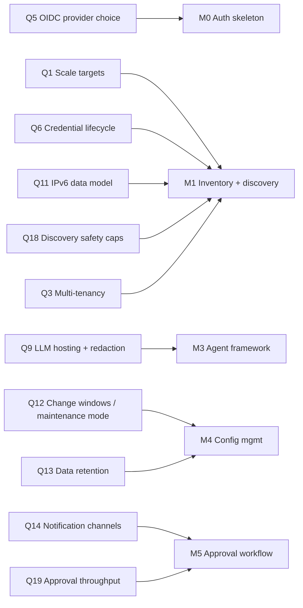

# Gap Analysis — Missing & Underspecified Requirements

**Project:** AI Network Operations Platform
**Author:** Consultant Agent
**Date:** 2026-06-09
**Status:** Active — platform owner offline; build proceeds on recommended defaults
**Inputs:** `CLAUDE.md` (platform constitution), `docs/architecture/DECISIONS-BRIEF.md` (binding decisions D1–D16)

## How to read this document

Each gap states: what the constitution/brief says today, what is missing, why it matters concretely, and the **working default** the build proceeds on. Every gap cross-references a question (`Qn`) in `docs/consultant/QUESTIONS.md` and a registered assumption (`An`, same number) in `docs/consultant/ASSUMPTIONS.md`.

Severity legend:

- **BLOCKING** — must be resolved (or defaulted) before the milestone listed, or rework is guaranteed.
- **HIGH** — wrong default causes significant rework or operational risk.
- **MEDIUM** — wrong default is absorbable with bounded effort.

### Blocking gaps mapped to milestones

---

## 1. Scale & capacity targets — **BLOCKING (M1)** → Q1, Q18

**Today:** CLAUDE.md says "enterprise infrastructure teams"; the brief sizes nothing. D8 names four Celery queues but not worker counts. D12 picks Cytoscape.js with no node-count ceiling.

**Missing:** target device count, site count, concurrent users, discovery cadence, per-device connection caps, pcap volume per day, topology graph size.

**Why it matters:**
- `raw_artifacts` and `audit_log` (brief §6) grow with every device touch. At 10k devices × daily discovery, `raw_artifacts` is millions of JSONB rows/quarter — partitioning must be decided in the first Alembic migration, not retrofitted.
- Cytoscape.js becomes unusable somewhere past ~2,000–5,000 rendered nodes; the frontend needs a site-scoped/clustered rendering strategy if device count exceeds that.
- Celery worker sizing and Neo4j heap depend directly on these numbers.
- Uncapped discovery can dos a fragile device (TCAM-poor switches with slow control planes).

**Working default (A1, A18):** design point **2,000 devices / 50 sites / 25 concurrent users**, hard architectural ceiling 10,000 devices; full discovery sweep every 24h; ≤2 concurrent sessions per device, ≤50 platform-wide; topology UI renders site-scoped subgraphs, never the whole estate.

## 2. HA/DR expectations & platform backup/restore — **HIGH** → Q2, Q17

**Today:** Brief §8 punts HA to the production roadmap with no RPO/RTO. D5 chooses **Neo4j 5 Community** — single instance, no clustering, no hot backup. Redis persistence is unspecified. D14 stores pcaps on a disk volume with no backup statement. Nothing in either document covers backing up the platform itself.

**Missing:** RPO/RTO numbers, active/passive vs. active/active posture, what is backed up, where backups go, restore drill expectations.

**Why it matters:** the platform holds device credentials and the only normalized record of the network. Losing Postgres = losing the credential vault and audit history. Conversely, over-engineering HA for a tool used by a 10-person team wastes the MVP.

**Working default (A2, A17):**
- MVP (Compose): single node; nightly `pg_dump` + volume snapshot of pcap/config storage; **RPO 24h, RTO 4h** (documented restore runbook in `scripts/`).
- Production (K8s/Helm): Postgres streaming replication (active/passive), **RPO ≤ 5 min, RTO ≤ 1 h**.
- **Neo4j is never backed up** — per D5 it is a rebuildable projection; restore = replay projection from Postgres. This is the explicit justification for tolerating Community edition's backup limitations.
- Redis: AOF off; queues are re-enqueueable, cache is disposable.

## 3. Multi-tenancy — **BLOCKING (M1, schema-shaping)** → Q3

**Today:** Neither document says whether one deployment serves one organization or many (MSP/NOC-as-a-service model).

**Why it matters:** tenancy is the most expensive thing to retrofit: it touches every table in brief §6, every Neo4j label, JWT claims, RBAC, and the plugin credential resolution path. It must be decided before the first migration.

**Working default (A3):** **single-tenant per deployment.** An MSP runs one instance per customer (D13's Helm chart makes that cheap). Mitigation so this isn't a one-way door: all queries go through the service layer (brief §3), so a tenant filter could later be added in one place; no raw table access from routers or agents.

## 4. RBAC granularity & SSO/OIDC provider — **BLOCKING (M0/M1)** → Q4, Q5

**Today:** D10 defines four global roles (`viewer`, `operator`, `engineer`, `admin`) and "Local users + OIDC (pluggable)". D11 says approvers must differ from requesters.

**Missing:**
- **Scoping:** can a role be limited to a site or device group ("engineer for datacenter A, viewer elsewhere")? Brief is silent.
- **Approval mapping:** which role(s) may approve a ChangeRequest? Unstated.
- **OIDC:** no named provider, no group→role mapping rule, no statement on whether local users remain enabled when OIDC is on.

**Working default (A4, A5):** roles are **global in v1** (no site scoping; deferred to production roadmap as a device-group scoping extension). ChangeRequest approval requires `engineer` or `admin`, requester ≠ approver per D11. **Keycloak** is the reference IdP (ships in the dev Compose profile); the implementation targets **generic OIDC discovery + PKCE** so Entra ID/Okta work unmodified; IdP group claims map to the four D10 roles via configurable claim mapping; local accounts stay enabled as break-glass.

## 5. Credential management & rotation — **BLOCKING (M1)** → Q6

**Today:** D11 covers storage well (AES-256-GCM envelope encryption, master key via env/file/KMS, never returned by any API). Brief §7 adds the KMS-compatible interface.

**Missing:** rotation policy and tooling, credential scoping (per-device vs. per-site vs. global), SNMPv3 key handling, break-glass retrieval, and integration with enterprise secret stores (HashiCorp Vault, CyberArk) that many target customers already mandate.

**Working default (A6):** built-in vault per D11 is the v1 store; credentials are scoped per device with site-level defaults; **manual rotation** with a built-in "credential age" report and configurable max-age warning (90 days); no automated rotation in v1. **PROPOSED:** the D11 master-key interface (`env/file/KMS`) gains a fourth driver, HashiCorp Vault Transit, on the production roadmap — interface designed for it now, implemented later. There is deliberately **no** break-glass plaintext retrieval; recovery = rotate on the device.

## 6. Compliance regimes — **HIGH** → Q7

**Today:** "Secure by default, audit everything" (CLAUDE.md) but no named regime.

**Why it matters:** SOC2 vs. PCI-DSS vs. FedRAMP are different products. FedRAMP would force FIPS-validated crypto modules (constrains the D11 AES-GCM implementation choice), US-person constraints, and a documentation burden incompatible with the MVP timeline. PCI would demand network segmentation attestations and 1-year audit retention minimums.

**Working default (A7):** build to **SOC2 Type II-aligned controls** (the D11 append-only audit log, RBAC, encrypted secrets, and D16 CI gates already map well). No FedRAMP/PCI commitments in v1; crypto goes through Python `cryptography` (FIPS-capable OpenSSL backend) so a FIPS mode is a configuration exercise later, not a rewrite.

## 7. Air-gapped operation — **HIGH** → Q8

**Today:** "Local first / self hosted" implies but never states full offline operation. D9 defaults to Ollama; D13 ships container images.

**Missing:** offline model distribution, container registry mirroring, `ntc-templates` update path (D7 depends on it), CVE/threat-feed updates for the Security Agent, license activation that phones home.

**Working default (A8):** the **core platform must run fully air-gapped**: a release bundle = container images (tar), Ollama model files, and pinned `ntc-templates` — installable from removable media. Features with inherent egress (AWS/Azure/Route53 plugins, external LLM profiles, CVE feeds) are **optional capabilities that degrade gracefully and are absent in the air-gapped profile**, never on the critical path of discovery/topology/troubleshooting/config management.

## 8. LLM hosting constraints & data egress — **BLOCKING (M3)** → Q9

**Today:** D9 gives the provider registry with `local` (Ollama) default and opt-in external profiles. Nothing on GPU sizing, model capability floor, or what data may leave the box when an external profile is enabled.

**Missing — three distinct gaps:**
1. **GPU availability:** which model class must the platform run well on? Agentic tool-calling quality differs enormously between an 8B and a 70B model.
2. **Egress policy:** when `anthropic`/`openai`/`azure` profiles are enabled, prompts will contain device configs. Configs contain **secrets** (SNMP communities, RADIUS keys, type-7/type-9 password material, SNMPv3 auth strings). Neither document defines a redaction requirement. This is a security gap, not just a question.
3. **Capability floor:** no eval harness is specified to verify a local model can actually drive the D3 LangGraph supervisor.

**Working default (A9):**
- Reference local target: **one 24 GB GPU** (L4/RTX 4090 class) running a 8–14B instruct model via Ollama; CPU-only documented as functional-but-degraded.
- **PROPOSED:** a mandatory **redaction layer in `backend/app/llm/`** that strips known secret patterns from any text entering a prompt (vendor-aware: `snmp-server community`, `key 7`, `set system root-authentication`, etc.), applied to *all* providers including local — uniform pipeline, no holes. Device credentials from the vault never enter prompts under any profile (consistent with D11 "never returned by any API").
- **PROPOSED:** a small agent-eval suite (golden troubleshooting transcripts) gating which models the `local` profile recommends; lands with M3.

## 9. Streaming telemetry — gNMI / NetFlow / sFlow — **HIGH (scope gap)** → Q10

**Today:** **Entirely absent from CLAUDE.md.** Discovery is poll-based (SNMP/SSH/API per CLAUDE.md Required Features); the brief's §9 flags telemetry as an open item. Consequence: the Troubleshooting Agent reasons over point-in-time snapshots — it cannot answer "what changed at 14:32" or see microbursts/flow data.

**Why it matters:** modern NX-OS/JunOS/EOS/IOS-XE estates expect gNMI; flow data (NetFlow/sFlow/IPFIX) is the difference between "the ACL looks right" and "here is the flow that was dropped." Omitting it is defensible for MVP but must be a *decision*, not an accident — and the plugin contract should not have to break later.

**Working default (A10):** **out of scope through M5.** **PROPOSED:** reserve `TELEMETRY_GNMI`, `FLOW_NETFLOW`, `FLOW_SFLOW` in the D6/§4 `Capability` enum now (names only, no interfaces) so plugin packages can adopt them without a contract-breaking change; telemetry ingestion engine is a production-roadmap item with its own ADR.

## 10. IPv6 scope — **BLOCKING (M1, schema-shaping)** → Q11

**Today:** not one mention of IPv6 in CLAUDE.md or the brief. §6 node labels include `Subnet`/`IPAddress` with no family statement.

**Why it matters:** address-family assumptions fossilize instantly — in normalized Pydantic models (D7), `normalized_*` tables, Neo4j `IN_SUBNET` relationships, and every routing-analysis prompt. Retrofitting IPv6 into an IPv4-shaped schema is a rewrite; building dual-stack from day one is nearly free.

**Working default (A11):** **dual-stack data model from the first migration** — all address/prefix fields use family-agnostic types (Python `ipaddress`, Postgres `inet`/`cidr`); Tier-1 plugin parsers (IOS/IOS-XE/EOS) collect IPv6 interfaces/routes/neighbors from M1. IPv6-only *management plane* (platform reaching devices over v6) is supported in code but untested/unsupported in v1. BGP analysis covers both AFs; OSPFv3 follows OSPF in the same milestone.

## 11. Change windows & maintenance-mode behavior — **BLOCKING (M4/M5)** → Q12

**Today:** D11's ChangeRequest lifecycle (`draft → pending_approval → approved → executing → …`) executes immediately on approval. No concept of a change window. No maintenance mode — so during any planned work, M4 drift detection will fire false alarms and the topology diff will report churn.

**Working default (A12, both PROPOSED as additive to D11 — no state-machine change):**
- `change_requests` gains optional `execute_not_before` / `execute_not_after` columns; the executing worker holds approved CRs until the window opens; a CR whose window lapses unexecuted moves to `failed` with reason `window_expired`. Emergency immediate execution requires `admin` + mandatory justification, audited.
- `devices` gains a `maintenance_until` timestamp; while set, drift-detection and topology-change **alerting** is suppressed for that device, but snapshots and diffs are still **recorded** (audit-everything is preserved; only the noise is suppressed).

## 12. Data retention — **HIGH (M4)** → Q13

**Today:** D14 mentions a retention policy for pcaps only. Nothing for `audit_log`, `raw_artifacts`, `config_snapshots`, `reasoning_traces`, `discovery_runs`.

**Why it matters:** pcaps can contain payloads (credentials, PII) — long retention is a liability; audit logs are the opposite — short retention is the liability. These need opposite defaults, and cleanup jobs must exist or disks fill.

**Working default (A13):** configurable per class, shipped defaults:

| Data class | Default retention | Notes |
|---|---|---|
| pcap files + `pcap_metadata` | **30 days**, 50 GB volume cap | shortest — payload/PII liability |
| `raw_artifacts` | 90 days | normalized rows are kept; raw is for audit/replay |
| `reasoning_traces` | 365 days | explainability commitment (CLAUDE.md) |
| `config_snapshots` | **indefinite** | small text, immense diagnostic value |
| `audit_log` | **never auto-purged**; 7-year guidance + export tooling | append-only per D11 |
| `discovery_runs` metadata | 180 days | |

Cleanup runs as scheduled Celery tasks on the existing D8 queues.

## 13. Alerting & notification channels — **BLOCKING (M5)** → Q14

**Today:** zero notification mechanism in either document. Yet the entire D11 approval workflow depends on a human *finding out* a ChangeRequest is pending; drift detection (M4) is pointless if nobody is told.

**Working default (A14):** **PROPOSED** notification service (`backend/app/services/notifications.py`) with three v1 channels: **in-app**, **SMTP email**, and **generic signed webhook** (one integration that reaches Slack, Teams, and PagerDuty via their inbound webhooks — no per-product connectors in v1). Event types at launch: CR pending approval, CR executed/failed, drift detected, discovery run failed, credential age warning. Lands with M5 (approval workflow); air-gap safe (SMTP/webhook are local-network).

## 14. Existing source-of-truth integrations (NetBox, ITSM) — **MEDIUM** → Q15

**Today:** brief §9 names NetBox as an open item. Most target customers already have NetBox/Nautobot (intended state) and ServiceNow (change tickets). Nothing defines whether this platform's inventory is authoritative or subordinate.

**Working default (A15):** the platform **owns its own discovered inventory** (observed state) in v1 — that is its core value and avoids sync-conflict hell. Post-MVP: **one-way NetBox import** (seed devices/sites/credentials-references from NetBox API) as a `scripts/` utility, then a read-only "intended vs. observed" comparison view on the production roadmap. No bidirectional sync, ever, without a dedicated ADR. ServiceNow: deferred; the Q14 webhook channel can post CR events to ServiceNow inbound APIs as an interim bridge.

## 15. Licensing for commercial vendor APIs — **MEDIUM (but blocks plugin dev sequencing)** → Q16

**Today:** D7 commits to Infoblox WAPI, BlueCat, F5 iControl, PAN-OS XML API, FortiOS — all of which require licensed products to develop and test against. Neither document says who provides licenses or how CI tests these plugins (D16 demands tests for every feature).

**Working default (A16):** **customer-provided licenses/instances** for all commercial endpoints; the project budgets no vendor licenses. Engineering/CI strategy: plugin tests run against **recorded/mocked API fixtures** (httpx transport mocking) checked into the repo; free/virtual platforms (Arista cEOS-lab, containerlab topologies, FRR) provide live-ish integration tests for Tier-1 plugins. Each plugin's README documents its license/API-version prerequisites. This is why M1's plugin order (IOS, IOS-XE, EOS — brief §8) is correct: it front-loads the vendors testable without licenses.

## 16. Minor gaps acknowledged (not blocking, tracked only here)

- UI accessibility target (WCAG 2.1 AA assumed), i18n (English-only v1), browser support (evergreen Chrome/Edge/Firefox).
- NTP/syslog ingestion as a troubleshooting input — folded into the Q10 telemetry decision.
- Mobile/responsive layout for the approval flow only (approvers are often on phones) — flag for D12 frontend work in M5.

---

## Challenged assumptions

The Consultant Agent's mandate is to refine requirements, which includes pushing back. Seven choices in CLAUDE.md / the brief deserve challenge:

### C1 — Is Neo4j worth a second database for MVP? (challenges CLAUDE.md "Store relationships in Neo4j", D5)

**Challenge:** Neo4j adds a second persistence technology, a JVM container, and (Community edition) no clustering, no hot backup, no RBAC — for an MVP whose M2 graph queries (neighbor traversal, path finding, dependency walks) could plausibly be served by Postgres recursive CTEs at the A1 scale (2k devices). Every ops runbook, every backup plan, every K8s manifest pays the two-database tax forever.

**Recommendation:** **Keep Neo4j, but enforce two containment conditions** (both already implied by the brief, now made explicit): (1) D5's projection rule is inviolable — Neo4j never holds data that exists nowhere else, so it can be dropped or swapped without data loss; (2) all graph access goes through `backend/app/knowledge/` only — no Cypher outside that module. Re-evaluate after M2: if the queries that actually shipped are CTE-expressible, raise an ADR to swap; if path-finding/centrality queries dominate (likely for the Troubleshooting Agent), Neo4j has earned its keep. Do **not** remove it preemptively — CLAUDE.md names it, and topology is genuinely graph-shaped.

### C2 — Are 13 vendor families realistic for v1? (challenges CLAUDE.md Vendors list)

**Challenge:** 13 families × ~19 capabilities (brief §4) is a parser-and-test surface no small team ships in one version with D16's 80% coverage gate. Five of the thirteen (PAN-OS, FortiOS, F5, BlueCat, Infoblox) cannot even be tested without customer licenses (gap 15).

**Recommendation:** treat CLAUDE.md's list as the **v1.x program**, not the v1.0 release. Tier explicitly: **Tier 1 (M1):** Cisco IOS, IOS-XE, Arista EOS — per brief §8. **Tier 2 (v1.0 GA):** NX-OS, JunOS, PAN-OS, Infoblox — covers the dominant DC, WAN, firewall, and DDI estates. **Tier 3 (v1.x):** FortiOS, F5 BIG-IP, BlueCat, AWS, Azure, VMware. The D6 entry-point plugin design is exactly what makes this tiering safe: late vendors are additive packages, not core changes. Publish the tiering so "required support" has honest dates.

### C3 — Is human approval for EVERY change workable at scale? (challenges CLAUDE.md "Human approval for changes", D11/§5 "no exceptions")

**Challenge:** at 2,000 devices, a routine task ("add this NTP server everywhere") is one logical change but thousands of device operations. If each device op is a ChangeRequest, approvers rubber-stamp 2,000 clicks — which is *worse* security than fewer, meaningful approvals, because rubber-stamping trains humans to stop reading.

**Recommendation:** keep the constitution's rule but define its unit correctly: **one ChangeRequest = one logical change**, which may contain N device operations approved atomically as a unit, with full per-device preview/diff and per-device rollback. This is consistent with D11's letter ("every state-changing action goes through *a* ChangeRequest") and its spirit. Pre-approved change templates / policy-based auto-approval are **deferred and flagged as a constitution amendment** requiring explicit owner sign-off — do not back into them silently. (→ Q19)

### C4 — Do 10 agents make sense at MVP? (challenges CLAUDE.md Core Agents, D3)

**Challenge:** the brief's own roadmap ships 2 agents by M3 and ~5 by M5 — the right call — but the framework risks being designed for 10 peer runtime agents when two of the ten aren't really peers: the **Master Architect Agent** *is* the LangGraph supervisor (D3 says so), and the **Consultant Agent** is a behavior (clarify-or-default) the supervisor invokes, not a network specialist with tools. Building them as siblings of Discovery/Troubleshooting adds routing complexity for nothing.

**Recommendation:** implement Master Architect as the supervisor graph itself and Consultant as a supervisor-owned subgraph/mode (it already "owns" this document set per §5) — keep all ten *names* in the UI and docs to honor CLAUDE.md, but acknowledge in ADR-0003 that two of the ten are orchestration-layer roles, not specialist subgraphs. Eight specialist subgraphs, one supervisor, one clarification mode.

### C5 — "Wireshark" as a platform requirement (challenges CLAUDE.md Packet Analysis: tcpdump/tshark/Wireshark)

**Challenge:** Wireshark is a desktop GUI; it cannot run inside the D14 sandboxed worker, and embedding it makes no sense. Taken literally this requirement is unimplementable.

**Recommendation:** interpret as **"Wireshark-compatible"**: captures stored as standard pcap/pcapng, one-click download from the UI so engineers open them in their own Wireshark; server-side analysis is tshark/pyshark per D14. Record this interpretation in ADR-0014 so it is an explicit reading, not a silent scope cut.

### C6 — Can "local first" LLMs actually drive the agents? (challenges CLAUDE.md "Local first" + "Support multiple LLMs", D9 local-default)

**Challenge:** the D3 supervisor pattern demands reliable multi-step tool calling and structured output. Models that fit the A9 reference hardware (8–14B on a 24 GB GPU) are materially worse at this than frontier hosted models. Defaulting to local risks a first impression of "the AI is dumb," which kills adoption faster than any missing feature.

**Recommendation:** keep `local` as the default *profile* (constitutional), but (1) ship the M3 agent-eval suite (A9) and publish per-model scores so operators choose local models with eyes open; (2) make per-agent model overrides first-class in the D9 registry (e.g., local model for Documentation, hosted model for Troubleshooting where permitted); (3) make the degraded-mode UX honest — when a local model fails a structured-output retry budget, say so in the reasoning trace rather than hallucinating. The Q9 redaction layer is what makes hosted profiles defensible for config-bearing prompts.

### C7 — Kubernetes as the production posture (challenges D13)

**Challenge:** the realistic buyer is a network team, not a platform team; many have no K8s cluster and no desire to run one for a NetOps tool. If "production = Helm" is the message, single-node Docker Compose deployments will happen anyway — unsupported, unhardened, and unpatched.

**Recommendation:** keep the Helm chart (D13 stands), but promote a **hardened single-node Compose profile to a supported production tier** for ≤500-device estates: TLS, non-root containers, the A17 backup cron, and an upgrade script. Document the decision matrix (device count, HA needs → Compose vs. K8s). This costs little — D13 already maintains both artifacts — and matches how the product will really be deployed.

---

*Next documents: `QUESTIONS.md` (Q1–Q19 with recommended defaults) and `ASSUMPTIONS.md` (A1–A19 register).*
