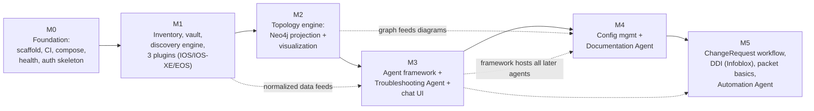

# MVP Roadmap — Milestones M0–M5

**Project:** AI Network Operations Platform
**Status:** Draft v0.1 — Iteration 1 (Phase 1: Architecture)
**Date:** 2026-06-09
**Authority:** Expands §8 of `docs/architecture/DECISIONS-BRIEF.md`. Bound by `CLAUDE.md` and decisions D1–D16. Anything deferred past M5 is mapped explicitly to `docs/roadmap/PRODUCTION.md` in the traceability table at the end of this document — nothing in CLAUDE.md "Required Features" or "Core Agents" is unmapped.

---

## 1. How to read this plan

- Each milestone is a shippable increment: `docker compose up` works at the end of every milestone (D13), CI gates of D16 apply from M0 onward.
- **Scope discipline:** "Out of scope" lists are binding. Pulling an item forward requires updating this document and the affected ADR.
- All write paths (config deploy/restore, DDI record changes, automation) are blocked behind the ChangeRequest approval gate (D11, brief §5). Until M5 delivers the full approval workflow, the gate is a hard reject — agents are read-only in M0–M4 by construction, not by convention.
- Durations below are indicative engineering estimates, **PROPOSED** (the brief does not fix dates): M0 = 2 wks, M1 = 4 wks, M2 = 3 wks, M3 = 4 wks, M4 = 3 wks, M5 = 4 wks (~20 weeks total).

### Milestone dependency graph

### MVP lab environment (PROPOSED)

Integration tests need real-ish devices. **PROPOSED:** a `containerlab` topology under `scripts/lab/` with Arista cEOS-lab nodes plus Cisco IOL/CML images where licensing permits; CI runs against **recorded netmiko/pysnmp session fixtures** (verbatim transcripts checked into `backend/tests/fixtures/`) so the pipeline never depends on vendor image licensing. Live-lab runs are a manual pre-release gate per milestone.

---

## 2. M0 — Foundation: scaffold, CI, compose, health, auth skeleton

**Goal:** A running skeleton of every container in brief §1 with the D16 CI gates enforced, so every subsequent milestone ships on rails. No feature code — only the chassis.

**In scope**

- Monorepo layout exactly per brief §3 (`backend/app/{core,api/v1,models,schemas,services,agents,plugins,engines,knowledge,llm,workers}`, `frontend/`, `deploy/`, `docs/`, `scripts/`).
- FastAPI app factory (`backend/app/main.py`); `core/` with config (pydantic-settings), structlog JSON logging (D15), error model, security primitives.
- Alembic baseline migration: `users`, `roles`, `audit_log` (append-only — migration revokes UPDATE/DELETE grants per brief §7); `audit_log` is **partitioned monthly from this baseline migration** (in-force default A1/Q1 — partitioning cannot be retrofitted cheaply at 10k-device scale).
- AuthN/Z skeleton (D10): local users, password hashing, short-lived JWT access tokens, RBAC roles `viewer` / `operator` / `engineer` / `admin` enforced by FastAPI dependency; seeded admin user. OIDC is **out** (production roadmap).
- `docker-compose.yml` (D13): `frontend`, `api`, `worker`, `postgres` (16 + pgvector), `neo4j` (5 Community), `redis` (7), optional `ollama` profile. All containers non-root; health/readiness endpoints everywhere (D15).
- Celery app wired to Redis with the four queues `discovery`, `config`, `packet`, `docs` (D8) and one no-op heartbeat task per queue.
- Frontend shell (D12): Vite + React 18 + TS strict + Tailwind; login page, authenticated layout, empty nav for Inventory / Topology / Chat / Changes / Audit.
- Prometheus `/metrics` on `api` and `worker` (D15).
- CI (D16): GitHub Actions — ruff (format+lint), mypy, pytest + pytest-asyncio with ≥80% coverage gate on core modules, import-linter enforcing brief §3 module boundary rules, vitest + testing-library + eslint + tsc, image builds, Trivy scan.
- `docs/adr/` populated: ADR-0001..0016 mirroring D1–D16, plus the `README.md` index.

**Out of scope:** vendor plugins, discovery, Neo4j data model (container runs empty), agents, LLM providers, OIDC, Helm chart (skeleton chart may be stubbed but is not a deliverable until production roadmap).

**Deliverables**

1. Repo scaffold matching brief §3, with import-linter contract file.
2. Compose stack with all seven containers and the `ollama` profile.
3. Auth API (`/api/v1/auth`): login, refresh, me; RBAC dependency used by one protected sample endpoint per role tier.
4. Append-only `audit_log` with write helper in `core/audit.py`; every auth event audited.
5. Green CI pipeline on `main`; ADR set 0001–0016.

**Exit criteria (verifiable)**

- [ ] `docker compose up` from a clean checkout: all containers reach healthy/ready within 120 s.
- [ ] Login as seeded admin returns a JWT; the same protected endpoint returns 200/403/401 for admin / viewer / anonymous respectively (automated tests).
- [ ] `UPDATE audit_log ...` as the application DB role fails with a permission error (automated test).
- [ ] CI is green: ruff, mypy, pytest (core coverage ≥80%), import-linter, vitest, eslint, tsc, image build; Trivy reports zero critical CVEs.
- [ ] Each Celery queue processes its heartbeat task; `/metrics` and health endpoints respond on every container.

---

## 3. M1 — Inventory, credential vault, discovery engine, first three plugins

> **Status: COMPLETE** (2026-06-12, branch `release/m1`). 18 tasks delivered via orchestrated workflow `wf_a7368a4c-6a1`; all gates green (backend 605 unit tests, 95% coverage; frontend 17 tests). Lab-only exit criteria (live LLDP/CDP walk, SNMP against real devices) remain tagged for lab validation.

**Goal:** Discover a real Cisco IOS / Cisco IOS-XE / Arista EOS estate over SSH and SNMP into a normalized, audited inventory — the data foundation every later milestone consumes.

**In scope**

- Postgres models + migrations (brief §6): `devices`, `device_credentials` (AES-256-GCM envelope encryption, master key from env/file via KMS-compatible interface — D11), `discovery_runs`, `raw_artifacts` (JSONB + verbatim text; **partitioned monthly from its first migration** per in-force default A1/Q1), `normalized_interfaces`, `normalized_routes`, `normalized_neighbors`.
- Plugin system (D6): `plugins/base.py` with `Capability` enum and `VendorPlugin` ABC, capability interfaces, `plugins/registry.py` resolving `(vendor_id, capability)`, discovery via `netops.plugins` entry points.
- Plugins `cisco_ios`, `cisco_iosxe`, `eos` implementing: `DISCOVERY_SSH`, `DISCOVERY_SNMP`, `INTERFACES`, `ROUTES`, `NEIGHBORS_LLDP`, `NEIGHBORS_CDP` (CDP on the two Cisco plugins; EOS delivers LLDP — CDP is not applicable on EOS).
- Connectivity layer (D7): netmiko + ntc-templates/TextFSM → normalized Pydantic models (`NormalizedInterface`, `NormalizedRoute`, `NormalizedNeighbor`); pysnmp for SNMP v2c **and** v3.
- Discovery engine (`engines/discovery/`): seed-device expansion via LLDP/CDP neighbors, job planning, normalization pipeline; runs as Celery tasks on the `discovery` queue with retries and per-device fan-out.
- API: `/api/v1/devices` (CRUD, RBAC: write requires `engineer`), `/api/v1/discovery` (start run, run status, run results); credential create/rotate endpoints that **never** return secret material.
- Frontend: inventory table (devices, interfaces, neighbors), discovery run launcher + status view.
- Audit: every credential read/decrypt and every discovery run is an `audit_log` entry.

**Out of scope:** API-based discovery plugins (`httpx` family — first one is Infoblox in M5), Neo4j projection (M2), any agent, config backup (M4), BGP/OSPF/ACL collection (M3).

**Deliverables**

1. Plugin framework + registry + entry-point loading, with a conformance test suite any future plugin must pass (capability declared ⇒ interface implemented ⇒ normalized models validate).
2. Three certified plugins (IOS, IOS-XE, EOS).
3. Discovery engine + `discovery` queue tasks; seed-expansion bounded by configurable hop limit and subnet allowlist.
4. Credential vault service with envelope encryption and rotation.
5. Inventory API + UI; recorded-fixture test suite for all parsers.

**Exit criteria (verifiable)**

- [ ] From one seed device, a discovery run against the lab discovers all lab devices reachable via LLDP/CDP within the hop limit; interfaces, routes, and neighbors populate normalized tables.
- [ ] Every normalized row links back to a `raw_artifacts` record containing the verbatim command output (D6 auditability — automated test).
- [ ] SNMPv3 (authPriv) and SNMPv2c collection both succeed against the lab.
- [ ] No API response, log line, or trace contains credential plaintext (automated leak test greps API responses and structured logs).
- [ ] Re-running discovery is idempotent: device/interface counts stable, changes recorded as updates not duplicates.
- [ ] Plugin conformance suite passes for all three plugins; parser coverage backed by recorded fixtures in CI.

---

## 4. M2 — Topology engine: Neo4j projection + visualization

**Goal:** A living L2/L3 topology graph in Neo4j, fully derived from Postgres (rebuildable per D5), rendered interactively in the frontend.

**In scope**

- `knowledge/` Neo4j client (driver, session management, retry).
- Projection engine (`engines/topology/`): Postgres → Neo4j ETL producing node labels `Device`, `Interface`, `Vlan`, `Subnet`, `IPAddress`, `VRF`, `Site` and relationships `CONNECTED_TO` (L2 from LLDP/CDP), `HAS_INTERFACE`, `IN_SUBNET`, `L3_ADJACENT`, `ROUTES_TO` (from normalized routes) — brief §6 model, MVP subset.
- Full-rebuild command (`scripts/` + Celery task): drop and rebuild the entire projection from Postgres; incremental sync after each discovery run.
- Topology diff: compare projections between two discovery runs (links/nodes added/removed).
- API: `/api/v1/topology` (graph queries scoped by site/VRF/layer, diff endpoint).
- Frontend: Cytoscape.js topology view (D12) with L2/L3 layer toggle, node detail panel (device, interfaces, IPs), diff highlighting.

**Out of scope:** `DnsZone`/`DnsRecord` nodes and `RESOLVES_TO` (M5, requires DDI data), `Application`/`DEPENDS_ON` (production roadmap — requires VMware/flow inputs), real-time streaming topology updates, `MEMBER_OF`/`LOCATED_AT` beyond static `Site` assignment.

**Deliverables**

1. Topology projection engine with incremental sync + full rebuild.
2. L2 and L3 builders with unit tests against fixture inventories.
3. Topology API with RBAC (read: `viewer`+).
4. Cytoscape.js topology UI with layer toggle and run-to-run diff view.

**Exit criteria (verifiable)**

- [ ] Destroying the Neo4j volume and running the rebuild restores a graph isomorphic to the pre-destroy export (automated test compares node/relationship multisets) — proves the D5 "projection, rebuildable" property.
- [ ] Lab topology renders in the UI in <3 s for the full lab graph; L2 links match the lab's cabling plan exactly.
- [ ] Disconnecting a lab link and re-discovering produces a diff that flags exactly that `CONNECTED_TO` edge as removed.
- [ ] Incremental sync after a discovery run completes in <10% of full-rebuild time on the lab dataset.
- [ ] Neo4j contains no data absent from Postgres (spot-check test: random sampled nodes traceable to normalized rows).

---

## 5. M3 — Agent framework + Troubleshooting Agent (read-only) + chat UI

**Goal:** The first AI loop: a LangGraph supervisor routing user intent to specialist agents that answer routing/BGP/OSPF/ACL questions grounded in collected data, with every step traced, explained, and audited.

**In scope**

- `agents/framework/` (D3, brief §5): base agent, agent registry, **typed tool wrappers** over engine/service functions (agents never import engines directly — module boundary rule), reasoning-trace persistence (`agent_sessions`, `reasoning_traces` tables), and the **approval gate**: any tool flagged state-changing is rejected outright in M3–M4 with an audit entry ("write tools disabled until ChangeRequest workflow — M5").
- `llm/` (D9): provider registry behind the LangChain chat-model interface; profiles `local` (Ollama, default), `anthropic`, `openai`, `azure`; all prompts versioned in-repo under `llm/prompts/`; structured outputs via Pydantic; the **mandatory prompt-redaction layer** (`llm/redaction.py`, in-force default A9/Q9) stripping vendor secret patterns (SNMP communities, type-7/9 material, SNMPv3 strings, BGP/RADIUS keys) from all prompt content for **all** providers — vault credentials never enter prompts under any profile.
- **Master Architect Agent**: LangGraph supervisor — plans, routes to specialists, synthesizes the final answer.
- **Consultant Agent**: clarifying-question node; when intent is ambiguous it asks the user before routing (brief §5); in autonomous runs it records the question + recommended default in `docs/consultant/QUESTIONS.md` and proceeds on the default.
- **Discovery Agent**: thin specialist wrapping the M1 engine via typed tools (trigger discovery run [read-only job-launch is permitted as it changes no device state], inspect inventory, query neighbors).
- **Troubleshooting Agent** (read-only): routing analysis, BGP analysis, OSPF analysis, ACL analysis tools over normalized data + on-demand live reads through plugins.
- Plugin extension: add `BGP`, `OSPF`, `ACL` capabilities to `cisco_ios`, `cisco_iosxe`, `eos` (new normalized models: `NormalizedBgpPeer`, `NormalizedOspfNeighbor` **PROPOSED** as the OSPF normalized model name — brief lists BGP/ACL models explicitly, OSPF model name chosen conservatively to match the pattern, `NormalizedAclEntry`).
- RBAC inheritance (brief §7): the agent session carries the invoking user's role; tool wrappers enforce it — an agent can never do what its user cannot (automated test).
- Chat UI: WebSocket streaming chat console, reasoning-trace viewer (steps, tool calls, evidence) linked from every answer; audit view shows agent actions.

**Out of scope:** any write/change tool, DNS/DHCP troubleshooting (M5 — needs DDI), firewall analysis (production — needs PAN-OS/FortiOS), packet tools (M5), Configuration/Documentation/DDI/Automation/Security agents.

**Deliverables**

1. Agent framework with registry, typed tools, trace persistence, hard-reject approval gate.
2. LLM provider registry with the four profiles, versioned prompts, and the mandatory prompt-redaction pipeline (A9).
3. Master Architect + Consultant + Discovery + Troubleshooting agents as LangGraph subgraphs.
4. BGP/OSPF/ACL capabilities on all three MVP plugins, with fixtures.
5. Chat UI with streaming and reasoning-trace viewer; `/api/v1/agents` session API.

**Exit criteria (verifiable)**

- [ ] "Why is BGP peer X down on device Y?" yields a grounded answer citing specific collected evidence (peer state, interface status, route presence), with a persisted reasoning trace linked from the answer and from the audit log.
- [ ] An ambiguous request ("fix the network") triggers the Consultant Agent's clarifying question rather than action (automated eval case).
- [ ] Invoking any state-changing tool is rejected and audited (automated test).
- [ ] A `viewer`-role session cannot invoke `engineer`-tier tools; the denial is audited (automated test).
- [ ] The redaction layer strips seeded vendor secret patterns (SNMP communities, type-7/9 material, BGP/RADIUS keys) from prompt content on every provider profile; no secret pattern reaches a provider call (automated test).
- [ ] The same eval suite passes on the `local` (Ollama) profile and at least one external provider profile, proving D9 portability.
- [ ] 100% of agent answers in the eval suite have a complete trace (no orphan answers).

---

## 6. M4 — Config management + Documentation Agent

**Goal:** Scheduled configuration backups, drift detection, and compliance checking across the three MVP vendor plugins; the Documentation Agent generates inventories, diagrams, and runbooks from live data.

**In scope**

- Plugin extension: `CONFIG_BACKUP` on `cisco_ios`, `cisco_iosxe`, `eos`.
- `engines/config_mgmt/`: snapshot capture to `config_snapshots` (content-addressed, diff-friendly), scheduled + on-demand backups on the `config` queue; drift detection (current vs. last-approved baseline, unified diff); compliance engine evaluating `compliance_policies` — **PROPOSED rule format:** declarative YAML rules with regex and parsed-model assertions, severity levels (`info`/`warn`/`violation`), scoped by vendor/role/site.
- **Configuration Agent** (read-only in M4): explain a drift diff in plain language, assess a device against policy, summarize compliance posture. Its write tools (`CONFIG_DEPLOY`/`CONFIG_RESTORE`) ship in M5 behind ChangeRequest.
- **Documentation Agent** on the `docs` queue, generating:
  - **Network inventories** — Markdown + CSV from normalized tables.
  - **Diagrams** — topology exports from the Neo4j projection (Mermaid source + rendered PNG via the frontend Cytoscape export — **PROPOSED** format pair; brief does not fix output formats).
  - **Runbooks** — per-device / per-site Markdown from templates + LLM narrative grounded in inventory and topology.
- `documents` table + pgvector `embeddings` (D4): every generated document is chunked and embedded; RAG retrieval in `knowledge/` so agents can cite platform-generated docs.
- API: config-management endpoints live **under the existing `devices` router** — `/api/v1/devices/{device_id}/config-snapshots` (+ drift and compliance sub-resources), per REPO-STRUCTURE.md §4.5; the brief §3 fixes exactly ten v1 routers, so **no new `configs` router is added**. Document endpoints ride the brief's `docs` router (`/api/v1/docs`). Frontend views for snapshots/diffs/compliance and a documents library.

**Out of scope:** config restore/deploy execution (M5 — requires ChangeRequest workflow), compliance for vendors beyond the three MVP plugins (production waves), incident reports (M5 — generated from agent sessions once troubleshooting + packet workflows are complete).

**Deliverables**

1. `CONFIG_BACKUP` on three plugins + snapshot storage with retention setting.
2. Drift detection + compliance engine with seeded example policy pack (e.g., "SSHv2 only", "no `permit ip any any`", "NTP servers configured").
3. Configuration Agent (read-only) registered with the Master Architect.
4. Documentation Agent producing inventories, diagrams, runbooks; documents embedded into pgvector; RAG retrieval tool available to agents.
5. UI: config snapshots/diff/compliance views; document library with download.

**Exit criteria (verifiable)**

- [ ] Nightly scheduled backup stores snapshots for 100% of reachable lab devices; failures alert via job status and are audited.
- [ ] An out-of-band config change on a lab device is flagged as drift on the next cycle, with an accurate unified diff; the Configuration Agent's explanation references the changed lines.
- [ ] A seeded policy violation is detected and reported with device, rule, severity, and evidence; a compliant device reports clean (both automated against fixtures).
- [ ] Generated inventory matches normalized-table content exactly (round-trip test); generated diagram matches the Neo4j projection node/edge set.
- [ ] A RAG query against a generated runbook returns the relevant chunk with citation (automated retrieval eval).
- [ ] All generated artifacts are downloadable from the UI and recorded in `documents` with embeddings present.

---

## 7. M5 — ChangeRequest workflow, DDI (Infoblox), packet analysis basics, Automation Agent

**Goal:** Close the loop: the platform can now *change* the network — but only through human-approved ChangeRequests — and gains DDI (Infoblox), packet analysis, and the Automation, DDI, and Packet Analysis agents. MVP is feature-complete at exit.

**In scope**

- **ChangeRequest workflow** (D11, brief §7): full lifecycle `draft → pending_approval → approved → executing → completed | failed → rolled_back`; `approvals` table; approver must differ from requester (configurable, **on by default**); approval UI (queue, diff/intent preview, approve/reject with comment); every transition audited with before/after state and reasoning-trace link.
- **Automation Agent**: the only executor of approved changes. Executes `CONFIG_RESTORE` / `CONFIG_DEPLOY` (added to the three route/switch plugins) and DDI record changes; structured rollback step per change; refuses anything not in `approved` state.
- **Infoblox plugin** (`infoblox`): WAPI via httpx (D7); capabilities `DISCOVERY_API` (first API-based discovery plugin — satisfies the CLAUDE.md "Discovery → APIs" requirement), `DDI_DNS`, `DDI_DHCP`, `DDI_IPAM`.
- **DDI Agent**: DNS troubleshooting (zone/record lookups, delegation and resolution-path checks, mismatch detection vs. inventory) and DHCP troubleshooting (scope utilization, lease lookup, conflict detection) — read-only tools; record add/modify/delete tools create ChangeRequests.
- Topology extension: `DnsZone`, `DnsRecord` nodes + `RESOLVES_TO` relationships projected from Infoblox data — delivers CLAUDE.md "Topology → DNS dependencies".
- **Packet analysis** (D14): `engines/packet/` — capture orchestration via the `PACKET_CAPTURE` plugin capability (**PROPOSED MVP scope:** worker-side `tcpdump` capture on reachable segments + device-side capture on `eos` via monitor session; Cisco EPC orchestration follows in production hardening); pcap upload/ingestion; tshark/pyshark analysis in a sandboxed worker on the `packet` queue; pcap artifacts on a disk volume with `pcap_metadata` + retention policy in Postgres; pcap download for offline **Wireshark** analysis (interop deliverable).
- **Packet Analysis Agent**: summarize a capture (top talkers, protocols, errors/retransmissions), answer filter-style questions, attach findings to troubleshooting sessions.
- **Documentation Agent extension — incident reports**: generate an incident report from an agent troubleshooting session (timeline, evidence, findings, remediation CRs) — completes CLAUDE.md "Documentation".
- MVP hardening pass: TLS for compose ingress, retention jobs (pcaps, raw artifacts), final security review per Development Standards.

**Out of scope:** BlueCat and Route53 (PRODUCTION.md Waves 1 and 4), the remaining nine vendor families, Security Agent (PRODUCTION.md P2 — depends on firewall plugins), firewall analysis, OIDC/SSO, Helm/Kubernetes production deployment, HA.

**Deliverables**

1. ChangeRequest service + approval UI + four-eyes rule; Automation Agent as sole executor.
2. `CONFIG_RESTORE`/`CONFIG_DEPLOY` on IOS/IOS-XE/EOS plugins with rollback step.
3. Infoblox plugin (API discovery + DNS/DHCP/IPAM) passing the plugin conformance suite.
4. DDI Agent, Packet Analysis Agent registered with the Master Architect; DNS-dependency topology layer.
5. Packet engine: capture orchestration, sandboxed tshark analysis, pcap retention, Wireshark-compatible download.
6. Incident-report generation; MVP security review sign-off document.

**Exit criteria (verifiable)**

- [ ] **End-to-end golden path:** DDI Agent finds a stale DNS record → drafts a ChangeRequest → a *different* user approves in the UI → Automation Agent executes via Infoblox WAPI → record verified changed → audit log shows the full chain (requester, approver, executor, before/after, reasoning trace) — demonstrated live and covered by an integration test against an Infoblox mock.
- [ ] A ChangeRequest in any non-`approved` state cannot execute; self-approval is rejected under default config (automated tests).
- [ ] Config restore of a prior snapshot executes through a ChangeRequest on a lab device and the device config matches the snapshot afterward.
- [ ] A capture started from the UI produces a pcap analyzed by tshark in the sandboxed worker; the Packet Analysis Agent's top-talkers summary matches `tshark` ground truth (automated comparison); the same pcap opens cleanly in Wireshark.
- [ ] Expired pcaps are removed by the retention job; metadata rows are tombstoned and audited.
- [ ] An incident report generated from a real troubleshooting session contains timeline, evidence links, and trace references; stored + embedded in `documents`.
- [ ] DNS-dependency layer visible in topology UI; `RESOLVES_TO` edges match Infoblox zone data.
- [ ] Security review checklist (Development Standards step 5) signed off; Trivy zero critical CVEs; all M0 CI gates still green.

---

## 8. Traceability — every CLAUDE.md Required Feature and Core Agent

Every item below maps to the milestone that delivers it, or to `PRODUCTION.md` (with phase) if post-MVP. **Nothing is unmapped.**

### Required Features

| Area | CLAUDE.md item | Delivered in | Delivering component / note |
|---|---|---|---|
| Discovery | SNMP | **M1** | pysnmp v2c/v3 via `DISCOVERY_SNMP` on IOS/IOS-XE/EOS plugins |
| Discovery | SSH | **M1** | netmiko + ntc-templates via `DISCOVERY_SSH` |
| Discovery | APIs | **M5** | First API plugin: Infoblox WAPI (`DISCOVERY_API`); breadth across PAN-OS/F5/cloud → PRODUCTION.md Waves 2–4 |
| Discovery | LLDP | **M1** | `NEIGHBORS_LLDP` capability; drives seed expansion |
| Discovery | CDP | **M1** | `NEIGHBORS_CDP` on Cisco plugins |
| Discovery | Route collection | **M1** | `ROUTES` capability → `normalized_routes` |
| Discovery | Interface inventory | **M1** | `INTERFACES` capability → `normalized_interfaces` |
| Topology | L2 topology | **M2** | `CONNECTED_TO` edges from LLDP/CDP, Neo4j projection |
| Topology | L3 topology | **M2** | `L3_ADJACENT`, `ROUTES_TO`, `IN_SUBNET` builders |
| Topology | DNS dependencies | **M5** | `DnsZone`/`DnsRecord` + `RESOLVES_TO` from Infoblox data |
| Topology | Application dependencies | **PRODUCTION.md** (P3) | `Application` + `DEPENDS_ON`; requires VMware (Wave 3) + DNS deps; flow telemetry is a §9 open item |
| Topology | Store relationships in Neo4j | **M2** | Projection engine; rebuildable per D5 |
| Troubleshooting | Routing analysis | **M3** | Troubleshooting Agent tools over normalized routes + live reads |
| Troubleshooting | BGP analysis | **M3** | `BGP` capability + `NormalizedBgpPeer`; agent tooling |
| Troubleshooting | OSPF analysis | **M3** | `OSPF` capability; agent tooling |
| Troubleshooting | DNS troubleshooting | **M5** | DDI Agent over Infoblox `DDI_DNS` |
| Troubleshooting | DHCP troubleshooting | **M5** | DDI Agent over Infoblox `DDI_DHCP` |
| Troubleshooting | ACL analysis | **M3** | `ACL` capability + `NormalizedAclEntry`; agent tooling |
| Troubleshooting | Firewall analysis | **PRODUCTION.md** (P2) | Requires `FIREWALL_POLICY` from PAN-OS/FortiOS plugins (Wave 2) |
| DDI | Infoblox | **M5** | WAPI plugin: DNS/DHCP/IPAM + API discovery |
| DDI | BlueCat | **PRODUCTION.md** (P1, Wave 1) | Reuses DDI capability interfaces proven on Infoblox |
| DDI | Route53 | **PRODUCTION.md** (P4, Wave 4) | Rides with AWS plugin (shared boto3/IAM plumbing) |
| Packet Analysis | tcpdump | **M5** | Worker-side capture + device capture orchestration (`PACKET_CAPTURE`) |
| Packet Analysis | tshark | **M5** | tshark/pyshark analysis in sandboxed `packet` worker (D14) |
| Packet Analysis | Wireshark | **M5** | Pcap artifact storage + Wireshark-compatible download (interop) |
| Config Management | Backup | **M4** | `CONFIG_BACKUP` + `config_snapshots`, scheduled on `config` queue |
| Config Management | Restore | **M5** | `CONFIG_RESTORE` executed by Automation Agent via ChangeRequest only |
| Config Management | Drift detection | **M4** | Baseline diff engine in `engines/config_mgmt/` |
| Config Management | Compliance checks | **M4** | `compliance_policies` engine + policy pack |
| Documentation | Diagrams | **M4** | Documentation Agent: topology exports from Neo4j projection |
| Documentation | Runbooks | **M4** | Documentation Agent: template + LLM, grounded in inventory/topology |
| Documentation | Incident reports | **M5** | Generated from agent troubleshooting sessions + traces |
| Documentation | Network inventories | **M4** | Markdown/CSV from normalized tables; embedded for RAG |

### Core Agents

| # | Agent | Delivered in | Note |
|---|---|---|---|
| 1 | Master Architect Agent | **M3** | LangGraph supervisor (D3); hosts all later specialists |
| 2 | Consultant Agent | **M3** (runtime) | Clarifying-question subgraph; its document process (`docs/consultant/`) is active from Phase 1 |
| 3 | Discovery Agent | **M3** | Thin typed-tool wrapper over the M1 discovery engine |
| 4 | Troubleshooting Agent | **M3** | Read-only; routing/BGP/OSPF/ACL; DNS/DHCP tools extend it in M5; firewall tools in PRODUCTION.md P2 |
| 5 | Packet Analysis Agent | **M5** | Over the sandboxed packet engine (D14) |
| 6 | Configuration Agent | **M4** | Read-only in M4 (drift/compliance explanation); deploy/restore tools gated via ChangeRequest in M5 |
| 7 | DDI Agent | **M5** | Infoblox-backed; BlueCat/Route53 tool coverage in PRODUCTION.md |
| 8 | Documentation Agent | **M4** | Inventories/diagrams/runbooks; incident reports added in M5 |
| 9 | Security Agent | **PRODUCTION.md** (P2) | Its core value (firewall policy + security posture analysis) depends on PAN-OS/FortiOS plugins (Wave 2); ships with them |
| 10 | Automation Agent | **M5** | Sole executor of approved ChangeRequests; per D11/brief §5 |

### Deliberately post-MVP (per brief §8 closing note)

Remaining nine vendor families, BlueCat, Route53, application-dependency topology, firewall analysis, Security Agent, OIDC/SSO, HA, Kubernetes/Helm production deployment and hardening — all scheduled with rationale in `docs/roadmap/PRODUCTION.md`.
