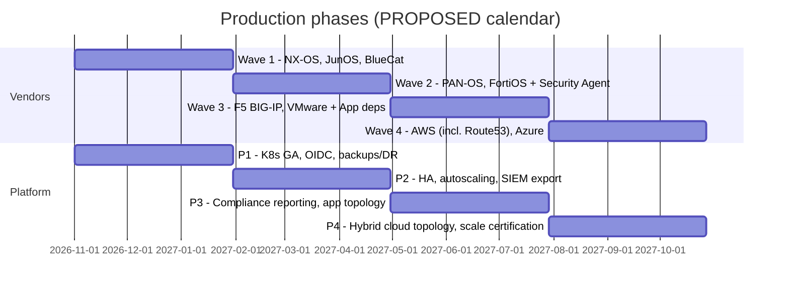
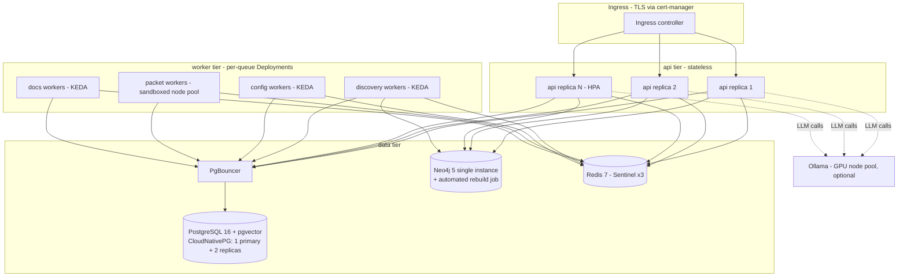

# Production Roadmap — Post-MVP Path to Enterprise Production

**Project:** AI Network Operations Platform
**Status:** Draft v0.1 — Iteration 1 (Phase 1: Architecture)
**Date:** 2026-06-09
**Authority:** Bound by `CLAUDE.md` and `docs/architecture/DECISIONS-BRIEF.md` (D1–D16). Entry condition: **MVP exit = M5 complete** per `docs/roadmap/MVP.md`. This document schedules everything the MVP traceability table maps to "PRODUCTION.md", plus the hardening required by CLAUDE.md's Production Readiness section. Where the brief leaves a decision open it is marked **PROPOSED**; items routed to the Consultant Agent (brief §9) are flagged with their open question.

---

## 1. Phase overview

Four production phases, each ending with all five readiness gates (§11) re-evaluated. Calendar quarters are **PROPOSED** (the brief fixes no dates; assumes MVP exit ≈ 2026-Q4):

| Phase | Vendor wave | Platform track |
|---|---|---|
| **P1** | Wave 1: Cisco NX-OS, Juniper JunOS, BlueCat | Kubernetes/Helm GA, OIDC/SSO, backup/DR baseline, K8s hardening round 1 |
| **P2** | Wave 2: Palo Alto PAN-OS, Fortinet FortiOS; **Security Agent** ships here | HA + scale-out (API replicas, worker autoscaling, Postgres HA), audit export to SIEM |
| **P3** | Wave 3: F5 BIG-IP, VMware; **application-dependency topology** ships here | Compliance & audit reporting suite, observability SLO enforcement |
| **P4** | Wave 4: AWS (incl. **Route53**), Azure | Hybrid on-prem/cloud topology stitching, scale certification, upgrade-path rehearsal N-2 |

---

## 2. Vendor rollout — all 13 vendor families

Wave assignment criteria: (a) reuse of proven connectivity/parsing paths first (lowest marginal risk per D7), (b) each wave must validate one *new* capability surface before broadening it, (c) dependencies of cross-cutting features (Security Agent needs firewalls; app dependencies need VMware; Route53 needs AWS credential plumbing).

Every plugin ships against the **plugin conformance suite** from M1 (capability ⇒ interface ⇒ normalized models ⇒ verbatim raw artifacts ⇒ docs ⇒ ≥80% coverage) and the per-wave exit criteria in §2.6.

### 2.1 Wave 0 — delivered in MVP (for completeness)

| Vendor (`vendor_id`) | Milestone | Capabilities |
|---|---|---|
| Cisco IOS (`cisco_ios`) | M1/M3/M4/M5 | SSH/SNMP discovery, interfaces, routes, LLDP/CDP, BGP, OSPF, ACL, config backup/restore/deploy |
| Cisco IOS-XE (`cisco_iosxe`) | M1/M3/M4/M5 | Same as `cisco_ios` |
| Arista EOS (`eos`) | M1/M3/M4/M5 | Same minus CDP; + device-side `PACKET_CAPTURE` |
| Infoblox (`infoblox`) | M5 | `DISCOVERY_API`, `DDI_DNS`, `DDI_DHCP`, `DDI_IPAM` |

### 2.2 Wave 1 (P1) — Cisco NX-OS, Juniper JunOS, BlueCat

| Vendor | Why this wave | Capabilities delivered |
|---|---|---|
| Cisco NX-OS (`cisco_nxos`) | Same netmiko + ntc-templates toolchain as Wave 0 — lowest marginal cost; completes Cisco datacenter switching coverage, the most common gap in enterprise estates after IOS/IOS-XE | SSH/SNMP discovery, interfaces, routes, LLDP/CDP, BGP, OSPF, ACL, config backup/restore/deploy, `HA_STATUS` (vPC) |
| Juniper JunOS (`junos`) | Second-largest route/switch install base; netmiko-supported with mature ntc-templates; exercises the normalized models against a non-Cisco syntax family, hardening vendor-agnosticism before firewalls | SSH/SNMP discovery, interfaces, routes, LLDP, BGP, OSPF, ACL (firewall filters → `NormalizedAclEntry`), config backup/restore/deploy |
| BlueCat (`bluecat`) | Completes on-prem DDI required by CLAUDE.md; reuses the `DDI_*` capability interfaces and httpx client patterns proven on Infoblox in M5 — validates that the DDI abstraction is genuinely vendor-neutral | `DISCOVERY_API`, `DDI_DNS`, `DDI_DHCP`, `DDI_IPAM` via BlueCat Address Manager REST API |

### 2.3 Wave 2 (P2) — Palo Alto PAN-OS, Fortinet FortiOS (+ Security Agent)

| Vendor | Why this wave | Capabilities delivered |
|---|---|---|
| Palo Alto PAN-OS (`panos`) | First firewall family; introduces the `FIREWALL_POLICY` capability and `NormalizedFirewallRule` (**PROPOSED** model name, following the brief's normalized-model pattern); API-driven via XML API over httpx per D7 | `DISCOVERY_API`, interfaces, routes, `FIREWALL_POLICY`, ACL/NAT visibility, config backup, `HA_STATUS` |
| Fortinet FortiOS (`fortios`) | Ships in the same wave deliberately: two independent firewall vendors must validate `FIREWALL_POLICY` normalization before the interface is declared stable (same pattern as Wave 0 proving interfaces across three OSes) | `DISCOVERY_API` (REST) + SSH fallback, interfaces, routes, `FIREWALL_POLICY`, config backup, `HA_STATUS` |

**Security Agent ships in P2** (per MVP traceability): firewall policy analysis (shadowed/redundant/overly-permissive rules), security posture checks across configs and ACLs, findings feed compliance reports. It is read-only; remediations it proposes become ChangeRequests. CLAUDE.md "Troubleshooting → Firewall analysis" is delivered here (Troubleshooting Agent gains firewall tools backed by `FIREWALL_POLICY`).

### 2.4 Wave 3 (P3) — F5 BIG-IP, VMware (+ application dependencies)

| Vendor | Why this wave | Capabilities delivered |
|---|---|---|
| F5 BIG-IP (`f5_bigip`) | ADC layer: VIPs, pools, members, monitors via iControl REST per D7 — the primary source of service-to-server mappings, a direct input to application-dependency topology | `DISCOVERY_API`, interfaces, routes (self-IPs), virtual-server/pool inventory, `HA_STATUS`, config backup (UCS) |
| VMware (`vmware`) | pyVmomi per D7: vSwitch/dvSwitch, port groups, VM-to-port and VM-to-host mappings — bridges physical L2 topology to workloads; prerequisite for `Application`/`DEPENDS_ON` graph data | `DISCOVERY_API`, virtual interfaces/port groups, VM inventory, host/cluster topology |

**Application-dependency topology ships in P3** (per MVP traceability): `Application` nodes + `DEPENDS_ON` edges in Neo4j, derived from F5 VIP→pool→member chains, VMware VM placement, DNS dependencies (M5), and manual application tagging in the UI. **PROPOSED:** flow-telemetry enrichment (NetFlow/gNMI) stays out of scope until the Consultant Agent's telemetry open item (brief §9) is answered — it is absent from CLAUDE.md.

### 2.5 Wave 4 (P4) — AWS (incl. Route53), Azure

| Vendor | Why this wave | Capabilities delivered |
|---|---|---|
| AWS (`aws`) | boto3 per D7. Last because it requires a new read-only cloud credential model (IAM roles/STS) and hybrid topology stitching, both designed once and shared with Azure. **Route53 rides here** (boto3 + same credentials), completing the CLAUDE.md DDI triad | `DISCOVERY_API`: VPCs, subnets, route tables, TGW/peering, security groups (→ `FIREWALL_POLICY`-style normalization), ENIs; `DDI_DNS` via Route53 |
| Azure (`azure`) | azure SDK per D7; service-principal credential model mirrors the AWS design; paired in one wave so cloud normalization (VNet↔VPC, NSG↔SG) is validated across two providers before declared stable | `DISCOVERY_API`: VNets, subnets, route tables, peerings, NSGs, NICs |

Hybrid topology stitching (cloud VPC/VNet subnets joined to on-prem L3 graph via VPN/Direct Connect/ExpressRoute edges) is the P4 platform deliverable.

### 2.6 Per-wave exit criteria (apply to every wave)

- [ ] All listed capabilities pass the plugin conformance suite; raw output stored verbatim; normalized models round-trip.
- [ ] Discovery, topology projection, and at least one agent workflow demonstrated live against a lab/sandbox instance of each vendor.
- [ ] Write paths (where applicable) execute only via ChangeRequest; covered by integration tests.
- [ ] Plugin documentation + API docs published (CLAUDE.md Development Standards); coverage ≥80% (D16).
- [ ] No regression in the cross-vendor eval suite (M3 agent evals re-run across all installed plugins).

---

## 3. HA and scale-out (P2 platform track)

Targets below marked **PROPOSED** are defaults pending the Consultant Agent's scale/HA answers (brief §9: device count, sites, HA/DR expectations); the build proceeds on these defaults.

### 3.1 Topology

### 3.2 Decisions

| Component | HA / scale approach | Notes |
|---|---|---|
| `api` | ≥2 replicas always; HPA on CPU + request rate. Stateless by design (JWT auth per D10, no server-side sessions). WebSocket agent-session streaming fanned out via Redis pub/sub so any replica can serve any session — **PROPOSED** (required consequence of replica >1; brief D8 already places Redis in the stack) | PodDisruptionBudget minAvailable 1 |
| `worker` | One Deployment per queue (`discovery`, `config`, `packet`, `docs` per D8). Autoscaling via **KEDA ScaledObjects on Redis queue length** — **PROPOSED** (fallback: HPA on celery-exporter metrics). Celery `acks_late` + idempotent tasks so scale-in/node loss only re-runs work | Packet workers pinned to a dedicated node pool with the D14 sandbox profile (§9) |
| `postgres` | **PROPOSED: CloudNativePG operator** — 1 primary + 2 streaming replicas, automated failover, PgBouncer in front; synchronous replication for the `audit_log` write path (quorum commit) so audit entries survive primary loss; pgvector verified on replicas. Alternative if no operator allowed: Patroni | System of record (D4) — strongest HA tier |
| `neo4j` | **Default: single instance + automated rebuild.** D5 makes Neo4j a projection that "can be fully rebuilt" from Postgres — the designed mitigation. Rebuild job is the recovery path; measured rebuild time becomes the topology-RTO (gate G-REL). Neo4j 5 Community has no clustering; **PROPOSED opt-in:** Neo4j Enterprise causal cluster if the customer licenses it (Consultant open item: HA expectations) | Liveness failure triggers automatic recreate + rebuild |
| `redis` | Redis Sentinel (3 nodes) for broker/result/cache; AOF persistence. Broker loss is tolerable: tasks are idempotent and re-enqueueable; scheduled jobs (backups, retention) re-fire on next beat | |
| `ollama` | Optional GPU node pool; request queueing + per-model concurrency limits; external LLM profiles (D9) remain the failover path if local inference is saturated | Consultant open item: GPU availability |

---

## 4. OIDC / SSO (P1)

Implements the "pluggable OIDC" half of D10.

- Authorization Code + PKCE against any standards-compliant IdP (Keycloak, Entra ID, Okta — provider choice is the Consultant's "SSO provider" open item; the integration is provider-agnostic).
- IdP group → RBAC role mapping (`viewer`/`operator`/`engineer`/`admin`), configured per realm; deny-by-default for unmapped groups.
- Local users remain as **break-glass only** in production: local login restricted to the `admin` role, alerted on use, and audited.
- Short-lived access tokens (existing JWT model) + refresh via IdP; logout revokes platform sessions.
- **PROPOSED:** SCIM user/group provisioning deferred until a customer IdP requires it; group-mapping at login is sufficient for P1.
- Approval workflow honors SSO identity: the D11 different-user approval rule is enforced on the IdP subject, not the local account.

**Exit criteria:** login via OIDC end-to-end against two IdPs (one self-hosted Keycloak, one cloud IdP); role mapping tests; break-glass drill documented and audited.

---

## 5. Security hardening checklist (P1–P2, then continuous)

Builds on the D11/brief §7 baseline already live at MVP exit (envelope-encrypted vault, append-only audit, ChangeRequest gate, RBAC inheritance, non-root containers, TLS).

- [ ] Master key moved from env/file to a real KMS via the D11 KMS-compatible interface (Vault, cloud KMS, or HSM — customer choice); key rotation procedure with re-wrap of data keys, rehearsed.
- [ ] Device credential rotation jobs (scheduled re-issue where vendor supports it); per-credential scoping (site/role) so a leaked credential bounds blast radius.
- [ ] mTLS between containers — **PROPOSED:** via service mesh or cert-manager-issued SPIFFE-style certs; mandatory for `api`↔`postgres` and `worker`↔`postgres` at minimum.
- [ ] Audit log streaming export to customer SIEM (syslog/CEF + HTTPS push) in near-real-time; export lag is an SLO (§6).
- [ ] **PROPOSED:** audit-log hash chaining (each entry carries hash of predecessor) so tampering below the DB-grant layer is detectable; verification job runs daily.
- [ ] Image supply chain: SBOM generation (syft), image signing + admission verification (**PROPOSED:** cosign + policy controller), Trivy gate raised to zero critical *and* high CVEs at release.
- [ ] Dependency and secret scanning in CI (pip-audit, npm audit, gitleaks) added to the D16 pipeline.
- [ ] API rate limiting (Redis-backed, per-user and per-token) and login throttling/lockout.
- [ ] Prompt-injection defenses for agents: tool allow-lists per agent (already typed per brief §5), output-schema validation (D9 structured outputs), and an eval suite of injection attempts that must score 100% "no unauthorized tool call".
- [ ] External penetration test before GA; no open high/critical findings (gate G-SEC).
- [ ] Collector network segmentation: workers reaching device management networks run in a dedicated namespace/node pool with egress restricted to management subnets via NetworkPolicy.

---

## 6. Observability SLOs (P2 measurement, P3 enforcement)

D15 gives structlog JSON, Prometheus `/metrics`, OTel tracing, health endpoints. Production adds Grafana dashboards, alert rules with runbooks, and these SLOs (targets **PROPOSED** pending Consultant scale answers):

| SLI | SLO | Measured by |
|---|---|---|
| API availability (non-5xx on `/api/v1/*`) | ≥99.9% / 30 days | Prometheus, multi-window burn-rate alerts |
| API read latency | p95 < 300 ms, p99 < 1 s | FastAPI middleware histograms |
| Agent chat first-token latency | p95 < 5 s (local profile, reference GPU); < 3 s (external providers) | Agent-session spans (OTel) |
| Discovery job success rate | ≥99% of device tasks succeed (after retries) per run | Celery task metrics per queue |
| Scheduled config backup completeness | 100% reachable devices snapshotted per cycle; misses alerted < 15 min | `config` queue job metrics |
| ChangeRequest execution → audit completeness | 100% — every executed CR has full audit chain + trace link | Daily reconciliation job (count CRs vs. audit entries) |
| Topology projection freshness | Projection lag after discovery run < 5 min | Projection job timestamps |
| Audit → SIEM export lag | p95 < 60 s | Export pipeline metric |
| Reasoning-trace persistence | 100% of agent answers have a trace (no orphans) | Reconciliation job (M3 invariant, kept forever) |

Supporting requirements: 100% of containers expose `/metrics` + health endpoints (already D15); OTel tracing on by default in production with 100% sampling of agent runs and ≥10% of API requests; every alert rule links to a runbook (generated and maintained by the Documentation Agent — dogfooding); log retention per the data-retention Consultant answer (**PROPOSED default:** 90 days hot, 1 year archived).

---

## 7. Compliance and audit reporting (P3)

- **Change report:** scheduled (weekly/monthly) report of all ChangeRequests — requester, approver, executor agent, before/after state, reasoning-trace links — generated by the Documentation Agent, exportable CSV/PDF, suitable as change-management evidence.
- **Compliance posture report:** roll-up of the M4 compliance engine across all vendors/waves — pass/fail by policy, device, severity, trend over time; scheduled and on-demand.
- **Access review report:** users, roles, OIDC group mappings, last login, break-glass usage — monthly, for periodic access reviews.
- **Audit integrity report:** results of the daily hash-chain verification (§5) + append-only grant attestation.
- **Regime mapping:** SOC 2 / ISO 27001 / NIST control-evidence mapping is pending the Consultant's "compliance regimes" open item (brief §9); the reports above are designed as the evidence sources regardless of regime. **PROPOSED default:** structure evidence around SOC 2 CC-series controls until answered.
- Retention: audit log never purged within the configured retention window (**PROPOSED default:** 7 years for audit, per common enterprise policy — Consultant open item "data retention").

---

## 8. DR / backup (P1 baseline, drills from P2)

RPO/RTO targets are **PROPOSED** defaults pending the Consultant HA/DR answer.

| Component | Method | Frequency | Retention | Restore test |
|---|---|---|---|---|
| PostgreSQL (system of record) | **PROPOSED: pgBackRest** — full weekly, incremental daily, continuous WAL archiving to object storage (**PROPOSED:** MinIO for air-gap-friendly on-prem, S3-compatible) | Continuous (WAL) | 35 days + monthly fulls 1 year | Quarterly drill, timed |
| Neo4j | **No backup required** — rebuilt from Postgres (D5). Optional `neo4j-admin dump` nightly to cut recovery time | Nightly (optional) | 7 days | Rebuild drill quarterly (also validates G-REL topology-RTO) |
| Redis | AOF persistence only; broker state is expendable (idempotent tasks) | — | — | Covered by failover drill |
| pcap volume | Volume snapshot/rsync to object storage; retention already policy-driven in `pcap_metadata` (D14) | Daily | Per retention policy | Annual spot-restore |
| Config snapshots / raw artifacts | Live in Postgres — covered by Postgres backup | — | — | — |
| Secrets/master key | KMS-managed; key escrow procedure documented | — | — | Key-recovery drill annually |
| Helm values / platform config | In git (single source); sealed-secrets or external-secrets references only | Continuous | — | — |

**Targets (PROPOSED — these are the consultant working defaults A2/Q2 for the production/K8s tier, and the values Consultant question Q2 defaults to):** RPO ≤ 5 min (continuous WAL archiving + streaming replication); RTO ≤ 1 h full platform (active/passive standby per A2); topology graph RTO = measured Neo4j rebuild time (must be < 30 min at 5,000-device scale — gate G-REL). DR runbook generated and kept current by the Documentation Agent; full DR drill (restore to clean cluster from backups alone) at least twice yearly.

---

## 9. Kubernetes hardening (P1 round 1, P2 round 2)

Builds on D13 (Helm chart, one image per container) and brief §7 (non-root, NetworkPolicies, TLS).

- [ ] Pod Security Standards: `restricted` profile enforced namespace-wide; **exception:** packet workers (D14 sandbox) get a documented, minimal deviation — **PROPOSED:** `NET_RAW`-capable but still non-root, isolated on a dedicated node pool with its own seccomp profile and a default-deny NetworkPolicy allowing only management-subnet egress. No privileged containers anywhere.
- [ ] NetworkPolicies: default-deny ingress+egress in all platform namespaces; explicit allows matching the §3.1 topology only; device-management egress confined to the collector namespace.
- [ ] `readOnlyRootFilesystem: true` everywhere (writable `emptyDir` mounts only where required: pcap scratch, Ollama model cache).
- [ ] Resource requests/limits on every container; LimitRanges + ResourceQuotas per namespace; PriorityClasses so `api`/`postgres` outrank batch workers under pressure.
- [ ] Secrets: no Kubernetes Secret holds device credentials (they live AES-256-GCM-encrypted in Postgres per D11); platform secrets (DB passwords, master key reference) via **PROPOSED** external-secrets operator or CSI secrets store backed by the customer KMS/Vault.
- [ ] Kubernetes RBAC least privilege: platform ServiceAccounts with no cluster-scope permissions; `automountServiceAccountToken: false` where unused.
- [ ] Ingress: TLS only, cert-manager-managed certs, HSTS; no NodePort/LoadBalancer side doors.
- [ ] Admission policy (**PROPOSED:** Kyverno or ValidatingAdmissionPolicy): require signed images (§5), disallow `latest` tags, enforce PSS deviations allow-list.
- [ ] etcd encryption at rest enabled (documented requirement for customer-managed clusters); CIS Kubernetes Benchmark scan (kube-bench) clean or deviations documented.
- [ ] Helm chart ships hardened defaults — security must be opt-out (with warnings), never opt-in (CLAUDE.md "Secure by default").

---

## 10. Upgrade strategy (P1 onward)

- **Versioning:** platform-level semver; one version covers all images + Helm chart (D13: one image per container, released as a set). Supported skew: components within one release only — no mixed-version operation except during a rolling upgrade window.
- **Database migrations:** Alembic (D2) using **expand/contract**: release N adds columns/tables (expand), release N+1 removes old paths (contract). Migrations run as a Helm pre-upgrade Job; `api`/`worker` pods of version N must run correctly against the N+1 expanded schema, enabling rolling upgrades without downtime.
- **Rolling upgrade order:** migrate DB (expand) → roll `worker` per queue with Celery warm shutdown (finish in-flight tasks, no new) → roll `api` (≥2 replicas keep availability) → frontend. Neo4j projection rebuild triggered automatically post-upgrade if the projection schema version changed.
- **Prompts and models:** prompts are versioned in-repo (D9) and pinned per release; LLM model tags (Ollama model digests, provider model IDs) pinned in the release manifest. The M3 agent eval suite runs in CI against the release's pinned prompt+model set — a prompt change failing evals blocks release like a failing test.
- **Plugin compatibility:** plugin API (the D6 capability interfaces) is semver'd independently; entry-point plugins declare a compatible range; the registry refuses to load incompatible third-party plugins with a clear error.
- **Rollback:** prefer roll-forward. `helm rollback` is supported across one version because of expand/contract (old code runs on expanded schema); contract migrations are only shipped after the previous release is out of the support window.
- **Cadence (PROPOSED):** minor release per phase (quarterly), patch releases as needed; security patches out-of-band with same-day target for critical CVEs. N-2 → N upgrade path tested every release in CI on a seeded dataset (gate G-MNT).

---

## 11. Production-readiness gates

CLAUDE.md requires every iteration to improve **security, reliability, scalability, observability, maintainability**. Each dimension has a gate with measurable criteria. A phase (P1–P4) is not complete until every gate passes; GA requires all gates green simultaneously.

### G-SEC — Security

- [ ] Zero critical or high CVEs in shipped images (Trivy, at release time).
- [ ] 100% of state-changing actions traverse the ChangeRequest lifecycle — verified by automated test suite plus monthly audit sampling (zero direct-write findings).
- [ ] Self-approval impossible under default config; four-eyes rule enforced on IdP identity (automated test).
- [ ] Credential leak tests green: no plaintext device credential in any API response, log, trace, or backup sample.
- [ ] Audit log append-only attested (grant check) and hash-chain verification passing daily.
- [ ] OIDC enabled; local auth restricted to break-glass with alerting; break-glass drill executed in the last 6 months.
- [ ] External penetration test completed with no open high/critical findings.
- [ ] Prompt-injection eval suite: 100% of attack cases result in zero unauthorized tool calls.

### G-REL — Reliability

- [ ] 30-day staging soak meets all §6 SLOs, including API availability ≥99.9%.
- [ ] Postgres failover drill: primary kill → automated promotion, write service restored ≤ 60 s, zero committed-audit-entry loss (synchronous audit path verified).
- [ ] Neo4j destroy-and-rebuild drill: full topology restored from Postgres within the topology-RTO (< 30 min at the certified scale point).
- [ ] DR drill from backups alone onto a clean cluster: RPO ≤ 5 min and RTO ≤ 1 h demonstrated (PROPOSED targets per A2/Q2 until Consultant answer).
- [ ] Worker node kill mid-run: discovery/config jobs complete via retry with no duplicate side effects (idempotency verified).
- [ ] Celery task success rate ≥99% after retries over the soak window.

### G-SCA — Scalability

Scale targets are **PROPOSED** reference points pending the Consultant's "scale targets" answer; the gate re-bases on the answered numbers.

- [ ] Discovery of a 500-device seeded estate completes ≤ 60 min with worker autoscaling engaged (observed scale-out and scale-in).
- [ ] API load test: 100 concurrent users, p95 < 300 ms read latency, zero 5xx, with 2 `api` replicas; linear improvement demonstrated at 4 replicas.
- [ ] Topology projection and UI render usable at 5,000 devices / 100k interfaces (projection lag SLO held; UI uses scoped queries, no full-graph fetch).
- [ ] Queue-burst test: 10× normal `discovery` queue depth triggers KEDA scale-out and drains within the SLO without starving `config`/`packet`/`docs` queues (per-queue isolation verified).
- [ ] Postgres connection budget holds under the above via PgBouncer (no connection-exhaustion errors).

### G-OBS — Observability

- [ ] 100% of containers expose `/metrics`, liveness, and readiness endpoints (D15) — verified by automated inventory check.
- [ ] Golden-signal dashboards (latency, traffic, errors, saturation) exist for api, each worker queue, Postgres, Neo4j, Redis, and LLM providers.
- [ ] Every §6 SLO has a recording rule and a multi-window burn-rate alert; every alert links to a runbook; runbook freshness ≤ 90 days.
- [ ] Fault-injection exercise: synthetic failures (DB down, queue stall, LLM provider failure) detected by alerts with MTTD < 5 min each.
- [ ] 100% of agent runs traced end-to-end (session → LLM calls → tool calls) and joinable to audit entries.
- [ ] Audit → SIEM export operating within the lag SLO.

### G-MNT — Maintainability

- [ ] D16 gates green continuously: ruff, mypy strict, pytest coverage ≥80% on core modules, vitest/eslint/tsc; import-linter module-boundary contract green (brief §3 rules).
- [ ] Every binding decision D1–D16 has a current ADR; any deviation has a superseding ADR (no silent drift).
- [ ] Every shipped feature has tests, documentation, and API documentation (CLAUDE.md Development Standards) — release checklist item, spot-audited per release.
- [ ] N-2 → N upgrade rehearsal green in CI on a seeded production-shaped dataset, including expand/contract migration and Neo4j rebuild.
- [ ] New-plugin onboarding measured: a conformance-suite-passing plugin skeleton can be produced from the plugin template in ≤ 1 day of engineering effort (validated each wave).
- [ ] Open Consultant questions (brief §9) reviewed each phase; answered items converted to ADR updates, defaults re-confirmed for the rest.

---

## 12. Consultant Agent dependencies (from brief §9)

These open items materially shape this roadmap; defaults above are conservative and marked PROPOSED. Phase kickoffs re-check `docs/consultant/QUESTIONS.md`:

| Open item | Affects |
|---|---|
| Scale targets (devices/sites) | G-SCA numbers, HA sizing (§3) |
| HA/DR expectations | RPO/RTO (§8), Neo4j Enterprise opt-in (§3.2) |
| SSO provider | §4 IdP integration testing matrix |
| Compliance regimes | §7 regime mapping |
| Air-gapped operation | §5 image supply chain, §8 object-storage choice (MinIO default) |
| GPU availability | §3.2 Ollama pool, §6 first-token SLO |
| Telemetry (gNMI/NetFlow) | §2.4 app-dependency enrichment (out until answered) |
| Data retention | §6 log retention, §7 audit retention, §8 pcap retention |
| Multi-tenancy, NetBox integration, commercial API licensing | Backlog — none scheduled in P1–P4 without an answer |
